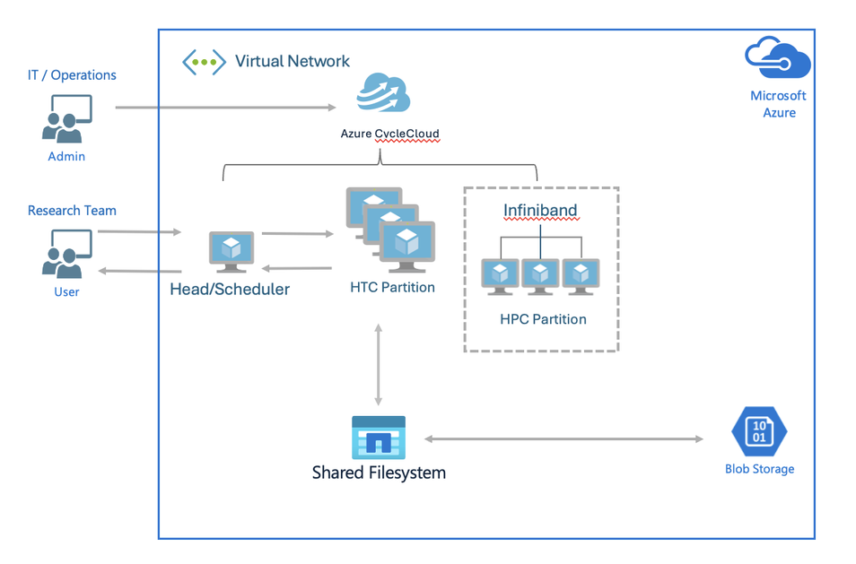

# 1. HPC & CycleCloud 아키텍처

이 문서는 **① 범용 HPC 개념**(어느 CSP에서도 통하는 원리), **② Azure CycleCloud 아키텍처**, **③ 운영 지침** 순서로 정리한다.

HPC를 처음 접하는 운영 담당자가 약 20분 안에 전체 그림을 잡고, 다른 클라우드의 HPC를 다루더라도 같은 개념으로 대응할 수 있게 하는 것이 목표이다.

> 📌 **Cloud MSP 운영 범위 안내**
> — 본 문서의 HPC·Slurm 개념은 **지원 문의에 대응하기 위한 배경 지식**이다.
> Cloud MSP의 실제 책임은 **인프라 운영/관리**(클러스터 생성, 노드 증감, 스토리지 마운트, 사용자 관리, 모니터링, 트러블슈팅)이며, Slurm 작업 제출/튜닝(`sbatch`/QOS 등)은 주로 **최종 사용자(연구자·개발자)의 영역**이다.
> 따라서 Slurm/HPC를 세부까지 숙지할 필요는 없고, 개념 수준으로 이해하면 충분하다.

---

## 1.1 HPC란 무엇인가 

**HPC(High Performance Computing, 고성능 컴퓨팅)** 는 한 대의 서버로는 감당하기 어려운 대규모 계산을, **여러 대의 컴퓨터(노드)를 네트워크로 묶은 클러스터**에 분산시켜 처리하는 방식이다.

대표적인 워크로드는 다음과 같다.

- **긴밀결합(Tightly-coupled)**: 여러 노드가 고속 네트워크로 협력하는 MPI 계산 — CFD/구조해석, 기상, 유전체 분석 등
- **느슨결합(Loosely-coupled)**: 서로 독립적인 다수 태스크를 병렬 처리 — 파라미터 스윕, 렌더링, 배치 처리
- **AI/ML**: GPU 기반 대규모 모델 학습·추론

클라우드·온프레미스·어느 CSP든 HPC 클러스터는 **① 사용자 접속 관문 + ② 작업 스케줄러 + ③ 계산 노드 + ④ 공유 스토리지** 라는 동일한 구성 요소로 이루어진다. 이 개념을 이해하면 특정 제품(CycleCloud, Slurm)에 종속되지 않고 상황에 대처할 수 있다.

### 1.1.1 HPC가 해결하는 문제 (왜 필요한가)

GPU처럼 값비싼 자원을 개인·팀별로 고정 할당하면 활용률이 낮아지고(유휴 자원), 급한 작업이 밀리거나 부서 간 자원 분쟁이 생긴다. HPC 스케줄러는 이런 운영 문제를 정책으로 해결한다.

| 문제 상황 | HPC 해결책 |
|-----------|-----------|
| 유휴 GPU 자원 | Job 단위로 자원을 할당하고, 작업이 끝나면 자동 회수 |
| 급한 작업 | 우선순위(QOS) 정책으로 중요한 작업에 자원 우선 배정 |
| 시스템 장애 | 다운된 노드를 클러스터에서 제외해 Job이 배치되지 않도록 조정 |
| 자원 사용 제한 | 그룹별·사용자별 Quota로 사용량 제한 |
| 자원 사용 분쟁 | 사용량을 정량 추적해 리포팅(공정 분배 근거) |

- **TCO 절감**: 고가의 GPU를 유휴 없이 촘촘히 돌려 총소유비용(TCO)을 낮추는 것이 HPC 도입의 핵심 목적이다.
- **초저지연 네트워크**: 대규모 분산 학습은 노드 간 통신 속도가 성능을 좌우한다. HPC는 InfiniBand·RoCE 같은 고속·저지연 네트워크로 이를 뒷받침한다(Azure에서는 `HB`/`HC`/`ND` 계열이 해당).

### 1.1.2 공유 스토리지와 소프트웨어 실행환경 (개념 이해용 참고)

클러스터의 모든 노드는 데이터를 **공유 파일시스템**의 동일 경로(예: `/home`, `/shared`, `/data`)로 마운트해, 한 노드에서 저장한 데이터를 다른 노드에서 즉시 접근한다. 대표 방식은 다음과 같다.

- **NFS**: 가장 단순하고 널리 쓰이는 네트워크 파일 공유 (CycleCloud 기본 `/shared`, `/sched`)
- **Lustre / BeeGFS / GPFS**: 대규모 병렬 I/O가 필요한 고성능 환경 (Azure는 Managed Lustre 제공)

소프트웨어 실행환경의 일관성은 두 가지 방식으로 관리한다.

| 구분 | Environment Module (Lmod) | HPC 컨테이너 |
|------|---------------------------|--------------|
| 원리 | `module load`로 환경변수(PATH 등)를 동적 전환 | 사용자 공간(OS·라이브러리)을 이미지로 패키징·격리 |
| 이점 | 빠른 버전 전환, 중앙 관리 용이 | 완전한 재현성·이식성 |
| 대표 | Lmod, Environment Modules | Apptainer(구 Singularity), Enroot/Pyxis(NVIDIA) |

- HPC 컨테이너는 다중 사용자 보안을 위해 **root 없이(rootless)** 실행하며, 커널·드라이버는 호스트와 공유해 InfiniBand·GPU 성능 손실을 피한다(격리보다 통합).
- 이 계층은 주로 **최종 사용자(연구자)** 가 다룬다. MSP 운영자는 공유 스토리지가 정상 마운트되는지(→ [7·8장](07-데이터-디스크-마운트.md))만 확인하면 된다.

---

## 1.2 HPC 클러스터의 노드 유형

클러스터의 노드는 역할에 따라 크게 세 가지로 나뉜다.

| 노드 유형 | 역할 | 상시 가동 | 자동확장 | 사용자 SSH |
|-----------|------|:---------:|:--------:|:----------:|
| **Login 노드** (Head/Submit) | 사용자 접속·작업 제출 창구이며 계산은 하지 않음 | ○ (고정) | ✗ | ○ (여기로 접속) |
| **Scheduler 노드** (Controller/Master) | 작업 큐 관리·자원 할당·정책 적용 | ○ (항상 1대) | ✗ | 원칙적으로 접속 안 함 |
| **Compute 노드** (Execute/Worker) | 실제 계산 수행 | ✗ (평상시 0대) | ○ (수요 기반) | 직접 접속 안 함(작업이 배치됨) |

- **Login 노드**는 다수 사용자가 붙어 작업을 던지는 관문으로, 계산 부하를 스케줄러에서 분리해 안정성을 높인다. 없으면 사용자가 스케줄러에 직접 접속해야 해 보안·안정성상 권장되지 않는다.
- **Scheduler 노드**가 멈추면 스케줄링 전체가 중단되므로 상시 유지된다.
- **Compute 노드**는 작업이 있을 때만 생성되고 유휴 시 종료되어 **비용을 절감**한다.

> 노드 명칭은 CSP·스케줄러마다 다르다(Login=Head/Submit, Scheduler=Controller/Master, Compute=Execute/Worker). **명칭이 달라도 역할 개념은 동일**하므로, 이 세 유형만 이해하면 어느 환경에서도 구조를 파악할 수 있다.

---

## 1.3 작업 스케줄러와 오토스케일링

**작업 스케줄러(Job Scheduler)** 는 사용자가 제출한 작업(Job)을 큐에 담아 우선순위·자원 요구·정책에 따라 계산 노드에 배치하는 소프트웨어이다.

- 대표 스케줄러: **Slurm**, OpenPBS, LSF, HTCondor, Grid Engine 등이며 CycleCloud가 모두 지원한다. 본 교육은 **Slurm** 기준이며 상세는 [2장 Slurm 개념 및 사용 가이드](02-Slurm-개념-및-사용-가이드.md)에서 다룬다.
- 스케줄러는 작업의 대기·실행 상태를 관리하고, 사용자/그룹별 사용량 한도(fairshare)와 파티션(큐) 권한을 적용한다.

**오토스케일링(Autoscale)** 은 큐에 쌓인 작업 수요에 맞춰 **계산 노드를 자동으로 생성·삭제**하는 클라우드 HPC의 핵심 기능이다.

- 작업이 제출되면 필요한 만큼 노드를 켜고(resume), 작업이 끝나 유휴 상태가 되면 노드를 끈다(suspend).
- 사용한 시간만큼만 과금되므로, 고정 규모 온프레미스 대비 **비용 효율**이 크다.

이 "클러스터 오케스트레이터 + 스케줄러" 조합은 CSP마다 제품명만 다를 뿐 개념이 같다.

| 계층 | Azure | AWS | GCP |
|------|-------|-----|-----|
| 클러스터 오케스트레이터 | **Azure CycleCloud** | AWS ParallelCluster | (Cluster Toolkit 등) |
| 작업 스케줄러 | Slurm / PBS 등 | Slurm / PBS 등 | Slurm / PBS 등 |

즉, 아래에서 설명하는 CycleCloud의 역할(노드 프로비저닝·오토스케일·템플릿 관리)을 이해하면, 다른 CSP의 HPC 관리 도구도 같은 관점으로 다룰 수 있다.

---

## 1.4 Azure CycleCloud 란?

**Azure CycleCloud**는 Azure에서 HPC 클러스터를 생성, 관리, 오케스트레이션(자동 증설/감설)하는 **엔터프라이즈 관리 서비스**이다.

- **다양한 스케줄러 지원**: Slurm, OpenPBS, LSF, HTCondor, Grid Engine 등
- **오토스케일링(Autoscale)**: 작업(Job) 큐의 수요에 따라 VMSS 기반 계산 노드를 자동으로 증설 및 감설
- **통합 제어 인터페이스**: 웹 포털 GUI, CLI(`cyclecloud`), REST API 제공

---

## 1.5 시스템 구성 아키텍처



CycleCloud 서버가 VNet 안에서 스케줄러·계산 노드(HPC/HTC 파티션)를 오케스트레이션하고, 공유 파일시스템과 Blob Storage(Locker)를 연결하는 전형적인 구성이다. 아래는 같은 구조를 텍스트로 표현한 것이다.

```
                    ┌─────────────────────────────────────────┐
   운영자/브라우저 ─▶│  CycleCloud 서버 VM (cc-server)          │
   (HTTPS 443)      │   - 웹 포털 / cycle_server 서비스         │
                    │   - cyclecloud CLI                      │
                    │   - System-assigned Managed Identity    │──▶ 구독 범위 노드 생성
                    └───────────────┬─────────────────────────┘   (Contributor)
                                    │ 클러스터 프로비저닝 (CLI / Template)
                     ┌──────────────┬─────────┼───────────────────────┐
                     ▼              ▼         ▼                       ▼
              Login 노드      스케줄러 노드   실행(Execute) 노드 …   (Autoscale)
             (사용자 접속·    (slurmctld)   (VMSS 계산 노드,
              작업 제출)                     수요 기반 생성/삭제)
                     └──────── VNet: cc-vnet / subnet: compute ──────┘

   Storage Account (cclkekwphusd3i) = "Locker" : 프로젝트/템플릿/cluster-init 객체 저장소
```

### 주요 구성 요소
1. **Control Plane (CycleCloud Server VM)**:
   - `cc-server`에서 `cycle_server`를 실행하고 Azure 리소스를 프로비저닝한다.
   - Azure 관리 ID(Managed Identity)를 사용하므로 시크릿/암호가 필요 없다.
2. **Login Node (사용자 접속 관문, 선택)**:
   - 사용자가 SSH로 접속해 `sbatch`/`srun`으로 작업을 제출하는 창구이다. 계산은 수행하지 않는다.
   - `NumberLoginNodes`(InitialCount)로 생성하며 **자동확장 대상에서 제외된다**. 기본값은 0(미생성)이며, 생성하려면 값을 1 이상으로 지정한다.
3. **Scheduler Node (Master/Controller Node)**:
   - `slurmctld`로 워크로드를 스케줄링하고 NFS(`/shared`, `/sched`)를 제공한다. 상시 1대 유지된다.
4. **Execute Nodes (Worker Nodes)**:
   - 작업(Job)을 수행하는 계산 전용 VM이다.
   - 작업 제출 시 자동 생성되고 유휴 시 자동 종료된다(오토스케일).
5. **Locker (Blob Storage)**:
   - 클러스터 템플릿과 `cluster-init` 스크립트를 보관한다.

---

## 1.6 이번 실습 환경에 배포된 리소스

리소스 그룹: `rg-cyclecloud-training` (Korea Central / 한국 중부)

| 리소스 | 이름 | 설명 및 사양 |
|--------|------|--------------|
| **서버 VM** | `cc-server` | CycleCloud 8 Server (Standard_D4s_v5) |
| **Managed Identity** | `cc-server` 시스템 할당 ID | 구독 범위 `Contributor` 역할 (노드 자동 생성 권한) |
| **VNet** | `cc-vnet` | `10.0.0.0/16` |
| **Subnet (서버)** | `cyclecloud` | `10.0.0.0/24` (CycleCloud Server 전용) |
| **Subnet (노드)** | `compute` | `10.0.1.0/24` (HPC 계산 노드 전용) |
| **NSG** | `cc-nsg` | 포털(HTTPS 443), HTTP(80), SSH(22) 허용 |
| **Public IP** | `cc-pip` | DNS 라벨 자동 생성 (배포 시 결정) |
| **Storage Account** | `cclkekwphusd3i` | Locker 전용 스토리지 (컨테이너 `cyclecloud`) |

---

## 1.7 접속 방법 및 권한 구조

### 접속 방법 요약
- **웹 포털 GUI**: `https://<서버-Public-IP-또는-DNS>` (배포 환경별로 상이 — 서버의 Public IP/DNS 또는 Bastion 경유)
- **서버 CLI 및 로그 확인 (SSH 키 불필요)**:
  - Azure Portal → `cc-server` → **운영 → "명령 실행 (Run Command)"**
  - 또는 Azure CLI: `az vm run-command invoke -g rg-cyclecloud-training -n cc-server --command-id RunShellScript --scripts "tail -50 /opt/cycle_server/logs/cycle_server.log"`
- **SSH 접속**: `ssh -i keys/cyclecloud_rsa azureadmin@<SERVER_PUBLIC_IP>`

---

## 1.8 네트워크·보안 아키텍처 (개념)

### 1.8.1 서브넷 구조 — 서버와 계산 노드의 분리

CycleCloud 환경은 하나의 VNet(`cc-vnet`, `10.0.0.0/16`) 안에서 역할별 서브넷을 분리한다.

| 서브넷 | 대역 | 용도 | 분리 이유 |
|--------|------|------|-----------|
| **서버 서브넷** (`cyclecloud`) | `10.0.0.0/24` | CycleCloud Server VM 전용 | 제어 평면(Control Plane)으로, 포털/오케스트레이션만 담당하므로 NSG를 좁게(443/22) 유지 |
| **계산 서브넷** (`compute`) | `10.0.1.0/24` | 스케줄러·계산 노드(VMSS) 전용 | 데이터 평면(Data Plane)으로, 노드가 **대량·수시로 생성/삭제**되므로 서버와 분리해 NSG·라우팅을 독립 관리 |
| **AzureBastionSubnet** | `/26` 이상 | Bastion 전용 (선택) | Bastion 사용 시 **이름·크기 고정 규격**이 강제됨(`/26` 이상, 이름 변경 불가) |

**IP 사이징 주의**
- 계산 노드는 **노드 1대당 IP 1개**를 계산 서브넷에서 사용한다. `/24`(약 251개 가용)는 대략 **250노드**가 한계이다.
- 대규모 운영(Slurm 100노드)처럼 규모가 크거나 증설 가능성이 있으면 계산 서브넷을 **`/23`·`/22`로 넉넉히** 설계해야 한다.
- 클러스터 생성 시 서브넷 선택 위치는 [3장 §3.3 Required Settings](03-신규-클러스터-생성.md)를 참고한다.

### 1.8.2 Private Endpoint & 보안 (스토리지/DB)

보안 강화 환경에서는 스토리지와 DB를 VNet 내부 사설 IP로만 접근하도록 구성한다.

- **스토리지(Locker) Private Endpoint**: Shared Key(계정 키)를 비활성화하는 정책을 적용하면(CycleCloud 8.7+ 권장), 노드/서버는 **Managed Identity 로만** Blob에 접근한다. 공용 엔드포인트를 차단하고 **Private Endpoint(예: `cc-blob-pe`, `10.0.0.5`) + Private DNS Zone**(`privatelink.blob.core.windows.net`)을 구성한다.
  - **Private DNS 연결 누락 시** 노드가 공용 IP로 이름을 해석하여 다운로드 403/타임아웃이 발생한다. **PE + Private DNS 는 세트**이다.
  - MI 권한 부여는 [3장 신규 클러스터 생성](03-신규-클러스터-생성.md)의 Managed Identity/RBAC 설명을 참고한다.
- **DB(Job Accounting) Private Access**: MySQL Flexible Server는 **Private Access (VNet Integration)** 로 공용 IP를 차단하고 VNet에서만 접근한다. 설정은 [11장 §11.1](11-Job-Accounting-설정.md)을 참고한다.

### 1.8.3 Public IP & 접근 모델

접근 경로는 보안 요구 수준에 따라 선택한다. 두 가지 Public IP 개념을 구분한다.

| 구분 | 대상 | 역할 | 트레이드오프 |
|------|------|------|--------------|
| **서버 공인 IP** (`cc-pip`) | CycleCloud Server | 웹 포털(HTTPS 443) 접근 | 편리하지만 포털이 인터넷에 노출되므로 NSG로 출발지 IP 제한을 권장하며, 운영 환경은 **PE/사설 + Bastion** 으로 대체 가능 |
| **Scheduler Public IP** (클러스터 옵션) | 스케줄러 노드 | 포털을 거치지 않고 노드에 직접 SSH | 편의를 위해 계산 노드에 공용 IP 부여 → **미사용(Unchecked) 권장**. 대신 서버를 점프호스트로 사용 |

**Public IP 미사용(사설 전용) 시 접근 방법**
- **Azure Bastion**: 공용 IP 없이 포털에서 브라우저로 SSH/RDP. 현재 랩 환경이 Bastion 방식이다.
- **점프호스트(서버 경유)**: CycleCloud 서버에 먼저 접속한 뒤 서버 내장 키로 계산 노드에 SSH. 노드 트러블슈팅은 [13장 §13.x](13-트러블슈팅-로그.md)를 참고한다.

**보안 등급별 권장 구성 (참고)**

| 등급 | 서버 접근 | 노드 접근 | 스토리지 |
|------|-----------|-----------|----------|
| **개발/학습** | 공인 IP + NSG 출발지 제한 | Scheduler Public IP 허용 가능 | Shared Key 허용 가능 |
| **운영(권장)** | 사설 + **Bastion** | 서버 점프호스트만 | **Shared Key 비활성화 + PE + MI** |


---

다음 단계: [2. Slurm 개념 및 사용 가이드](02-Slurm-개념-및-사용-가이드.md)
