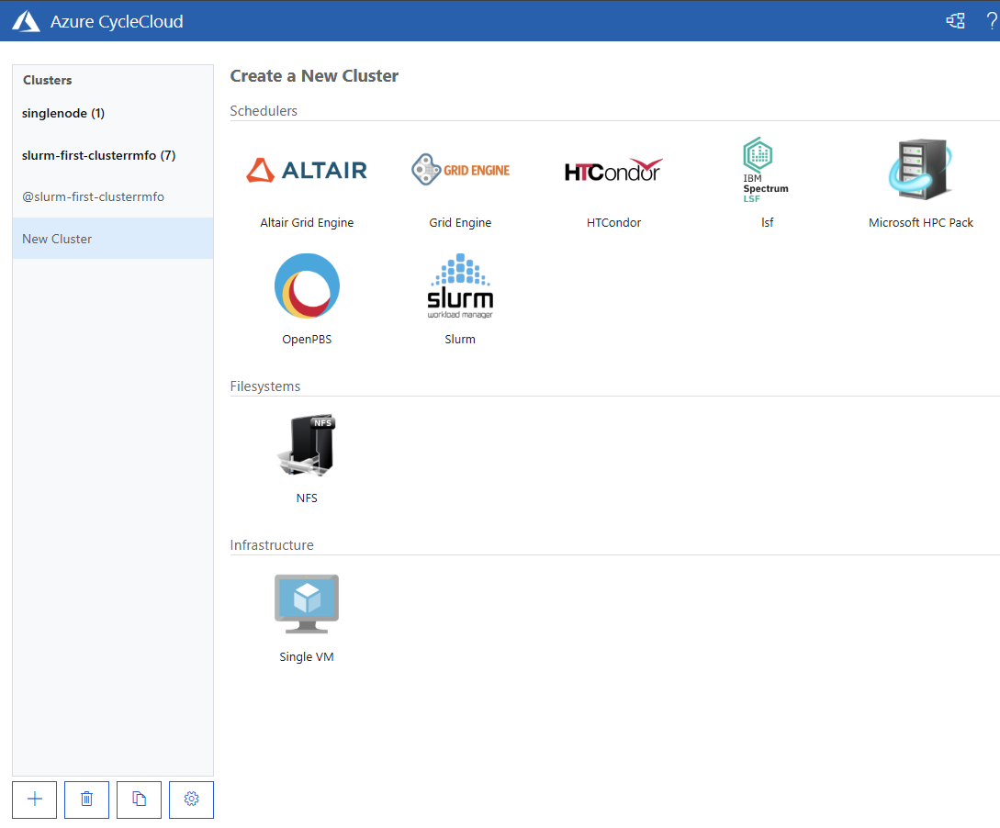
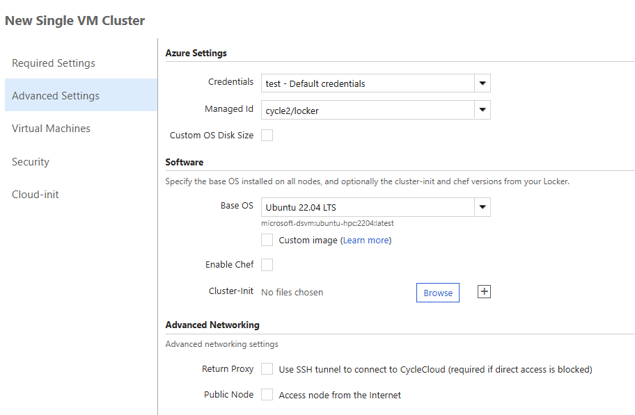
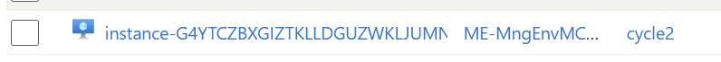

# 3-1. 싱글 노드 배포 (Single VM)

오토스케일 클러스터와 별개로, **독립 실행 VM 한 대**가 필요할 때가 있다. 데이터 이동·라이선스 서버·유틸리티 작업, 개발/테스트 용도가 대표적이다. CycleCloud는 이를 위한 **Single VM** 클러스터 유형을 제공한다. 이 문서는 포털(GUI)에서 Single VM을 생성하는 절차와, 기존 Slurm 클러스터에 **이름을 직접 지정한 단일 노드**를 템플릿으로 추가하는 방법을 다룬다.

> 표준 Slurm 클러스터 생성은 [3. 신규 클러스터 생성](03-신규-클러스터-생성.md)을 먼저 참고한다. 사전 리소스(Locker·Managed Identity·RBAC)는 3장과 동일하게 준비돼 있어야 한다.

---

## 3-1.1 포털에서 Single VM 생성

### 1. 클러스터 생성 화면에서 Single VM 선택

포털(`https://<서버-Public-IP 또는 DNS>`)에 접속한다. 자체 서명 인증서 경고가 나오면 **고급 → 계속**으로 진행한다. 좌측 하단 **`+`** 로 **Create a New Cluster** 를 연 뒤, **Infrastructure** 그룹에서 **Single VM** 을 선택한다.



### 2. 설정 입력 후 저장

표준 클러스터 생성과 유사하게 **Required Settings**, **Advanced Settings** 등을 채운 뒤 **Save** 를 누른다. 주요 항목은 다음과 같다.

| 항목 | 값 |
|------|-----|
| Credentials | 사용 중인 구독 자격증명 |
| Managed Id | 기존에 사용하던 **Locker UMI** 선택 |
| Base OS | 예: Ubuntu 22.04 LTS |
| Cluster-Init | 필요 시 Locker의 cluster-init 프로젝트 지정(선택) |



> Managed Id는 클러스터가 Locker에서 프로젝트를 내려받을 때 쓰인다. 3장에서 준비한 것과 동일한 Locker용 User-Assigned MI를 지정한다.

### 3. 배포 완료 후 노드 기동

저장하면 클러스터가 생성되고 우측에 노드 화면이 나타난다. **Start** 버튼을 누르면 VM이 생성된다. 상태는 `Off → Allocation → Installation → Started` 순으로 진행한다.


### 4. 생성 확인

기동이 완료되면 Azure 포털의 리소스 그룹에 노드 VM이 생성된다. VM 이름은 CycleCloud가 노드 ID(base32 suffix)를 붙여 자동 부여한다.



---

## 3-1.2 커스텀 명칭 단일 노드 (템플릿 방식)

포털 Single VM은 **템플릿에 정의된 노드 이름**(`instance`)으로 생성된다. **이름을 직접 지정한 단일 노드**(예: 데이터 이동·유틸리티용)를 **기존 Slurm 클러스터 안**에 추가하려면 GUI에 자유 입력 이름 필드가 없어 템플릿(`[[node <이름>]]`)으로만 가능하다.

### 1. 원본 템플릿에 블록 추가

`~/slurm.txt` 의 `[cluster Slurm]` 아래에서 기존 `node`/`nodearray` 와 같은 레벨에 블록을 추가한다. **다른 기존 블록은 삭제하지 않는다.**

```ini
[cluster Slurm]
    ...
    [[node scheduler]]                 # 기존
        ...
    [[node mynode]]                    # 새 노드(원하는 이름으로 치환)
    Extends = nodearraybase
    MachineType = Standard_D4s_v5
        [[[configuration]]]
        slurm.autoscale = false

    [[nodearray hpc]]                  # 기존(유지)
        ...
```

### 2. 반영 절차

CC 서버에서 현재 파라미터 값을 보존한 뒤 전체 템플릿을 import한다. 정의만 변경되며 **기존 실행 노드에는 영향이 없다.**

```bash
cyclecloud export_parameters <클러스터명> > ~/params.json
cyclecloud import_cluster <클러스터명> -c Slurm \
  -f ~/slurm.txt -p ~/params.json --force
```

새 노드는 브라우저(**Clusters → 클러스터 → 노드 목록 → `mynode` 선택 → Start**) 또는 CLI로 기동한다.

```bash
cyclecloud start_node <클러스터명> -n mynode
cyclecloud show_nodes -c <클러스터명> | grep mynode      # 상태 확인
```

> 노드명·hostname·Azure VM 이름의 관계(예: `ComputerName` 미지정 시 hostname 랜덤 부여, VM 이름에 base32 suffix 자동 부여), 회수·삭제 절차 등 실측 검증된 상세는 [운영 실습 가이드 §8. 커스텀 명칭 단일 노드 추가](CycleCloud-운영-실습-가이드.md#8-커스텀-명칭-단일-노드-추가-템플릿-방식)에 정리돼 있다.

---

## 참고 자료

- [3. 신규 클러스터 생성](03-신규-클러스터-생성.md) — 표준 Slurm 클러스터 생성 절차
- [운영 실습 가이드 §8](CycleCloud-운영-실습-가이드.md#8-커스텀-명칭-단일-노드-추가-템플릿-방식) — 템플릿 방식 단일 노드(실측 검증)
- [CycleCloud 클러스터 템플릿 (Microsoft Learn)](https://learn.microsoft.com/azure/cyclecloud/how-to/cluster-templates)

---

다음 단계: [4. Cluster-Init 및 커스텀 스크립트](04-cluster-init-및-커스텀-스크립트.md)
