# 3. CycleCloud 신규 생성 및 최초 클러스터 구축 (First-Time Setup)

이 문서는 요청사항 **"Cycle cloud 신규 생성"** 에 해당하는 표준 운영 절차(SOP)이다. 사전 리소스와 RBAC 준비, 사이트 초기화, 최초 Slurm 클러스터 생성과 기동, 스케줄러 접속 검증까지 다룬다.

> 개념(노드 유형, 아키텍처, 네트워크)은 [1. HPC & CycleCloud 아키텍처](01-HPC-및-CycleCloud-아키텍처.md), Slurm 명령은 [2. Slurm 개념 및 사용 가이드](02-Slurm-개념-및-사용-가이드.md)를 참고한다.

## 목적

CycleCloud 서버에서 첫 Slurm 클러스터를 생성하고 기동한 뒤, 스케줄러 노드에 접속해 정상 동작을 검증하는 표준 절차이다. 신규 환경을 처음 구축하거나 새 클러스터를 추가할 때 사용한다.

## 사전 조건

- Azure 구독에서 VM, 네트워크, Storage, Managed Identity, 역할 할당을 생성하고 변경할 권한.
- CycleCloud 서버 VM 과 계산 노드용 서브넷 준비(서버와 노드가 동일 VNet 또는 PE/DNS 로 연결).
- Locker 용 Storage Account 와 컨테이너, 관리 ID, RBAC 준비(§3.1).
- 노드 접속용 SSH 키페어와 포털 접속 경로(HTTPS 443).
- 잠긴 망이면 ARM, Entra ID, Storage, Azure Monitor 아웃바운드 엔드포인트 허용.

## 절차

### 3.1 사전 리소스 및 RBAC 준비

서버가 노드를 만들고, 노드가 Locker 에서 프로젝트를 내려받으려면 아래 아이덴티티와 권한이 필요하다. 구성요소 개념은 [1장 §1.4~1.5](01-HPC-및-CycleCloud-아키텍처.md#14-azure-cyclecloud-란)를 참고한다.

| 아이덴티티 | 역할 | 범위 | 용도 |
|---|---|---|---|
| 서버 시스템 MI (`<서버VM>`) | Contributor | 구독(또는 대상 RG) | 노드 VM, NIC, 디스크 생성과 삭제 |
| 서버 시스템 MI | Storage Blob Data Contributor | Locker 스토리지 | Locker 에 프로젝트 업로드(쓰기) |
| `locker-mi` (User-Assigned) | Storage Blob Data Reader | Locker 스토리지 | 노드가 Locker 에서 다운로드(읽기) |

> **순서 주의 (중요)**: **시스템 할당 MI(System MI)는 서버 VM이 생성된 뒤에야 존재**한다.
> 즉, principalId 가 VM 생성 시점에 발급되므로 서버 System MI 에 대한 역할 부여는 **VM 생성 이후에만** 가능하다.
> 반면 `locker-mi`(User-Assigned MI)는 VM과 무관하게 **먼저** 만들어 역할을 부여할 수 있다.
>
> 권장 순서: **① UMI·스토리지 선(先)생성 + 역할 부여 → ② 서버 VM 생성(System MI 활성화) → ③ 서버 System MI 역할 부여**

#### ① 서버 VM 생성 전 — locker-mi(UMI)와 스토리지 준비 (선행)

VM과 무관하게 수행할 수 있다.

- [ ] Locker 용 **User-Assigned MI**(`locker-mi`) 생성.
- [ ] Locker 용 **Storage Account** 생성.
- [ ] `locker-mi` 에 **Storage Blob Data Reader**(Locker 스토리지 범위) 부여.
- [ ] 스토리지 공용 접근 차단 시 **Private Endpoint 와 Private DNS** 구성.

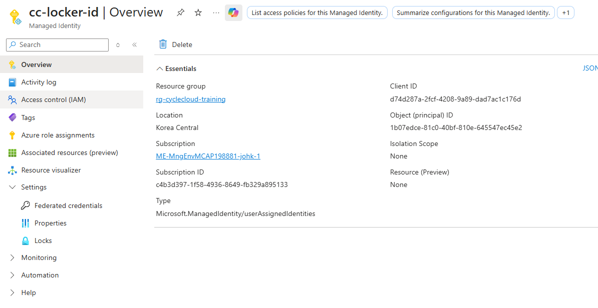

**Azure role assignments → Add role assignment** 에서 Locker 스토리지 범위로 역할을 부여한다.

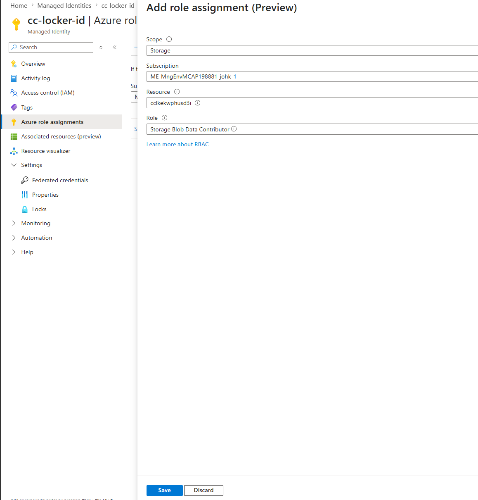

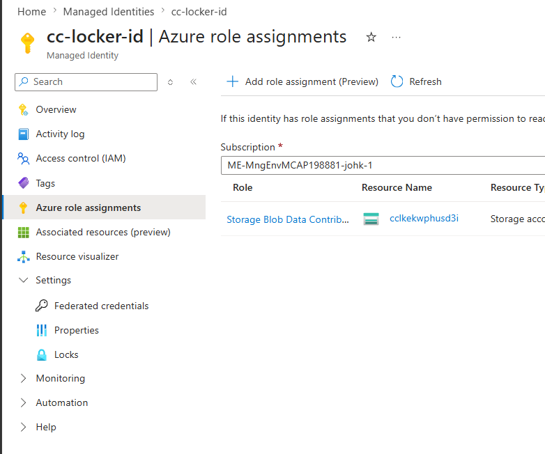

#### ② 서버 VM 생성 (System MI 활성화)

Marketplace **Azure CycleCloud** 이미지로 VM(최소 4 vCPU / 8GB)을 생성하고 **시스템 할당 MI** 를 활성화한다. 실습 환경의 서버(`<서버VM>`)는 이미 배포되어 있다.


#### ③ 서버 VM 생성 후 — System MI 역할 부여

System MI 의 principalId 는 VM 생성 후 발급되므로, 아래 역할은 **VM 생성 이후** 부여한다.

- [ ] 서버 System MI → **Contributor**(구독 또는 대상 RG 범위) — 노드 VM·NIC·디스크 생성용.
- [ ] 서버 System MI → **Storage Blob Data Contributor**(Locker 스토리지 범위) — 프로젝트 업로드용.

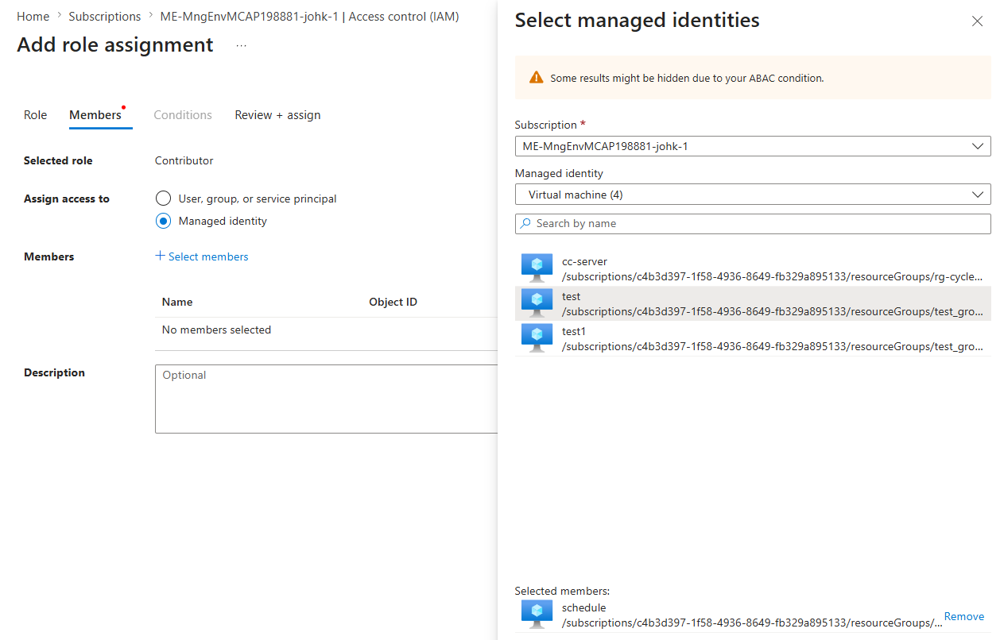

부여 결과는 CLI 로도 확인할 수 있다(반영에 수 분 소요).

```bash
az role assignment list --assignee <서버-MI-objectId> --all -o json
```

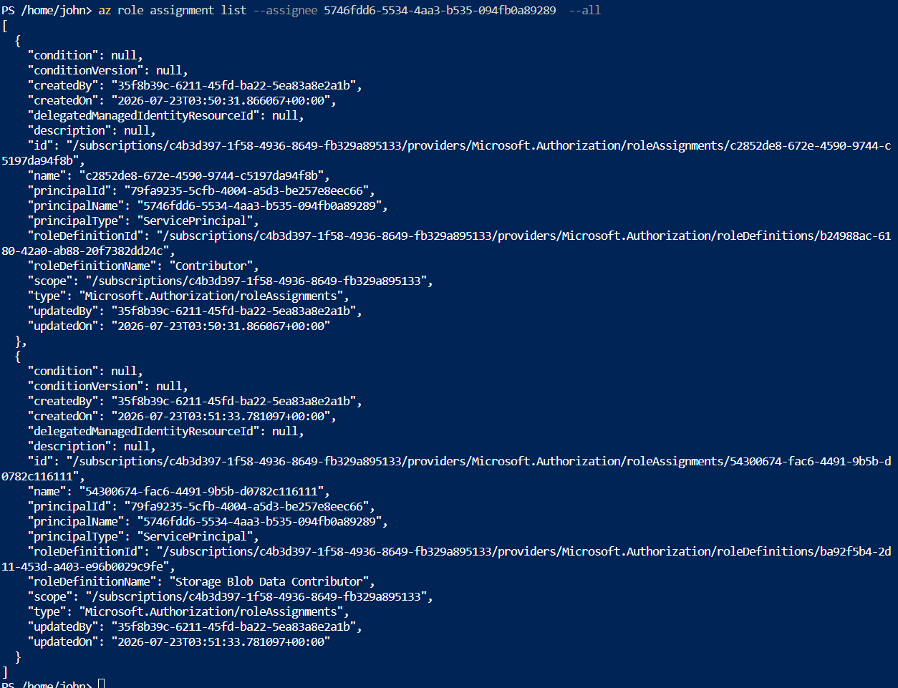

---

### 3.2 사이트 초기화 및 구독 등록

서버 최초 1회 설정이다.

1. 브라우저로 `https://<서버-Public-IP-또는-DNS>` 접속하고 자체 서명 인증서 경고는 **고급 → 계속** 진행한다.
2. **관리자 계정 생성** (Site Name, User ID / Password).

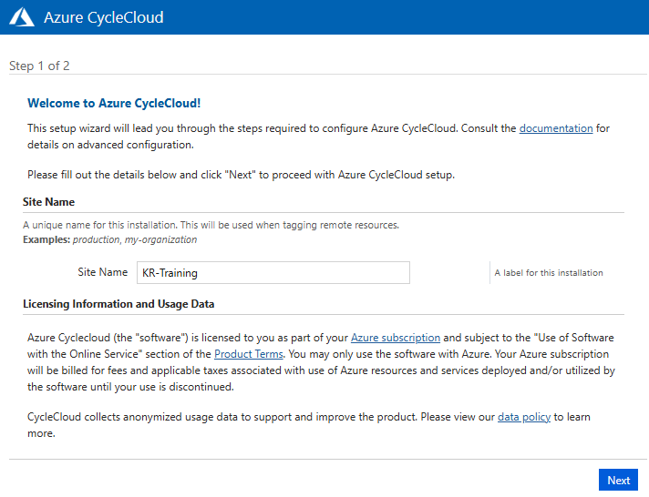

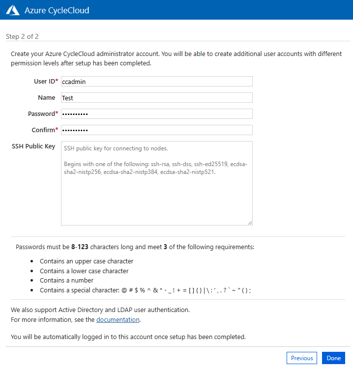

3. **Subscription 등록**: Settings → Subscriptions. Service Type = **Managed Identity**, 구독 ID, Default Region, 노드용 Resource Group, Locker Storage, Locker Identity(`locker-mi`)를 입력하고 **Validate Credential** → **Save**를 클릭한다.

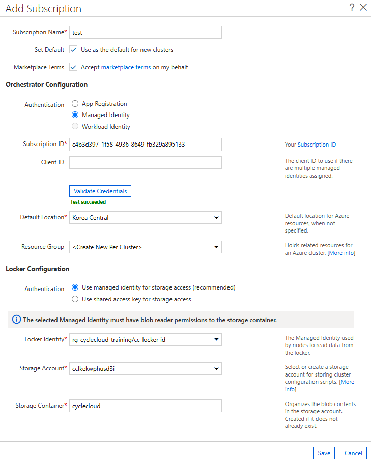

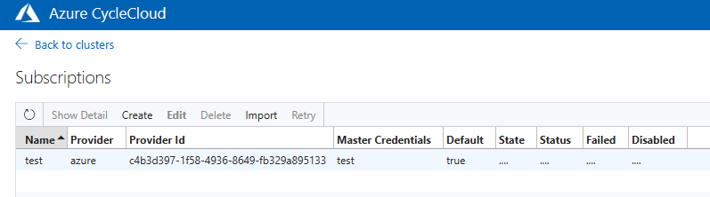

4. **SSH 키페어 생성 및 공개키 등록(필수)**

   노드에 접속하려면 SSH 키페어(공개키/개인키)가 필요하다. 로컬 PC(또는 서버)에서 키페어를 생성한다. 이미 키가 있으면 생성은 건너뛰고 공개키만 등록한다.

   **Linux / macOS / WSL**
   ```bash
   # -t 키 타입, -b 비트 수, -f 저장 경로, -C 주석(라벨)
   ssh-keygen -t rsa -b 4096 -f ~/.ssh/cyclecloud_rsa -C "cyclecloud-node"
   # 생성물: ~/.ssh/cyclecloud_rsa (개인키), ~/.ssh/cyclecloud_rsa.pub (공개키)

   # 등록할 공개키 출력 (ssh-rsa AAAA... 형태의 한 줄)
   cat ~/.ssh/cyclecloud_rsa.pub
   ```

   **Windows PowerShell**
   ```powershell
   ssh-keygen -t rsa -b 4096 -f $env:USERPROFILE\.ssh\cyclecloud_rsa -C "cyclecloud-node"
   # 등록할 공개키 출력
   Get-Content $env:USERPROFILE\.ssh\cyclecloud_rsa.pub
   ```

   > **개인키(`cyclecloud_rsa`)는 절대 공유하거나 업로드하지 않는다.** 포털에는 반드시 `.pub`(공개키)만 등록한다.

   그다음 우상단 **My Profile → SSH Public Keys** 에 위에서 출력한 **공개키 전체 한 줄**(`ssh-rsa AAAA...`)을 붙여넣어 등록한다. 키는 **노드 부팅 시 주입**되므로 클러스터 시작 전에 등록해야 하며, 미등록 시 노드 접속이 `Permission denied (publickey)` 로 실패한다.

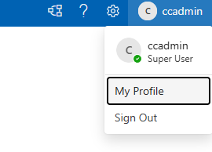

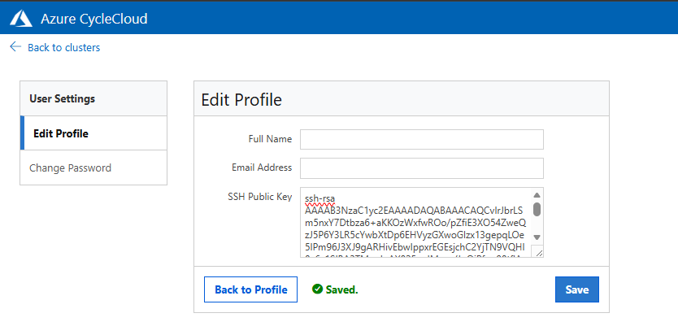

> Validate 가 실패하면 서버 MI 의 Contributor, Storage Blob Data Contributor 반영을 기다렸다 재시도한다(§3.1).

---

### 3.3 최초 Slurm 클러스터 생성

1. **Clusters → `+` → Slurm** 을 선택한다.
2. **About**: Cluster Name(예: `slurm-first-cluster`).
3. **Required Settings**: 아래 값을 지정한다.

| 항목 | 값(예) | 설명 |
|---|---|---|
| Region | 배포 리전 | 클러스터 리소스가 생성될 Azure 리전 |
| Scheduler VM Type | `Standard_D4s_v5` | `slurmctld` 가 상주하는 노드(1대), 안정적인 범용 SKU 권장 |
| HPC / HTC VM Type | `Standard_D4s_v5`(실습) 또는 IB/GPU SKU(운영) | 계산 노드 SKU. HPC=IB/RDMA, HTC=범용 |
| Max HPC / HTC Cores | `100` | 파티션 자동확장 상한(코어 수) |
| Max VMs per Scaleset | `40` | VMSS(=IB fabric) 경계 = 단일 MPI 작업의 최대 노드 규모 |
| Subnet | 계산 노드용 서브넷(예: `compute`) | 스케줄러와 계산 노드가 위치할 서브넷 |
| Autoscale | Enabled | 작업 큐에 따라 노드 자동 생성과 삭제 |

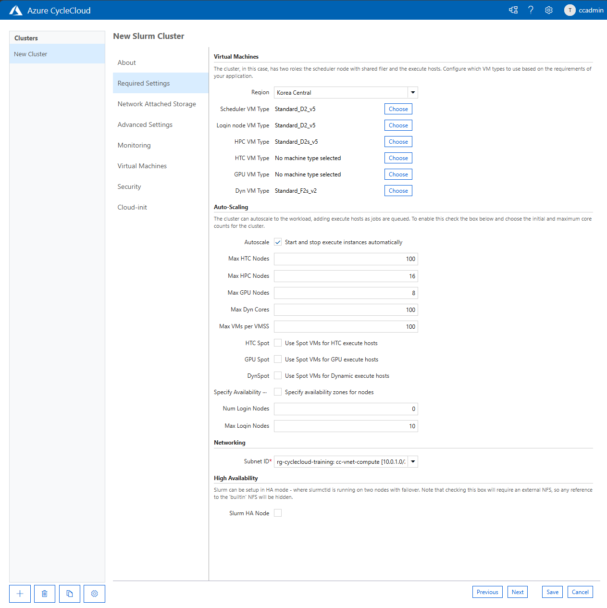

**노드 유형(VM Type)별 역할**

| 노드 유형 | 역할 | 스케일 | 권장 SKU |
|---|---|---|---|
| **Scheduler** | `slurmctld` 구동, `/shared` 와 `/sched` NFS 제공(클러스터의 두뇌) | 1대 상주 | 안정 범용(D 계열) |
| **Login** | 사용자 SSH 접속과 작업 제출(`sbatch`), 컴파일용(계산은 안 함) | 0~N(옵션) | 범용 |
| **HPC** | **긴밀결합(MPI)** 작업용, 노드 간 저지연 통신이 필요한 병렬 작업 | Autoscale | **InfiniBand/RDMA**(HB, HC, ND) |
| **HTC** | **느슨결합(독립 태스크)** 배치잡용, 노드 간 통신이 거의 없는 작업 | Autoscale | 범용(IB 불필요) |
| **GPU** | GPU 작업. `gres/gpu` 로 GPU 개수 스케줄링 | Autoscale | NC, ND, NG |
| **Dyn** (Dynamic) | 런타임에 유형을 유연하게 붙이는 동적 파티션(혼합 SKU, 특수 워크로드) | Autoscale | 혼합/특수 |

> **HPC = 서로 통신하는 묶음 노드(MPI)**, **HTC = 서로 독립적인 작업**. 자세한 개념은 [1장 §1.2](01-HPC-및-CycleCloud-아키텍처.md#12-hpc-클러스터의-노드-유형).

4. **Network Attached Storage**: NFS Type = `Builtin`, Size(GB)를 지정한다(스케줄러가 `/shared` 와 `/sched` 제공).

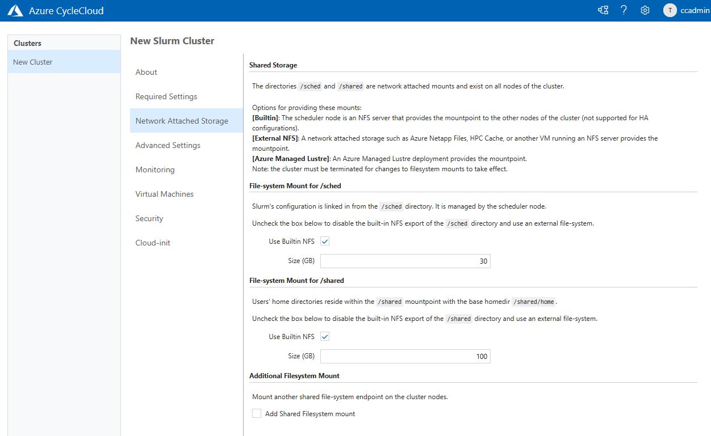

5. **Advanced Settings** — 아이덴티티 2개를 반드시 지정한다. 주요 필드는 아래와 같다.


**Slurm Settings**

| 항목 | 설명 |
|---|---|
| Slurm Version | 설치할 Slurm 버전 |
| Job Accounting | `sacct` 작업 회계 활성화(→ [11장](11-Job-Accounting-설정.md)) |
| Enable Termination Protection | 노드 우발 삭제 방지(기본 `false`) |
| Slurm Configuration | `slurm.conf` 에 병합할 커스텀 설정(영구 반영, 예 `SuspendExcParts=hpc`) |
| Launch Parameters | Slurm 실행 파라미터(예 `use_interactive_step`) |

**Azure Settings**

| 항목 | 설명 |
|---|---|
| Credentials | §3.2 에서 등록한 구독. 서버 MI 가 노드를 생성한 뒤 프로젝트를 업로드(control plane) |
| Managed Id | 노드에 붙는 `locker-mi`. 부팅 시 Locker 다운로드(data plane). *8.7+/shared key 비활성화 환경 필수* |
| BootDiskSize | 노드 OS 디스크(GB). `0`=기본(→ [9장](09-디스크-사이즈-변경.md)) |
| Enable Dynamic Partition | dynamic 파티션 생성 |
| VM Tags | 노드 VM 태그(비용, 거버넌스) |

**Software**

| 항목 | 설명 |
|---|---|
| Node / Scheduler Hostname | 노드 호스트명 규칙(기본 클러스터 접두사) |
| Scheduler / Login / HPC / HTC / GPU OS | 노드 유형별 OS 이미지(기본 `Ubuntu 22.04 HPC`). 커스텀 이미지 사용 시 **Custom image** 체크 |

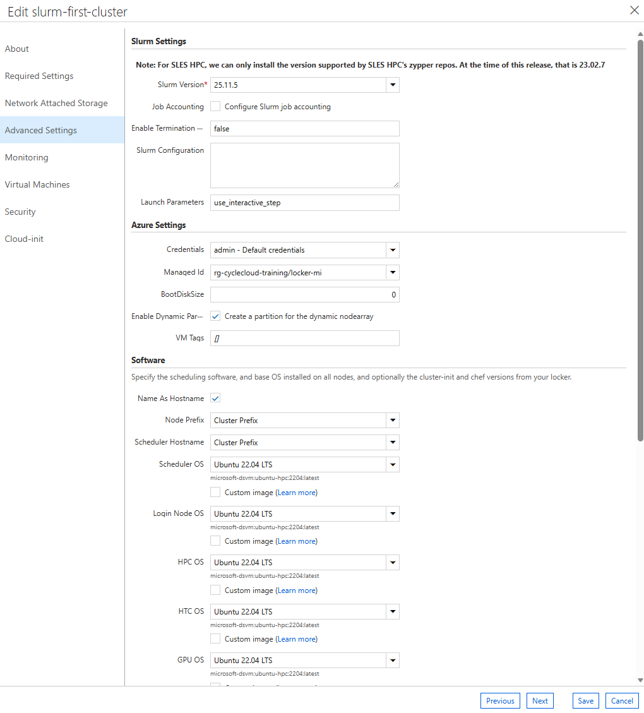

Advanced Settings 하단에는 Cluster-Init 첨부, Node Health Checks, Advanced Networking(Return Proxy, Public Head Node, Scheduler Zone) 항목이 있다.

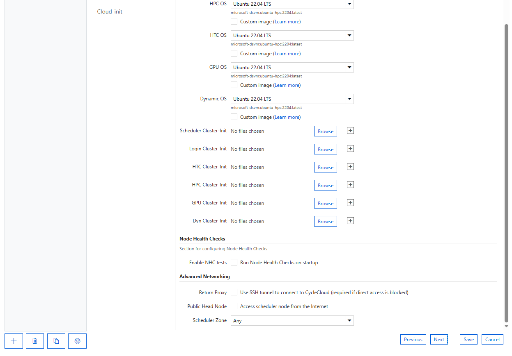

> ⚠️ Managed Id 드롭다운에서 **다른 RG 의 옛 MI** 를 고르지 말고 §3.1 의 `locker-mi` 를 선택한다(오선택 시 노드 다운로드 `403`).

6. **기타 탭(선택)** — 기본값으로 두어도 되며 필요 시 조정한다.

- **Monitoring**: Prometheus/Grafana 연동(→ [12장](12-모니터링.md)).
- **Virtual Machines**: VMSS Upgrade Policy 등 VM 세부 옵션.
- **Security**: Security Type, OS 디스크 암호화.
- **Cloud-init**: 노드 부팅 시 실행할 cloud-init 스크립트.

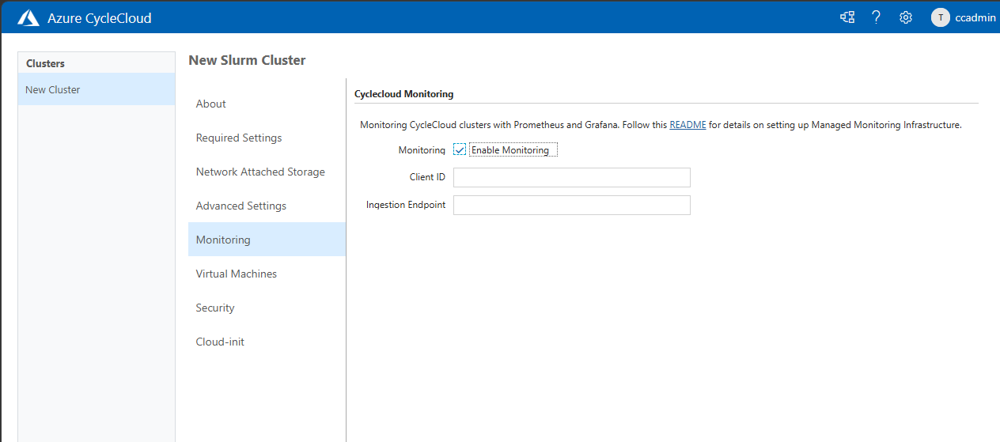

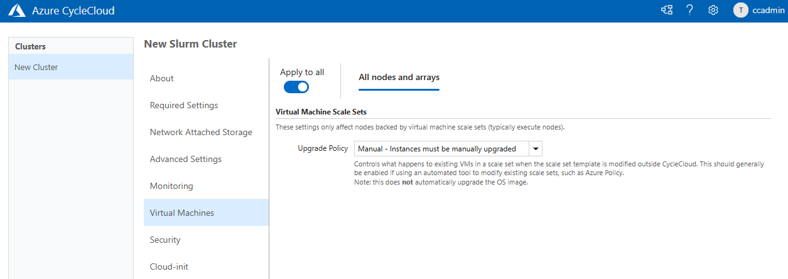

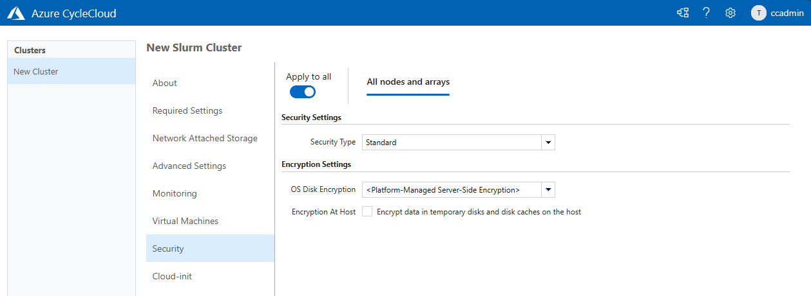

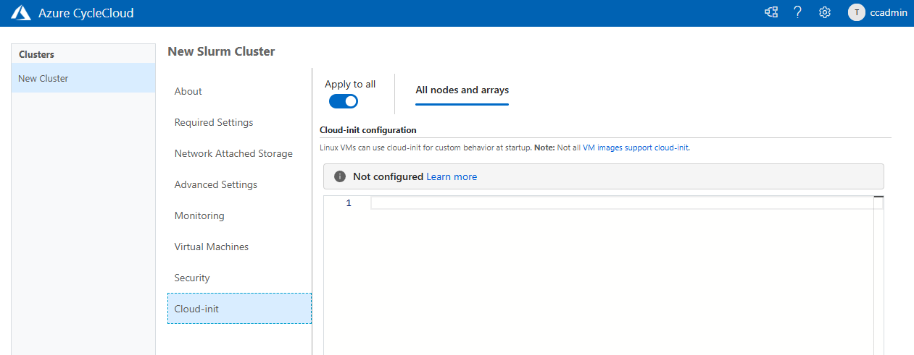

7. **Save**를 클릭한다. (클러스터는 `Off` 상태로 등록된다.)

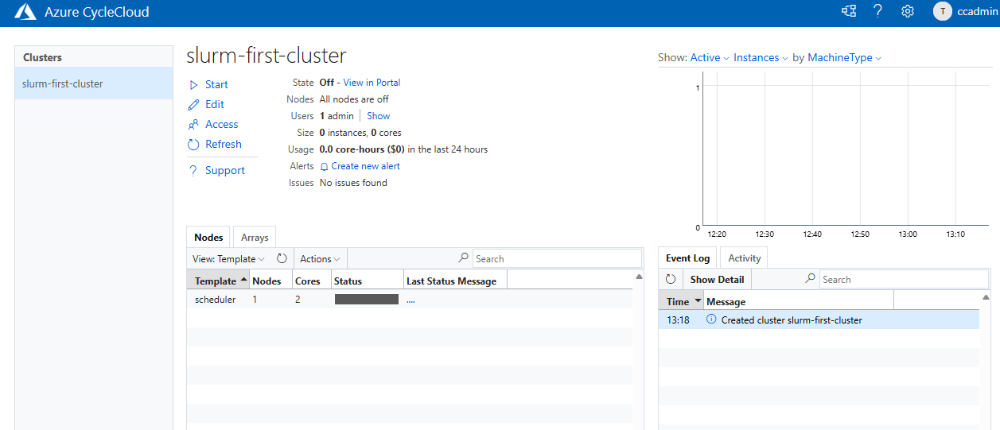

---

### 3.4 클러스터 기동 (Start)

1. (권장) 클러스터 페이지에서 **Budget Alert** 를 설정한다.

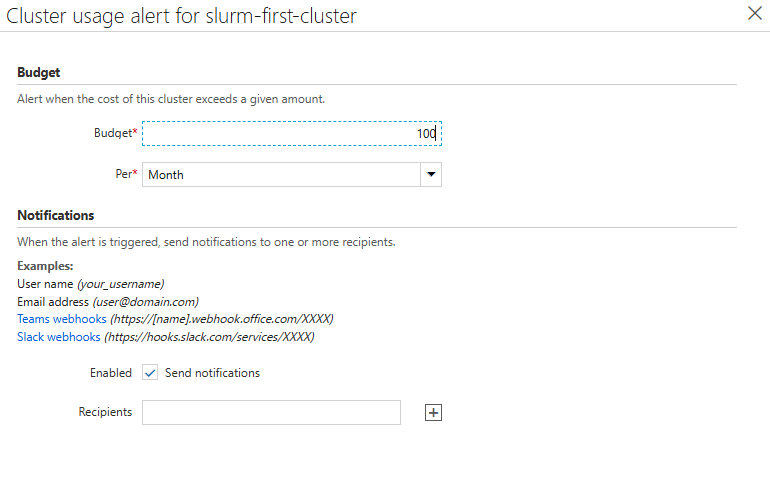

2. **Clusters → 클러스터 선택 → Start → OK**.

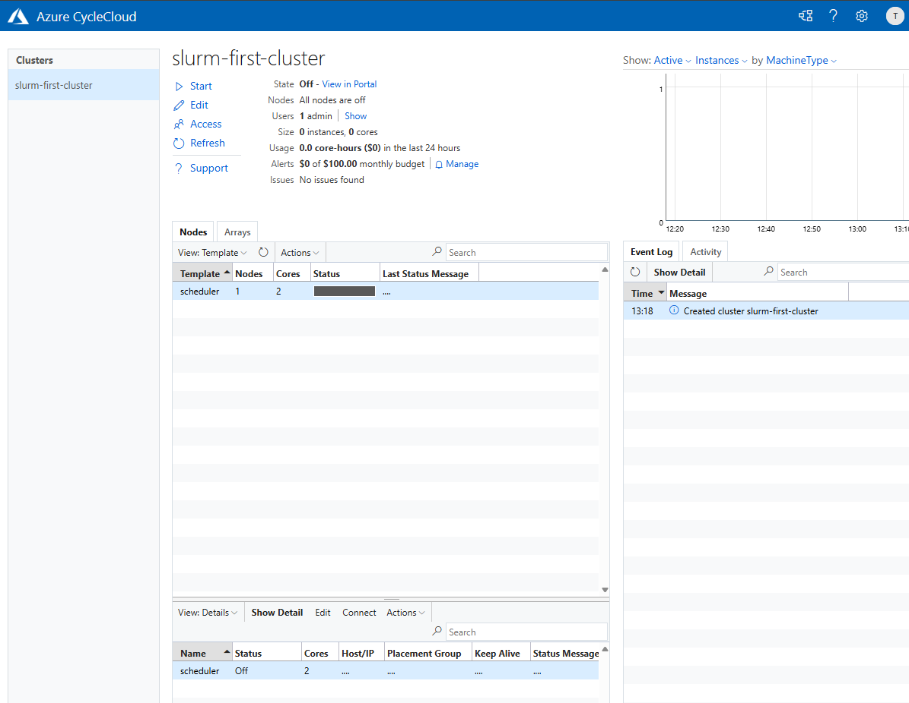

3. 상태 전이를 확인한다.

```
[Off] → [Acquiring] → [Preparing] → [Ready]
 (중지)   (VM 생성)      (부팅/설정)     (작업 수용)
```

포털 **Nodes** 탭 또는 서버에서 CLI 로 확인한다.

```bash
cyclecloud show_cluster slurm-first-cluster
cyclecloud show_nodes -c slurm-first-cluster
```

---

### 3.5 스케줄러 접속 및 검증

관리자 검증 흐름은 **① CycleCloud 서버 VM 접속, ② 서버에서 스케줄러 노드 접속, ③ 클러스터 확인** 순서이다.

1. **CycleCloud 서버 VM 에 SSH 접속** 한다(CLI 가 설치되고 인증된 위치).

```bash
ssh -i <SSH키> <서버관리자>@<서버IP>
# CLI 인증이 안 돼 있으면 최초 1회 (batch 모드 예시):
#   cyclecloud initialize --batch --url=https://localhost:9443 --verify-ssl=false \
#     --username='<포털관리자ID>' --password='<포털관리자PW>'
```

2. **서버에서 스케줄러 노드로 접속** 한다.

```bash
cyclecloud connect scheduler -c slurm-first-cluster
```

> `Permission denied (publickey)`는 §3.2 의 4) SSH 공개키 등록이 누락된 경우이며, 등록 후 노드를 재기동해야 한다.

3. **클러스터와 파티션 상태를 확인**한다.

```bash
sinfo
# PARTITION AVAIL  TIMELIMIT  NODES  STATE NODELIST
# hpc*         up   infinite    ...  idle~ slurm-first-cluster-hpc-[...]
```

4. **작업 실행을 검증**한다(자동확장 동작 확인).

```bash
srun -N1 hostname            # 계산 노드 1대를 할당받아 hostname 확인
sbatch --wrap="hostname"     # 배치 제출 → squeue 로 상태, 출력 파일로 결과 확인
```

---

### 3.6 클러스터 종료 및 정리

- 클러스터 페이지 **Terminate → OK** (노드 리소스 해제, 약 5분).
- 환경 전체 삭제 시 서버 RG 와 **클러스터 이름으로 시작하는 RG**(디스크 등)를 함께 삭제한다.

> ⚠️ Terminate 는 노드 **삭제**다. 단순 재부팅 목적으로 쓰지 않는다(GPU/RI 용량 재획득 실패 위험). 재부팅이 필요하면 CC GUI에서 재부팅하고자 하는 노드를 선택하고 Restart를 누른다.

---

## 검증

- 포털에 관리자 계정으로 로그인되고 Subscription 과 Locker 가 정상 상태로 표시된다.
- `cyclecloud show_cluster` 와 포털 Nodes 탭에서 스케줄러와 계산 노드가 Ready/Idle 로 전환된다.
- 스케줄러 노드에서 `sinfo`, `squeue` 가 정상이고 `srun`/`sbatch` 테스트 작업이 완료된다.
- 노드 자동확장과 축소 이벤트가 예상대로 발생한다.

## 롤백, 주의

- 비용 방지를 위해 검증 후 Terminate 하고, 필요 시 클러스터 RG 와 디스크 리소스를 삭제한다.
- Terminate 는 노드를 삭제하는 작업이므로 단순 재부팅 목적으로 사용하지 않는다.
- `403` 또는 jetpack 설치 실패는 Locker PE, DNS, RBAC 문제이므로, 재시작 전 권한과 네트워크를 점검한다(→ [13장](13-트러블슈팅-로그.md)).
- 중복 Locker 또는 잘못된 구독 자격증명이 있으면 클러스터 설정에서 사용할 Locker 를 명시하거나 Settings 에서 정리한다.

## 관련 문서

- [1. HPC & CycleCloud 아키텍처](01-HPC-및-CycleCloud-아키텍처.md)
- [2. Slurm 개념 및 사용 가이드](02-Slurm-개념-및-사용-가이드.md)
- [4. cluster-init 및 커스텀 스크립트](04-cluster-init-및-커스텀-스크립트.md)
- [13. 트러블슈팅 및 로그 확인](13-트러블슈팅-로그.md)

다음 단계: [4. cluster-init 및 커스텀 스크립트](04-cluster-init-및-커스텀-스크립트.md)
