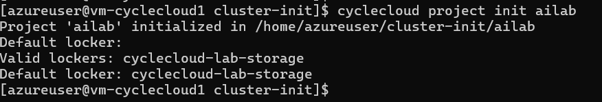
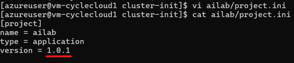
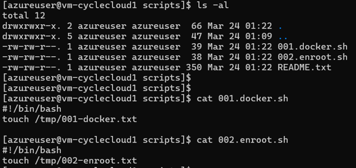
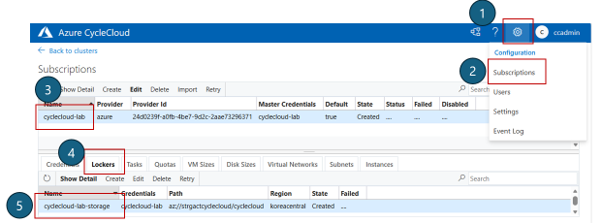
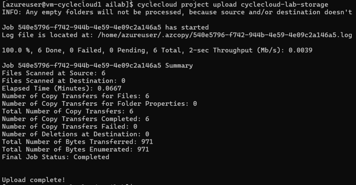
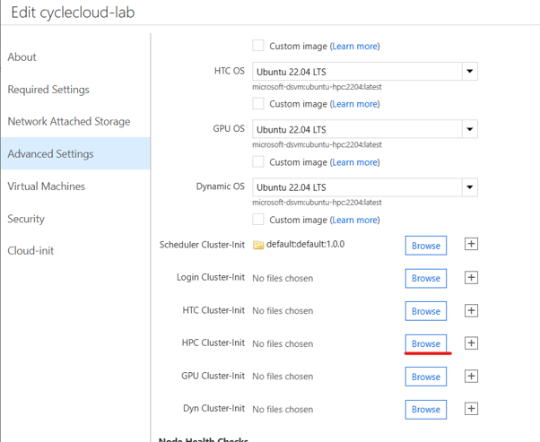

# 4. Cluster-Init 및 커스텀 스크립트

CycleCloud에서 노드 기동 시 스크립트를 실행하는 방법은 **cloud-init** 과 **cluster-init** 두 가지가 있다.

- cloud-init을 수정하면 전체 클러스터 재기동이 필요(CycleCloud 8.3 기준)하여 운영 중인 클러스터에 영향을 줄 수 있다.
- 따라서 특별한 이유가 없다면 **cluster-init을 사용한다.**

---

## 목적

CycleCloud 노드 구성 스크립트를 cloud-init 대신 cluster-init 프로젝트로 작성, 버전 관리, 업로드하는 표준 절차이다.
운영 중인 클러스터에 영향을 최소화하면서 패키지 설치, 파일 배포, 수렴 작업을 반복 적용해야 할 때 사용한다. cloud-init 불일치 오류를 피하고 노드 단위 재실행이 가능하도록 구성한다.

## 사전 조건

- CycleCloud 서버와 대상 클러스터가 준비되어 있고 CycleCloud 포털/CLI에 접근할 수 있을 것.
- CycleCloud CLI가 설치되어 있거나 설치 권한이 있을 것.
- 프로젝트를 저장할 Locker가 구성되어 있고 업로드 권한이 있을 것.
- 스크립트를 작성하고 검증할 셸 환경과 Git 또는 파일 버전 관리 절차가 준비되어 있을 것.
- 운영 클러스터에서는 cloud-init을 직접 수정하지 않는다는 운영 규칙을 준수할 것.

## 절차

### 4.1 cloud-init vs cluster-init

| 항목 | cloud-init | cluster-init (권장) |
|------|------------|---------------------|
| **제공 주체** | Azure / VMSS | CycleCloud 전용 |
| **실행 시점** | VM 최초 부팅 시 1회 | CycleCloud가 노드를 구성(converge)할 때마다 |
| **설정 방식** | YAML (user-data) | 셸 스크립트 + spec 디렉터리 구조 |
| **재실행** | 불가 | **스크립트 파일명 단위로** 노드당 1회 실행, 이후 converge 는 건너뜀. 파일명을 바꾸거나 새 스크립트를 추가하면 실행됨 ¹ |
| **버전 관리** | 불가 | CycleCloud 프로젝트 단위로 관리 및 배포 |
| **수정 시 영향** | 전체 클러스터 재기동 필요 | 개별 노드 단위 적용 가능 |

> **운영 규칙: cloud-init 수정 금지**
> 운영 중인 클러스터에서 노드 구성 스크립트를 작성할 때는 **반드시 cluster-init 프로젝트 방식**을 사용한다.

---

### 4.2 Cluster-Init 프로젝트 생성 및 업로드

cluster-init은 버전 관리가 되므로 GitHub에서 관리하거나, CycleCloud 서버에서 직접 작성하는 것을 권장한다.

#### 1) CycleCloud CLI 설치 및 초기화

CLI가 없으면 설치한다. [CycleCloud CLI 설치 가이드](https://learn.microsoft.com/azure/cyclecloud/how-to/install-cyclecloud-cli?view=cyclecloud-8)를 참고한다.

설치 후 서버에 연결한다.

```bash
cyclecloud initialize
```

#### 2) 프로젝트 초기화

CycleCloud Server VM에서 프로젝트를 생성한다.

```bash
mkdir -p ~/cluster-init && cd ~/cluster-init
cyclecloud project init <프로젝트명>
```



생성되는 디렉터리 구조는 다음과 같다.

```
<프로젝트명>/
├── project.ini                     # 프로젝트 이름 및 버전 관리 파일
└── specs/
    └── default/
        └── cluster-init/
            ├── scripts/            # 실행할 셸 스크립트 (파일명 순서대로 실행)
            ├── files/              # 노드로 배포할 파일
            └── tests/              # 테스트 스크립트
```

#### 3) 버전 관리

`project.ini` 파일에서 버전을 관리한다. 기존 프로젝트를 수정할 때는 **버전을 올려서** 배포한다.

```bash
vi <프로젝트명>/project.ini
```

예를 들어 `version = 1.0.0` → `1.0.1` 로 변경한다.



#### 4) 스크립트 작성

`specs/default/cluster-init/scripts/` 에 스크립트를 추가한다. 파일명 순서대로 실행되므로 `01-`, `02-` 등의 접두사를 붙이는 것을 권장한다.

```bash
# 예시: specs/default/cluster-init/scripts/01-install-packages.sh
#!/bin/bash
set -e
yum install -y htop tmux jq
```



#### 5) 업로드

cluster-init은 **Locker로 지정된 Blob Storage**에 업로드된다.

Locker 이름을 확인한다.

```bash
cyclecloud locker list
# 예: cyclecloud-lab-storage (az://storagecycle/cyclecloud)
```

UI에서도 **Settings → Lockers** 에서 확인할 수 있다.



프로젝트를 업로드한다.

```bash
cd ~/cluster-init/<프로젝트명>
cyclecloud project upload <locker명>
```



#### 6) 클러스터에 적용

포털에서 업로드한 프로젝트를 노드 배열에 연결한다.

> **Clusters → Slurm 선택 → Edit → Advanced Settings → 대상 파티션의 Cluster-Init → Browse**

1. 생성한 프로젝트(`<프로젝트명>`)를 선택한다.

2. 업로드한 버전(예: `1.0.1`)을 선택한다.

3. spec으로 `default` 를 선택한 뒤 **Select**를 클릭한다.

4. **Save**를 클릭한다.



---

### 4.3 스크립트를 추가·수정할 때

`.run` 마커는 **스크립트 파일명 단위**다. 따라서 다음 규칙을 따른다.
1. 기존 스크립트의 **내용만 수정**하면 이미 실행한 노드에서는 다시 실행되지 않는다 → 반영하려면 노드를 재생성한다.
2. **작업을 추가**할 때는 기존 파일을 고치지 말고 `02-`, `03-` 처럼 **새 파일명**으로 추가한다.
3. `project.ini` 의 **version 을 올려** 업로드한다.
4. 포털 **Cluster-Init → Browse** 에서 **새 버전으로 재지정**한 뒤 Save 한다.

```bash
# 예: /mnt/data2 마운트를 추가
cp specs/default/cluster-init/scripts/01-mount-data1.sh \
   specs/default/cluster-init/scripts/02-mount-data2.sh
vi specs/default/cluster-init/scripts/02-mount-data2.sh   # SRC/MP 수정
vi project.ini                                            # version = 1.0.1
cyclecloud project upload <locker명>
```

---

## 검증

- `cyclecloud locker list`로 업로드 대상 Locker가 보이는지 확인한다.
- `cyclecloud project upload <locker명>` 실행 후 포털 Cluster-Init Browse 화면에서 프로젝트명, 버전, spec이 표시되는지 확인한다.
- 노드에서 실행 여부를 확인한다.

  ```bash
  ls /mnt/cluster-init/<프로젝트>/<spec>/scripts/                     # 배포된 스크립트
  ls /mnt/cluster-init/.run/<프로젝트>/<spec>/scripts/                # 실행 이력 마커
  sudo grep -i cluster-init /opt/cycle/jetpack/logs/jetpack.log | tail -5
  ```

- 스크립트가 설치한 패키지, 배포 파일, 서비스 상태 등 기대 결과를 노드에서 직접 확인한다.

## 롤백·주의

- 문제가 있으면 `project.ini` 버전을 되돌리거나 정상 버전으로 올려 다시 업로드한 뒤 클러스터 설정에서 해당 버전을 선택한다.
- Cluster-Init 연결을 해제하려면 클러스터 Edit 화면에서 대상 파티션의 Cluster-Init 선택을 제거하고 저장한다.
- 파일명 순서대로 스크립트가 실행되므로 접두사 변경 시 실행 순서가 바뀌지 않도록 주의한다.
- cloud-init을 수정해 발생한 CloudInit mismatch는 임시 해소보다 cluster-init 전환으로 근본 해결하는 것을 우선한다.

## 관련 문서

- [CycleCloud CLI 설치 가이드](https://learn.microsoft.com/azure/cyclecloud/how-to/install-cyclecloud-cli?view=cyclecloud-8)
- [다음 단계: 노드 증설/감설 및 노드 사이즈 변경](05-노드-증감설-사이즈변경.md)

다음 단계: [5. 노드 증설/감설 및 노드 사이즈 변경](05-노드-증감설-사이즈변경.md)
