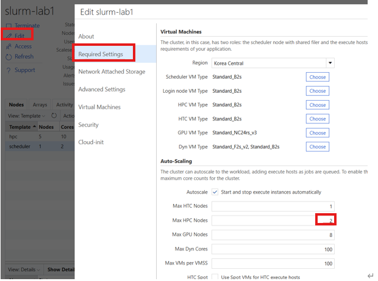
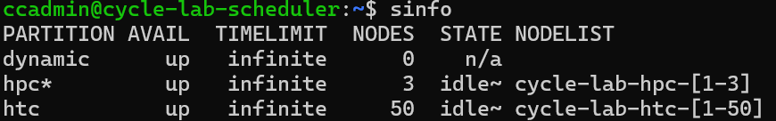

# 5. 노드 증설/감설 및 노드 사이즈 변경

## 목적

CycleCloud Slurm 클러스터에서 HPC 노드의 수량을 늘리거나(증설) 줄이고(감설), 노드를 할당하고 회수하며, VM SKU를 변경하는 절차이다. 자동 Scale-in을 방지하거나 파티션별 최대 수량을 조정할 때 사용한다. RI/GPU처럼 재할당 실패 위험이 큰 노드는 용량 유지 관점에서 특히 주의한다.

## 사전 조건

- CycleCloud UI에서 클러스터를 편집할 수 있는 권한이 필요하다.
- 스케줄러 노드에 SSH 접속하고 `sudo` 또는 `root` 권한으로 `scontrol`, `azslurm` 명령을 실행할 수 있어야 한다.
- 실행 중인 클러스터의 변경은 UI만으로 즉시 반영되지 않을 수 있으므로, 스케줄러 설정과 UI 값을 함께 관리한다.
- CycleCloud 8.6 이전은 count 값이 코어 수 기준이고, 8.7+ 부터는 인스턴스 수 기준이다.

> **버전별 스케일링 CLI 차이** — 아래 명령은 cyclecloud-slurm **3.0(CycleCloud 8.4.0)** 부터 제공되는 `azslurm` 기준이다. 그 이전 버전은 `azslurm` 이 없으므로 UI Save 후 클러스터 재시작 또는 `cyclecloud_slurm.sh` 를 사용한다.
>
> | cyclecloud-slurm | CycleCloud | 스케일링/설정 CLI | 노드 사전생성 |
> |---|---|---|---|
> | 2.x | ~8.3 | `/opt/cycle/slurm/cyclecloud_slurm.sh scale` (azslurm 없음) | O |
> | 3.0+ | 8.4.0+ | `azslurm scale` / `resume` / `suspend` / `partitions` | X (`azslurm resume` 시 생성) |
> | 4.0+ | 최신 | `azslurm` 유지 + `azslurmd` 데몬, `scale_m1`(GB200) 등 추가 | X |
>
> 설치된 버전은 스케줄러 노드에서 `sudo -i` 후 `azslurm version` 으로 확인한다. (3.0+ 부터 노드는 사전 생성되지 않고 `azslurm resume`, `srun`, `sbatch` 로 자원을 요청할 때 생성된다.)
- VM SKU 변경은 기존 노드 Terminate 후 새 노드 생성 시 반영되며, OS 디스크 크기 변경은 [9. 디스크 사이즈 변경](09-디스크-사이즈-변경.md)을 따른다.

## 절차

### 5.1 Scale-in 방지

Slurm은 필요할 때만 자원을 할당하고, 사용하지 않으면 자동으로 회수하여 비용 효율적으로 운영한다.

기본적으로 Suspend time이 **300초(5분)** 이므로, 노드에 Job이 할당되지 않으면 5분 내에 Scale-in 된다.

하지만 **Reserved Instance(RI) 계약**이 포함되어 Scale-in이 불필요한 경우에는 자동 축소를 방지해야 한다.

RI/GPU 노드는 자동 회수 후 재할당 시 용량 부족으로 실패할 위험이 크기 때문이다.

> **Quota ≠ Capacity**: Quota(구독 vCPU 상한)를 늘려도 Capacity(리전 물리 재고)가 없으면 재할당이 실패한다.
> RI는 요금 할인일 뿐 용량을 보장하지 않으며, 용량 보장은 **On-demand Capacity Reservation** 이 필요하다.
> ⚠️ CycleCloud UI의 `keep_alive` 옵션은 정상적으로 작동하지 않는다. (2025년 9월 기준) 따라서 아래 Slurm 설정으로 제외한다.

파티션별 Scale-in 제외는 스케줄러 노드의 `/etc/slurm/slurm.conf` 에서 설정한다.

```ini
# /etc/slurm/slurm.conf
SuspendExcParts=hpc      # hpc 파티션의 노드를 자동 축소 대상에서 제외
```

설정을 반영한다.

```bash
sudo scontrol reconfigure
```

> 개별 노드만 제외하려면 `SuspendExcNodes=<노드명>` 을 사용한다.

---

### 5.2 노드 수량 조정 (증설/감설)

> - 이미 동작 중인 클러스터에서는 UI로 조정해도 즉시 반영되지 않는다. 다만 나중에 있을 `azure.conf` 재생성(`azslurm scale` 또는 재시작)을 고려하여 **UI와 스케줄러 양쪽 모두** 반영하는 것을 권장한다.
> - CycleCloud 8.6 이전에는 count 값이 **코어 수** 기준이었으나, 8.7+ 부터는 **인스턴스 수** 기준이다.

**반영 방식 이해 — GUI 정의(원본) vs 스케줄러 `azure.conf`(실동작)**

- **CycleCloud GUI Auto-Scaling 값** 이 파티션 최대 수량의 **원본 정의**이다. 하지만 Save만으로는 동작 중인 클러스터의 스케줄러 설정 파일(`azure.conf`)에 즉시 반영되지 않는다.
- **`azure.conf` 손편집 + `sudo scontrol reconfigure`**: 스케줄러의 `/sched/<클러스터>/azure.conf` 를 직접 수정한 뒤 다시 읽는다.
- `scontrol reconfigure` 는 파일을 새로 만들지 않고 **현재 파일을 다시 읽기만** 하므로 증설과 감설 모두 **재시작 없이** 즉시 반영된다.
- 단, 증설은 **GUI에서 Max 수량을 올려야** CycleCloud가 그 노드를 프로비저닝한다(안 그러면 아래 `Unknown node name` 오류).
- **`azslurm scale`**: CycleCloud **정의를 기준으로 `azure.conf` 를 통째로 재생성**한다.
- GUI에서 Max를 올린 뒤 이 명령을 실행하면 **클러스터 재시작 없이** 증설이 반영된다. (클러스터 재시작도 같은 재생성을 하지만, 증감설만을 위해 재시작할 필요는 없다.)
- 본 문서는 **감설은 `azure.conf` 손편집 + `scontrol reconfigure`**, **증설은 GUI Save 후 `azslurm scale`**(또는 GUI Save 후 `azure.conf` 손편집 + `scontrol reconfigure`)를 기준으로 한다.

> **`azure.conf` 재생성 시 손편집 파티션 유실 주의**
> **`azslurm scale`**(또는 클러스터 재시작, 스케줄러 converge)은 CycleCloud 정의(GUI/템플릿)를 기준으로 `azure.conf` 를 다시 만들기 때문에, 정의에 없이 **`scontrol`, `azure.conf` 손편집으로만 만든 파티션과 노드는 이 시점에 사라진다.
> ** 고객이 임시로 손편집해 운영 중일 수 있으므로, 증설(재생성) 전에 `sinfo`, `scontrol show partition` 결과와 GUI의 nodearray 목록이 **일치하는지** 확인한다.
> GUI에 없는 파티션이 보이면 손편집분이며, 계속 필요하면 **CycleCloud 정의(GUI 값 또는 템플릿 `import_cluster`)로 이관**해야 한다. ([6.5 영구 파티션 추가](06-파티션-관리-및-추가.md#65-영구-파티션-추가-템플릿-기반-권장) 참고)

#### 1) 증설 (수량 늘리기)

증설은 **CycleCloud 정의(GUI Max)와 스케줄러 `azure.conf` 를 함께** 늘려야 한다.
GUI Max를 올리지 않고 `azure.conf` 범위만 `[1-3]` → `[1-4]` 로 손편집하면, Slurm은 노드를 알지만 CycleCloud가 프로비저닝을 거부해 아래 오류가 난다.

```
Error 'Unknown node name(s): cycle-lab-hpc-4'
```

1. **Clusters → 클러스터 → Edit → Required Settings → Auto-Scaling** 에서 최대 수량을 올린 뒤 **Save** (CycleCloud 정의 갱신).



2. 스케줄러 노드에서 새 노드 범위를 `azure.conf` 에 반영한다. **클러스터 재시작은 필요하지 않으며**, 다음 중 하나를 사용한다.

   - **(권장) `azslurm scale`** — CycleCloud 정의 기준으로 `azure.conf` 를 재생성한다.

     ```bash
     sudo -i
     azslurm scale
     ```

   - **또는 `azure.conf` 손편집 + reconfigure** — 범위를 직접 늘리고(예: `[1-3]` → `[1-4]`) 다시 읽는다. GUI Max를 이미 올렸으므로 이번에는 `Unknown node name` 오류가 없다.

     ```bash
     cyclecloud connect scheduler -c <클러스터명>
     sudo vi /sched/<클러스터명>/azure.conf   # 노드 범위 [1-3] → [1-4]
     sudo scontrol reconfigure
     ```

> `azslurm scale` 은 정의 기준으로 파일 전체를 재생성하므로 손편집으로만 만든 파티션은 사라질 수 있다.
> 손편집분을 유지해야 하면 reconfigure 방식을 쓰되, 근본적으로는 CycleCloud 정의로 이관한다.

늘어난 노드는 작업 제출(`srun`, `sbatch`) 또는 `azslurm resume`([5.3](#53-노드-할당-및-회수)) 시 실제로 생성된다.

#### 2) 감설 (수량 줄이기)

> 수량 정의를 줄여도 **이미 켜져 있는 VM은 꺼지지 않는다.
> ** 정의에서만 빠져 Slurm과 오토스케일러가 관리하지 못하는 **고아 VM(과금 지속)** 이 남을 수 있다. 반드시 아래 순서로 진행한다.


1. **돌고 있는 작업이 없는지 확인**한다. 작업이 실행 중인 노드를 회수하면 작업이 중단된다.

   ```bash
   squeue -p hpc                        # 해당 파티션에 RUNNING 작업이 없는지 확인
   squeue -w <클러스터>-hpc-<n>          # 특정 노드 기준 확인
   ```

   작업이 있으면 완료를 기다리거나, 새 배치를 막고 비운다.

   ```bash
   sudo scontrol update nodename=<클러스터>-hpc-<n> state=DRAIN reason="scale down"
   ```

2. **켜져 있는 노드를 내린다.** 정의가 남아 있을 때 회수해야 고아 VM이 생기지 않는다. [5.3](#53-노드-할당-및-회수)의 회수 또는 포털 Terminate를 사용한다.

   ```bash
   sudo -i
   azslurm suspend --node-list <클러스터>-hpc-<n>
   ```

3. **수량을 줄인다.** 감설은 이미 있는 범위를 줄이는 것이라 `scontrol reconfigure` 로 즉시 반영된다(증설과 달리 Unknown node 오류가 없다).

   - **즉시 반영**: 스케줄러 노드에 접속해 `azure.conf` 의 노드 범위를 줄이고(예: `[1-3]` → `[1-2]`) 다시 읽는다.

     ```bash
     cyclecloud connect scheduler -c <클러스터명>
     sudo vi /sched/<클러스터명>/azure.conf   # 노드 범위 축소
     sudo scontrol reconfigure
     ```

   - **영구 반영**: **Clusters → 클러스터 → Edit → Required Settings → Auto-Scaling** 에서 최대 수량을 낮추고 **Save** 한다.

> GUI Save 없이 `azure.conf` 만 편집하면, 이후 **`azslurm scale` 또는 클러스터 재시작(azure.conf 재생성)** 시 GUI 정의 기준으로 **이전 값으로 되돌아간다.
> ** 즉시 반영은 `azure.conf` 손편집 + `scontrol reconfigure`, 영구 반영은 GUI Save로 함께 처리한다.

---

### 5.3 노드 할당 및 회수

`azslurm` 명령으로 노드를 즉시 할당하거나 회수할 수 있다. 스케줄러 노드에서 `root` 로 실행한다.

현재 상태를 확인한다. (`idle~` 는 정지 상태)

```bash
sinfo
```



노드를 할당(기동)한다.

```bash
sudo -i
azslurm resume --node-list <클러스터명>-hpc-1
```

노드를 회수(삭제)한다.

```bash
azslurm suspend --node-list <클러스터명>-hpc-1
```

---

### 5.4 노드 사이즈(VM SKU) 변경

동작 중인 VM 크기는 실시간으로 변경되지 않는다. **SKU를 변경한 뒤 기존 노드를 Terminate하고 새 크기로 재생성**하는 순서로 진행하며, 반영 방식은 두 가지이다.

| 방식 | 정의 위치 | 지속성 | 적합한 경우 |
|---|---|---|---|
| **① GUI** | 클러스터 Edit → Machine Type | 영구(정의 반영) | 단일 배열, 빠른 변경 |
| **② 템플릿** | `slurm.txt` / `params.json` | 영구(IaC, 재현) | 코드 관리, 다중 배열 일괄 |

> SKU 변경과 **OS 디스크 크기 변경**은 별개이다. 디스크 크기는 [9. 디스크 사이즈 변경](09-디스크-사이즈-변경.md)을 참고한다.

#### 5.4.1 GUI 방식 (빠름)

1. **Clusters → 클러스터 → Edit** 로 이동한다.
2. 대상 배열의 **Machine Type** 을 변경한다. (예: `Standard_D4s_v5` → `Standard_D8s_v5`)
3. **Save**를 클릭한다.
4. **Arrays 탭**에서 기존 노드를 **Terminate** 한다. 다음 작업 제출 또는 `azslurm resume`([5.3](#53-노드-할당-및-회수)) 시 새 SKU로 생성된다.


#### 5.4.2 템플릿 방식 (영구, 재현)

템플릿의 **Machine Type 파라미터**(예: `HPCMachineType`) 값을 바꾸고 실행 클러스터에 재적용한다.
파라미터 구조는 예시 템플릿 [`templates/add-partition.txt`](../templates/add-partition.txt) 의 `[[[parameter XPUMachineType]]]` 블록을 참고한다.

```bash
cyclecloud export_parameters <클러스터명> > params.json
# params.json 에서 대상 배열의 MachineType 값 수정
#   (또는 slurm.txt 의 [[[parameter <Array>MachineType]]] DefaultValue 수정)
cyclecloud import_cluster <클러스터명> -c Slurm -f slurm.txt -p params.json --force
```

재적용 후 기존 노드를 **Terminate** 하면 다음 기동 시 새 SKU로 생성된다.

> RI/GPU 노드는 회수 후 재생성 시 용량 부족으로 실패할 수 있으므로, 변경 전 사전 용량을 확인한다([5.1](#51-scale-in-방지)).

#### 5.4.3 SKU 변경 후 `azslurm scale` 을 반드시 실행한다 (실측)

Slurm 클러스터에서는 SKU 를 바꾼 뒤 **`azslurm scale` 로 `azure.conf` 를 재생성하지 않으면**, 새 SKU 로 뜬 노드가 Slurm 에 **등록 거부**된다. `slurm.conf`/`azure.conf` 에 남아 있는 **이전 SKU 기준의 CPU·메모리 값**과 실제 노드 스펙이 달라지기 때문이다.

증상은 다음과 같다.

```bash
sinfo -N -o '%N %T'
# test-hpc-1 inval
# test-hpc-2 inval
```

```
# slurmctld.log
error: Setting node test-hpc-1 state to INVAL with reason:Low socket*core*thread count, \
  Low CPUs, Low RealMemory (reported:7934 < 90.00% of configured:15360)
drain_nodes: node test-hpc-1 state set to DRAIN
error: _slurm_rpc_node_registration node=test-hpc-1: Invalid argument
```

`scontrol show node` 의 `State` 에 `INVALID_REG` 가 함께 표시된다.

조치 순서이다.

```bash
# 1) [스케줄러] CycleCloud 정의 기준으로 azure.conf 재생성
sudo /opt/azurehpc/slurm/venv/bin/azslurm scale
sudo systemctl restart slurmctld

# 2) [각 노드] slurmd 재기동 → 새 스펙으로 재등록
sudo systemctl restart slurmd

# 3) [스케줄러] DRAIN 해제 후 복귀
sudo scontrol update nodename=<노드목록> state=undrain
sudo scontrol update nodename=<노드목록> state=resume
sinfo -N -o '%N %T %c %m'
```

> `azslurm` 은 PATH 에 없을 수 있다. 실제 경로는 `/opt/azurehpc/slurm/venv/bin/azslurm` 이다.
>
> `azslurm scale` 은 CycleCloud 정의 기준으로 `azure.conf` 를 통째로 다시 만들므로, **손편집으로만 만든 파티션·노드는 이 시점에 사라진다**([5.2](#52-노드-수량-조정-증설감설)).

---

## 검증

- `sinfo` 로 파티션의 노드 범위와 `idle~`, `idle`, `alloc` 상태가 예상대로 보이는지 확인한다.
- `scontrol show config | grep SuspendExcParts` 또는 `scontrol show config | grep SuspendExcNodes` 로 Scale-in 제외 설정을 확인한다.
- 노드 수량 조정 후 `azslurm resume --node-list <node>` 실행 시 새 노드가 정상 기동되는지 확인한다.
- VM SKU 변경 후 새로 생성된 노드의 Machine Type이 CycleCloud Arrays 탭 또는 Azure VM 정보에서 변경된 SKU인지 확인한다.
- SKU 변경 후 `sinfo -N -o '%N %T %c %m'` 로 노드가 `inval` 이 아니고 CPU/메모리 값이 새 SKU 와 일치하는지 확인한다(불일치 시 [5.4.3](#543-sku-변경-후-azslurm-scale-을-반드시-실행한다-실측)).

## 롤백·주의

- Scale-in 제외를 되돌리려면 `SuspendExcParts` 또는 `SuspendExcNodes` 설정을 제거하고 `sudo scontrol reconfigure` 를 실행한다.
- 파티션별 최대 수량은 CycleCloud UI 값과 `azure.conf` 범위를 이전 값으로 되돌린 뒤 `sudo scontrol reconfigure` 로 반영한다(증설 방향 복구는 GUI Save 후 `azslurm scale`).
- VM SKU를 되돌리려면 Machine Type을 이전 SKU로 저장하고 기존 노드를 Terminate하여 다시 생성한다.
- RI/GPU 노드는 `azslurm suspend`, Terminate, Stop(Deallocate) 후 재생성 시 용량 부족으로 실패할 수 있으므로, 자동 Scale-in 제외([5.1](#51-scale-in-방지))로 회수를 막고 불가피하게 재생성할 때만 사전 용량을 확인한다.

## 관련 문서

- [5.3](#53-노드-할당-및-회수)
- [9. 디스크 사이즈 변경](09-디스크-사이즈-변경.md)
- [6. 파티션 관리 및 추가](06-파티션-관리-및-추가.md)

다음 단계: [6. 파티션 관리 및 추가](06-파티션-관리-및-추가.md)
