# 6. 파티션 관리 및 신규 파티션 추가

## 목적

사용 중인 파티션의 노드를 공유하여 새로운 Slurm 파티션을 추가하는 절차이다. 
기존 nodearray의 VM을 논리적으로 공유하거나, 템플릿 기반으로 영구 파티션을 추가할 때 사용한다. 
수동으로 추가한 파티션은 특정 CycleCloud/azslurm 동작에서 초기화될 수 있으므로 영구 반영 여부를 함께 판단한다.

## 사전 조건

- 스케줄러 노드에 접속해 `azure.conf` 를 수정하고 `sudo scontrol reconfigure` 를 실행할 수 있어야 한다.
- 기존 노드를 공유하는 파티션인지, 전용 VM을 갖는 새 nodearray 파티션인지 결정해야 한다.
- 전용 VM을 갖는 새 nodearray 파티션은 GUI 또는 템플릿에서 Max Cores / Max VMs 설정이 필요하다.
- 영구 파티션 추가는 `cyclecloud export_parameters`, `cyclecloud import_cluster`, `azslurm scale` 명령을 사용할 수 있어야 한다.
- `azslurm` 은 venv에 설치되어 있어 일반 `sudo azslurm ...` 은 `command not found` 가 날 수 있다. **root 로그인 셸(`sudo -i`)** 에서 실행하거나 전체 경로(`sudo /opt/azurehpc/slurm/venv/bin/azslurm ...`)를 사용한다.
- 수동 편집한 파티션은 클러스터 Terminate 후 Start, `azslurm partition`, `azslurm scale` 동작 시 GUI 설정 템플릿 기준으로 초기화될 수 있다.

## 절차

파티션을 꼭 나눠야 하나요?

- 파티션 분리의 본질적 이유는 **① 하드웨어(VM 타입/GPU/InfiniBand)가 다르거나 ② 스케줄링 정책(우선순위, 시간 제한, 프리엠션)이 근본적으로 다를 때**이다.
- **단순히 팀별로 용량과 권한을 나누는 목적이라면 파티션을 늘리기 전에 아래를 먼저 검토한다.**

| 상황 | 권장 방식 |
|---|---|
| VM 타입 동일, 총 용량과 공정성만 조절 | **단일 파티션 + Max node count + Slurm QOS/fairshare** (파티션 추가 불필요) |
| 팀/계정별 사용량/우선순위 분리 | **slurmdbd Account/QOS**(`GrpTRES`, `MaxJobs`, fairshare) — [11. Job Accounting 설정](11-Job-Accounting-설정.md) 참고 |
| GPU/IB 등 **하드웨어가 다르거나 새 머신 타입 추가** | **새 파티션(nodearray)** → [6.5 영구 파티션 추가](#65-영구-파티션-추가-템플릿-기반-권장) |
| 특정 팀에 **노드 집합을 하드 격리 및 보장** | 파티션 + `AllowAccounts`/`AllowGroups`, 또는 **Reservation** |

-  같은 VM 타입에서 노드를 논리적으로만 쪼개는 파티션(§6.1)은 **정의에 없는 손편집이라 재생성 시 사라진다.
-  파티션 추가는 **하드웨어가 달라지거나 하드 격리가 필요할 때**로 한정하는 것을 권장한다.

### 파티션 추가 방식 

파티션을 추가하는 방법은 **성격이 완전히 다른 두 가지**가 있다. 목적에 맞는 방식을 선택한다.

| 구분 | **방식 A — 수동 편집 (임시)** | **방식 B — 템플릿 기반 (영구, 권장)** |
|---|---|---|
| 대상 절차 | **§6.1 ~ 6.4** | **[§6.5](#65-영구-파티션-추가-템플릿-기반-권장)** |
| 방법 | 스케줄러의 `/etc/slurm/azure.conf` 직접 편집 + `scontrol reconfigure` | 클러스터 템플릿(`slurm.txt`)에 새 nodearray 추가 후 `import_cluster` |
| 노드 | 기존 nodearray의 VM을 **논리적으로 공유**(전용 VM 없음) | 새 nodearray = **전용 VM/SKU/이미지** 지정 가능 |
| 영속성 | 클러스터 재시작이나 `azslurm scale` 시 **초기화되어 사라짐** | CycleCloud 정의에 포함되어 **영구 유지** |
| 적합한 상황 | 빠른 테스트, 같은 하드웨어의 임시 논리 분리 | 운영 반영, GPU/IB 등 **다른 하드웨어** 추가 |

> 잠깐 확인하거나 같은 VM을 논리적으로 나눠 쓰는 정도면 **방식 A(§6.1~6.4)**, 운영에 영구 반영하거나 다른 VM/GPU를 쓰는 파티션이면 **방식 B(§6.5)** 를 사용한다.

---

### 6.1 파티션 설정 (방식 A, 수동 편집)

스케줄러 노드에서 `azure.conf` 파일을 수정한다.

```bash
sudo vi /etc/slurm/azure.conf
```

기존 HPC 파티션 설정을 복사한 뒤 `PartitionName` 만 변경하여 추가한다.

```ini
# /etc/slurm/azure.conf

# 기존 hpc 파티션
PartitionName=hpc Nodes=cycle-lab-hpc-[1-3] Default=YES DefMemPerCPU=1536 MaxTime=INFINITE State=UP
Nodename=cycle-lab-hpc-[1-3] Feature=cloud STATE=CLOUD CPUs=2 ThreadsPerCore=1 RealMemory=3072

# 추가한 new 파티션 (hpc 노드를 공유)
PartitionName=new Nodes=cycle-lab-hpc-[1-3] Default=NO DefMemPerCPU=1536 MaxTime=INFINITE State=UP
```

설정을 반영한다.

```bash
sudo scontrol reconfigure
```

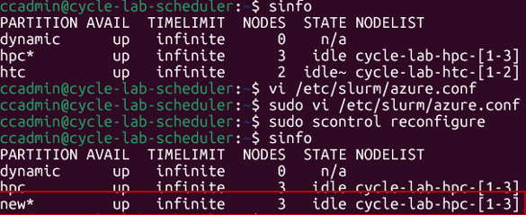

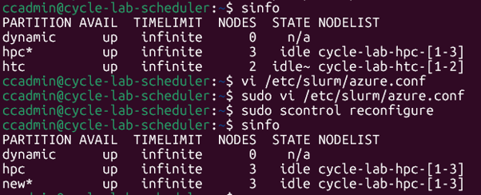

**GUI Max 노드 수정이 필요한가?**
- **기존 노드를 공유하는 파티션**(위 예시): 같은 nodearray의 VM을 빌려 쓰므로 **GUI 수정 불필요**.
- **전용 VM을 갖는 새 nodearray 파티션**: 자동확장 한도가 nodearray 단위이므로, GUI(또는 템플릿)에서 해당 배열의 **Max Cores / Max VMs** 를 지정해야 한다([6.5](#65-영구-파티션-추가-템플릿-기반-권장)).

---

### 6.2 단일 노드 제거 및 생성 시 동작 확인

`hpc` 노드 3대 중 1대를 제거한 뒤 다시 resume하여 정상 동작을 확인한다.

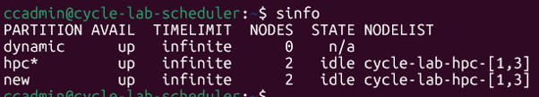

```bash
azslurm resume --node-list cycle-lab-hpc-1
```

노드 1대가 정상적으로 다시 기동되는지 확인한다.

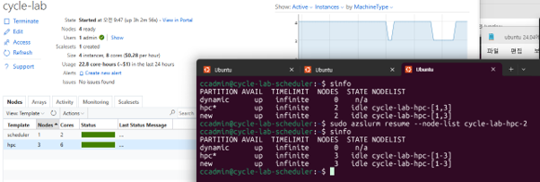

---

### 6.3 파티션별 Job 실행

파티션은 논리적으로 나뉘었지만 물리 VM은 공유하므로, 물리 자원(코어/메모리)의 제약을 받는다.

예를 들어 2 코어 VM 3대(총 6 코어) 환경에서 `--cpus-per-task=1` 로 Job을 실행하면, 최대 **6개 Job만 동시 수행**된다.

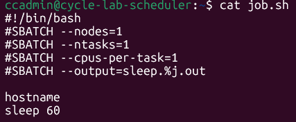

Job을 7번 제출하면 6개가 `RUNNING`, 1개는 `PENDING(Resources)` 상태로 대기한다.

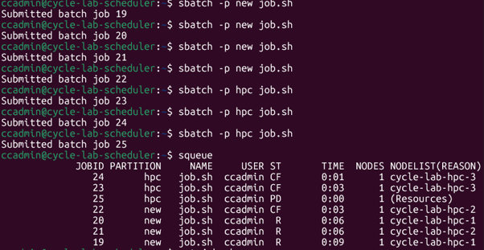

---

### 6.4 주의사항: 수동 파티션의 자동 초기화

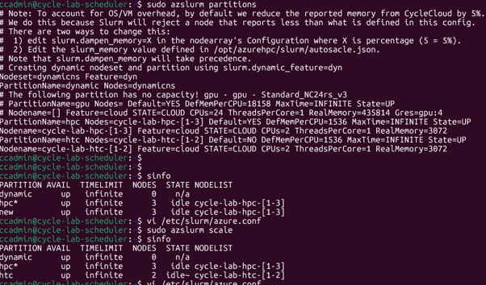

수동 편집한 파티션은 클러스터 재시작 또는 `azslurm` 설정 재생성 명령에서 초기화될 수 있다. 영구적으로 유지해야 하는 파티션은 템플릿 기반 절차를 사용한다.

---

### 6.5 영구 파티션 추가 (템플릿 기반, 권장)

**방식 B (영구).** 아래는 파티션을 **CycleCloud 정의에 영구 반영**하는 절차이다. (임시 방식은 §6.1~6.4)

- 6.1의 수동 편집(`azure.conf`)은 클러스터 재시작 시 CycleCloud 정의 기준으로 재생성되며 사라진다(6.4). 
- 영구적으로 파티션을 추가하려면 **클러스터 템플릿(`slurm.txt`)에 새 `[[nodearray]]` 를 정의**하고 실행 중인 클러스터에 재적용한다. 
- 아래 절차는 [Microsoft HPC 블로그](https://techcommunity.microsoft.com/blog/azurehighperformancecomputingblog/add-a-new-partition-to-a-running-cyclecloud-slurm-cluster/4209171)를 기준으로 하며, **클러스터를 종료하거나 재시작하지 않고** 새 파티션을 추가한다.

**참고** 
- CycleCloud의 **nodearray 1개 = Slurm 파티션 1개** 에 대응한다. 
- 따라서 영구 파티션 추가 = 템플릿에 nodearray 1개를 추가하고, GUI 노출용 Parameter를 함께 정의한 뒤, 실행 클러스터에 import → activate → scale 하는 작업이다.

**검증 환경(블로그 기준)**

| 항목 | 버전 |
|---|---|
| CycleCloud Server | 8.6.2 |
| cyclecloud-slurm 프로젝트 | 3.0.7 |
| Slurm | 23.11.7-1 |

**사전 조건**

- CycleCloud VM에 SSH 접속이 가능하고, CycleCloud CLI가 초기화(`cyclecloud initialize`)되어 있어야 한다. ([CLI 설치 및 초기화](https://learn.microsoft.com/en-us/azure/cyclecloud/how-to/install-cyclecloud-cli?view=cyclecloud-8#initialize-cyclecloud-cli))
- 대상 Slurm 클러스터가 실행 중이어야 한다.
- 새 파티션에 사용할 **VM SKU / OS 이미지 / (선택) cluster-init 스펙**을 미리 결정한다.

**전체 흐름**

```
1. repo 확보 → 2. 템플릿에 nodearray+Parameter 추가 → 3. 현재 파라미터 export
→ 4. 템플릿 import(--force) → 5. nodearray 활성화(start_cluster)
→ 6. GUI에서 VM/코어/OS/Cluster-Init 지정 → 7. azslurm scale 로 노드 정의 생성
```

> 아래 스크린샷은 실제 클러스터(`slurm-first-clusterrmfo`)에 **`XPU`** 라는 새 파티션을 추가한 예시이다. 본문 설명의 `gpu` 예시와 파티션 이름만 다를 뿐 절차는 동일하다.

> **바로 붙여넣어 쓸 수 있는 예시 템플릿 조각**: [`templates/add-partition.txt`](../templates/add-partition.txt) — 검증된 `XPU` 파티션 구조(nodearray 정의 + Parameter 5종: VM Type/Max Nodes/OS/Cluster-Init)를 담고 있다. 파티션 이름(`XPU`/`xpu`)만 치환해 아래 단계 2에서 `slurm.txt` 의 지정 위치에 삽입한다.

---

#### 단계 1. 템플릿 파일 확보

CycleCloud VM에 SSH 접속 후 cyclecloud-slurm 저장소를 받는다. (이미 편집용 `slurm.txt` 가 있으면 clone 생략)

```bash
sudo yum install -y git         # RHEL/AlmaLinux 계열. Ubuntu는 sudo apt-get install -y git
git clone https://github.com/Azure/cyclecloud-slurm.git
cd cyclecloud-slurm/templates
cp slurm.txt slurm-part.txt     # 원본 보존, 사본을 편집
```

#### 단계 2. 템플릿에 새 nodearray 추가

기본 템플릿에는 3개의 nodearray가 정의돼 있다.

| nodearray | 용도 | 핵심 설정 |
|---|---|---|
| `hpc` | InfiniBand 긴밀결합 MPI | `slurm.hpc = true` |
| `htc` | IB 없는 대량 처리(throughput) | `slurm.hpc = false` |
| `dynamic` | 한 파티션에 여러 VM 타입 혼용 | 동적 |

목적에 맞는 `[[nodearray ...]]` 블록을 복사해 새 파티션을 만든다. 아래는 `hpc` 기반의 `gpu` 파티션 예시이다(비교용으로 `hpc` 원본도 함께 표시).

```ini
  [[nodearray hpc]]
  Extends = nodearraybase
  MachineType = $HPCMachineType
  ImageName = $HPCImageName
  MaxCoreCount = $MaxHPCExecuteCoreCount
  Azure.MaxScalesetSize = $HPCMaxScalesetSize
  AdditionalClusterInitSpecs = $HPCClusterInitSpecs
  EnableNodeHealthChecks = $EnableNodeHealthChecks
    [[[configuration]]]
    slurm.default_partition = true
    slurm.hpc = true
    slurm.partition = hpc

  [[nodearray gpu]]
  Extends = nodearraybase
  MachineType = $GPUMachineType
  ImageName = $GPUImageName
  MaxCoreCount = $MaxGPUExecuteCoreCount
  Azure.MaxScalesetSize = $HPCMaxScalesetSize
  AdditionalClusterInitSpecs = $GPUClusterInitSpecs
  EnableNodeHealthChecks = $EnableNodeHealthChecks
    [[[configuration]]]
    slurm.default_partition = false
    slurm.hpc = true
    slurm.partition = gpu
    slurm.use_pcpu = false
```

>  **`slurm.default_partition` 은 클러스터 전체에서 정확히 하나만 `true`** 여야 한다. 기본값은 `hpc` 이다.
> 새 파티션을 기본으로 하려면 기존 `hpc` 를 `false` 로 바꾼다.

**2-1. 대응 Parameter 블록 추가** — nodearray의 `$GPUMachineType` 같은 변수는 CycleCloud에서 **Parameter**(GUI에 노출되는 값)이다. 템플릿 하단 `[parameters About]` 이후 영역에서 `hpc` 파라미터를 복사해 `gpu` 용 블록을 **함께 추가**해야 import가 정상 동작한다.

```ini
        [[[parameter GPUMachineType]]]
        Label = GPU VM Type
        Description = The VM type for GPU execute nodes
        ParameterType = Cloud.MachineType
        DefaultValue = Standard_F2s_v2

        [[[parameter MaxGPUExecuteCoreCount]]]
        Label = Max GPU Cores
        Description = The total number of GPU execute cores to start
        DefaultValue = 100
        Config.Plugin = pico.form.NumberTextBox
        Config.MinValue = 1
        Config.IntegerOnly = true

        [[[parameter GPUImageName]]]
        Label = GPU OS
        ParameterType = Cloud.Image
        Config.OS = linux
        DefaultValue = almalinux8
        Config.Filter := Package in {"cycle.image.centos7", "cycle.image.ubuntu20", "cycle.image.ubuntu22", "cycle.image.sles15-hpc", "almalinux8"}

        [[[parameter GPUClusterInitSpecs]]]
        Label = GPU Cluster-Init
        DefaultValue = =undefined
        Description = Cluster init specs to apply to GPU execute nodes
        ParameterType = Cloud.ClusterInitSpecs
```

> `DefaultValue` 는 여기서 지정하거나 나중에 GUI에서 지정할 수 있다. 편집을 마치면 저장한다(vi/vim은 `:wq`).

#### 단계 3. 현재 파라미터 내보내기 (import 전 필수)

import는 기존 클러스터 정의를 덮어쓴다. **먼저** 현재 GUI 파라미터를 json으로 내보내야 커스터마이징이 보존된다. 이 파일 없이 import하면 모든 설정이 **템플릿 기본값으로 초기화**된다.

```bash
cyclecloud export_parameters <클러스터명> > params.json
cat params.json     # MaxHPCExecuteCoreCount, HPCImageName 등 현재 값이 담겼는지 확인
```

#### 단계 4. 템플릿 재적용 (import)

갱신한 템플릿을 실행 중인 클러스터에 덮어쓴다.

```bash
cyclecloud import_cluster <클러스터명> -c Slurm -f slurm-part.txt -p params.json --force
```

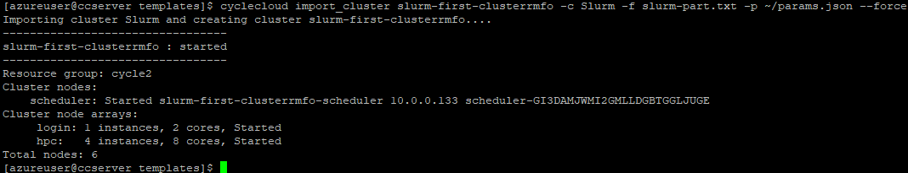

import 후 **GUI → 클러스터 → 가운데 패널 `Arrays` 탭**에 새 `gpu` nodearray가 보인다. 단, 아직 **Activated 상태가 아니라** 사용할 수 없다.

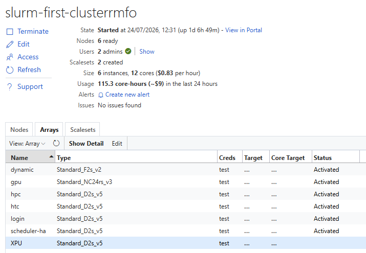

#### 단계 5. 새 nodearray 활성화

```bash
cyclecloud start_cluster <클러스터명>
```

GUI `Arrays` 탭에서 `gpu` 상태가 **Activation → Activated** 로 바뀌는지 확인한다.

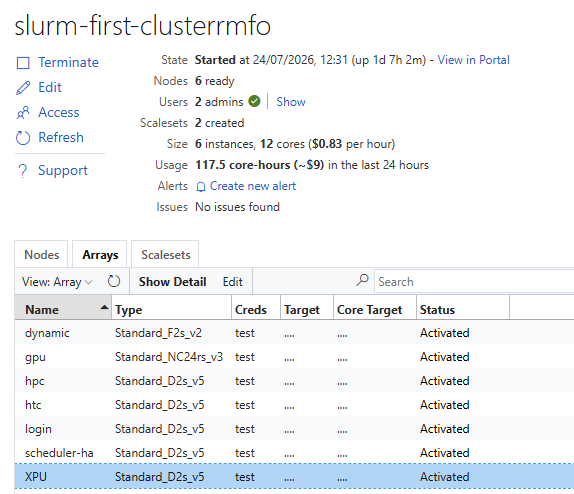

#### 단계 6. GUI에서 새 배열 설정

**Edit → Required Settings** 에서 새 파티션의 **GPU VM Type**, **Max GPU Cores** 를, **Advanced Settings** 에서 **GPU OS**, **GPU Cluster-Init** 을 지정하고 **Save** 한다. (단계 2에서 `DefaultValue` 를 지정했다면 값 확인만 한다.)

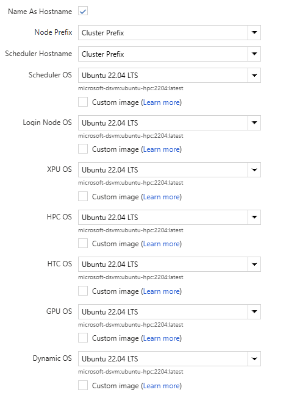

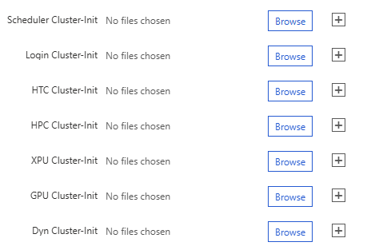

#### 단계 7. 스케일하여 노드 정의 생성

여기까지는 CycleCloud에만 추가된 상태로, Slurm은 아직 새 파티션을 모른다. 스케줄러 노드에서 확인한다.

```bash
sinfo               # 아직 gpu 파티션이 보이지 않음
```

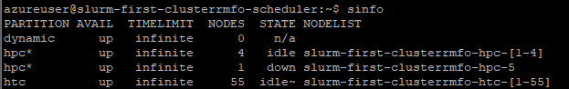

`azslurm scale` 로 노드를 사전 정의해 `azure.conf` 에 반영한다. `azslurm` 은 venv에 있으므로 **root 로그인 셸(`sudo -i`)** 에서 실행한다.

```bash
sudo -i
azslurm scale
# 또는 전체 경로: sudo /opt/azurehpc/slurm/venv/bin/azslurm scale
```

```bash
sinfo               # gpu 파티션이 표시되면 완료
```

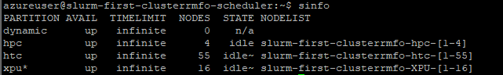

> **여기서 `azslurm scale` 은 안전하다.** 새 파티션이 이제 **CycleCloud 정의(템플릿)에 포함**되어 있으므로, 이후 `azslurm scale`이나 클러스터 재시작으로 `azure.conf` 가 재생성돼도 **초기화되지 않는다.** (반면 [5장 노드 증감](05-노드-증감설-사이즈변경.md)이나 6.1처럼 정의에 없이 손편집한 파티션은 이때 사라진다.)

**추가 옵션**

- **파티션 이름 커스터마이즈**: nodearray 이름과 파티션 이름을 다르게 하려면 `[[[configuration]]]` 에 `slurm.partition = my-name` 을 지정한다.
- **htc 기반 파티션**: throughput 워크로드는 `htc`(`slurm.hpc = false`, `slurm.use_pcpu = false`) 블록을 복제한다.
- **동적(Dynamic) 파티션**: `slurm.autoscale = true` 와 `slurm.dynamic_config` 로 한 파티션에서 **여러 VM 크기**를 Feature로 구분해 사용할 수 있다.

---

## 검증

- `sinfo` 로 추가한 파티션 이름과 공유 노드 범위가 표시되는지 확인한다.
- `sudo scontrol reconfigure` 후 오류가 없는지 확인하고, 필요한 경우 `scontrol show partition <파티션명>` 으로 설정을 확인한다.
- `azslurm resume --node-list cycle-lab-hpc-1` 실행 후 노드가 정상 기동되는지 확인한다.
- 파티션별 Job 제출 후 2 코어 VM 3대 환경에서는 6개가 `RUNNING`, 7번째 Job이 `PENDING(Resources)` 로 대기하는지 확인한다.

## 롤백·주의

- 수동 추가한 파티션을 되돌리려면 `azure.conf` 에서 추가한 `PartitionName` 항목을 제거하고 `sudo scontrol reconfigure` 를 실행한다.
- 템플릿 기반 파티션은 이전 템플릿과 `params.json` 으로 `cyclecloud import_cluster ... --force` 를 다시 적용한 뒤 `azslurm scale`(`sudo -i` 후) 로 반영한다.
- 기존 노드를 공유하는 파티션은 물리 자원을 공유하므로, 파티션 수가 늘어도 총 코어/메모리 용량은 증가하지 않는다.

**수동 편집한 파티션은 초기화될 수 있다.**

- `/etc/slurm/azure.conf` 를 수동 편집해 추가한 파티션은 아래 조건에서 **GUI 설정 템플릿으로 원복되어 삭제**된다.
- 1. 클러스터를 **Terminate 후 Start** 하는 경우
- 2. `azslurm partition` 또는 `azslurm scale` 명령이 수동/자동으로 실행되는 경우

```bash
azslurm partition
azslurm scale
```

## 관련 문서

- [6.5](#65-영구-파티션-추가-템플릿-기반-권장)
- [7. 데이터 디스크 마운트](07-데이터-디스크-마운트.md)

다음 단계: [7. 데이터 디스크 마운트](07-데이터-디스크-마운트.md)
