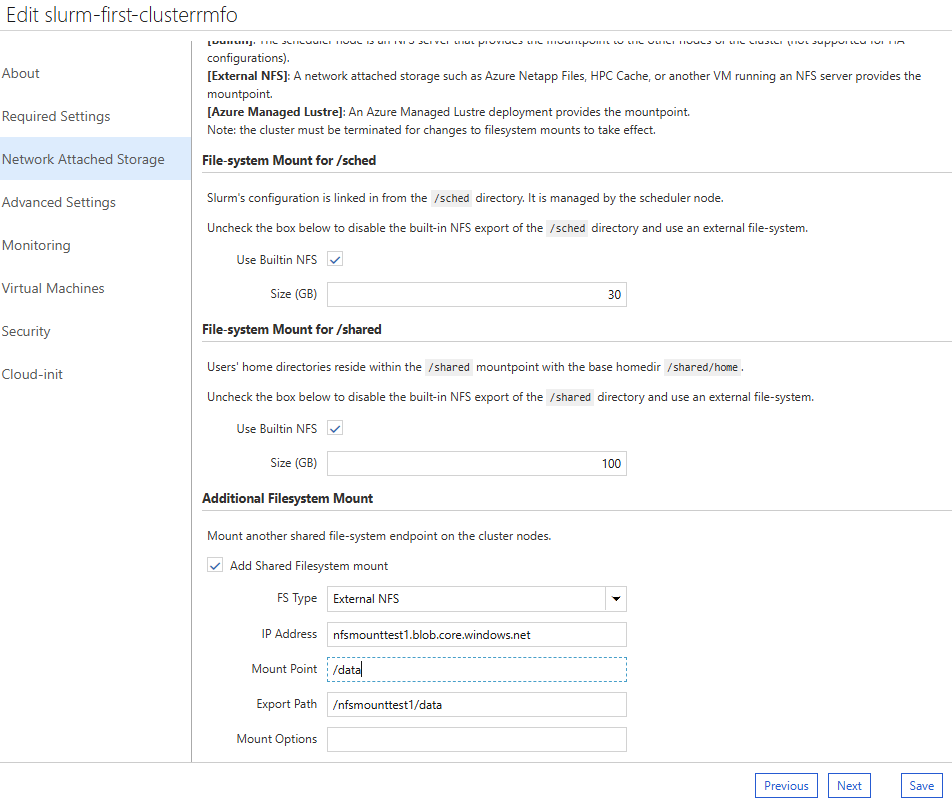
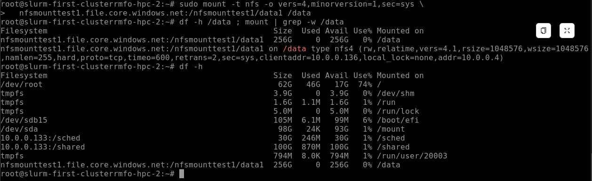
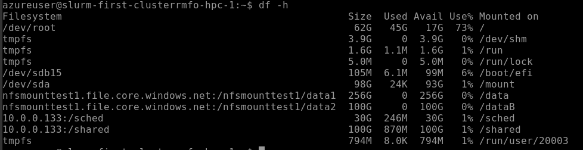

# 8. 스토리지 마운트 (NFS, 공유 파일시스템)

모든 노드가 동일한 데이터를 참조하도록 NFS/Lustre 공유 파일시스템, Azure Files(SMB), Blob(`blobfuse2`), Locker 스토리지를 마운트하고 확인한다.

---

## 목적

모든 노드가 **동일한 데이터**를 참조하도록 NFS/Lustre 공유 파일시스템, Azure Files(SMB), Blob Storage(`blobfuse2`)를 마운트하고 Locker 스토리지를 확인하는 절차이다. CycleCloud는 이 마운트를 템플릿의 `cyclecloud.mounts.*` 로 선언적으로 관리한다. 노드별 관리 디스크 추가는 [7. 데이터 디스크 마운트](07-데이터-디스크-마운트.md)를 참고한다.

## 사전 조건

- CycleCloud 클러스터와 대상 HPC 노드에 접속할 수 있어야 한다.
- NFS(ANF/Azure Files NFS/Blob NFS), Azure Managed Lustre 등 사용할 스토리지 리소스가 준비되어 있어야 한다.
- Azure Files 마운트에는 Storage Account 이름, File Share 이름, 인증 정보가 필요하다.
- `blobfuse2` 마운트에는 VM 관리 ID(Managed Identity)와 Storage Account의 `Storage Blob Data Contributor` RBAC 역할이 필요하다.
- Locker 확인에는 CycleCloud CLI가 필요하다.

## 절차

### 8.1 공유 파일시스템 (NFS / Lustre) 마운트

CycleCloud는 NFS/Lustre 마운트를 템플릿의 `cyclecloud.mounts.<이름>` 으로 선언적으로 관리한다. 이 마운트 선언은 **노드가 생성(부팅)될 때** `node.json` 에 렌더링된 뒤 **고정**된다. 따라서 `cyclecloud.mounts.*` 방식으로 마운트를 추가/변경하면 **이미 실행 중인 노드에는 반영되지 않으며 노드 재생성이 필요**하다. 자세한 적용 규칙은 §8.1.2.

| 종류 | 구성 예시 | 용도 및 특징 |
|------|--------------|--------------|
| **Built-in NFS** | Master 노드가 `/shared`, `/home` export | 실습 및 기본 데이터 공유 |
| **Blob Storage NFS** | 2개 컨테이너 NFS 마운트 | 대용량 입출력 파일 보관 |
| **Azure Managed Lustre** | **512TB** 초고속 병렬 파일시스템 마운트 | 초고성능 GPU 학습/분석 데이터셋 |

> CycleCloud 공식 참고: [간단한 NFS 및 파일 공유 만들기](https://learn.microsoft.com/ko-kr/azure/cyclecloud/how-to/create-fileserver?view=cyclecloud-8), [네트워크 파일 시스템 옵션](https://learn.microsoft.com/ko-kr/azure/cyclecloud/how-to/mount-fileserver?view=cyclecloud-8)

---

#### 8.1.1 클러스터 생성 시 NAS(Network Attached Storage) 설정

각 스케줄러 기본 템플릿에는 클러스터 생성 시 NFS 옵션을 구성하는 **Network Attached Storage** 섹션이 있다. `/shared` 디렉터리는 기본적으로 NFS 공유이며, `NFS Type` 드롭다운에서 다음 중 선택한다.

- **Builtin** — 클러스터 헤드(스케줄러) 노드가 Azure Managed Disk(표준 SSD)에 NFS 공유를 만들어 export 한다. `Size` 로 디스크 크기를 지정한다. *(HA 구성에서는 미지원)*
- **External NFS** — 외부 NFS 서버의 IP/호스트명을 입력한다. [Azure Files NFS](https://learn.microsoft.com/ko-kr/azure/storage/files/storage-files-quick-create-use-linux), [Azure NetApp Files](https://learn.microsoft.com/ko-kr/azure/azure-netapp-files/azure-netapp-files-introduction), [HPC Cache](https://learn.microsoft.com/ko-kr/azure/hpc-cache/hpc-cache-overview), [Azure Blob Storage NFS](https://learn.microsoft.com/ko-kr/azure/storage/blobs/network-file-system-protocol-support), AMLFS 등의 엔드포인트를 `/shared` 로 마운트한다.
- **Add NFS Mount** — `/data` 처럼 추가 마운트 지점이 필요할 때 선택하면, 마운트를 더 정의하는 필드가 나타난다.



---

#### 8.1.2 상황별 NFS 마운트 추가

NFS 마운트를 추가하는 절차는 **"어떤 상황에서 추가하는가"** 에 따라 선택하는 방식과 순서가 다르다. 아래 표에서 **상황**을 고른 뒤, 해당 상황의 절차만 따른다.

| 상황 | 권장 방식 | 이미 실행 중인 노드에 반영하려면 |
|---|---|---|
| **① 클러스터 신규 생성 시** | 마운트 **1개**: GUI(일반) · 마운트 **2개 이상**: cluster-init | 해당 없음 — 노드가 없거나 첫 부팅에 자동 적용 |
| **② 기존(운영 중) 클러스터에 추가** | cluster-init **또는** 템플릿 | 방법에 따라 다르다 — 아래 **방법별 표** 참고 |
| **③ 직접 임시 마운트 ** | 직접 마운트(`mount`) | 재생성 불필요(즉시 적용, 단 재생성 시 소실) |

**방법별 — 노드 재생성 / 클러스터 재시작 필요 여부**

**이미 실행 중인 노드**에 반영하는 관점이며, 새로 뜨는 노드(오토스케일 포함)는 어느 방법이든 자동 적용된다.

| 방법 | 실행 중 노드 반영 | 노드 재생성 | 클러스터 재시작 | 영구성 |
|---|---|---|---|---|
| GUI (Edit → NAS / 마운트 추가) | ❌ | **필요** | 불필요 | 영구 |
| 템플릿 `cyclecloud.mounts.*` + `import_cluster` | ❌ | **필요** | 불필요 | 영구 |
| cluster-init — 기존 스크립트 **내용만 수정**(파일명 동일) | ❌ | **필요** | 불필요 | 영구 |
| cluster-init — 프로젝트를 nodearray 에 **새로 연결** | ❌ | **필요** | 불필요 | 영구 |
| 직접 `mount` (상황 ③) | ✅ 즉시 | 불필요 | 불필요 | **임시**(재생성 시 소실) |
| cloud-init 수정 (운영 중 비권장) | ❌ | **필요** | **필요** | 영구 |

> **"노드 재생성"이란?** — 이미 실행 중인 노드를 **종료(terminate / `azslurm suspend`)했다가 다시 기동(`azslurm resume` / Start)** 해 **새 VM 으로 다시 만드는 것**이다.
> `cyclecloud.mounts.*` 로 선언한 마운트(GUI·템플릿)는 노드가 **부팅되는 순간** `node.json` 에 렌더링되어 **고정**되므로, 정의를 바꿔도 **이미 부팅된 노드는 바뀌지 않고** 새로 부팅되는 노드에만 반영된다.
> cluster-init 의 경우는 실행 이력 마커(`.run`)가 **스크립트 파일명 단위**라, 새 파일명만 재생성 없이 실행된다.
>
> - **클러스터 재시작**(전체 Stop→Start)이 필요한 것은 **cloud-init 수정뿐**이다.
> - GUI Save 나 `import_cluster` 재적용은 실행 중인 스케줄러를 내리지 않는다(실측 확인).
> - 신규로 뜨거나 오토스케일로 새로 뜨는 노드는 **자동** 적용된다. 재생성이 필요한 것은 **기 동작 중인** 노드이다.
> - 이 규칙은 **노드 SKU 와 무관**하다(GPU 노드도 동일). **실행 중인 고가 GPU 노드에 진행 중인 작업이 있어 재생성이 부담스러운 경우**, 위 표의 ✅ 경로를 우선 검토하고, 그것도 불가능하면 **상황 ③(직접 `mount`)으로 임시 연결**한다.

---

##### 상황 ① 클러스터 신규 생성 시

마운트가 **1개(일반적)** 면 **GUI(생성 마법사)**, **2개 이상**이면 **cluster-init** 을 쓴다. 신규 생성이므로 노드 첫 부팅 시 적용되어 **재생성이 필요 없다.**

①-A. GUI (마운트 1개, 일반)

1. 🌐 클러스터 **생성 마법사 → Network Attached Storage** 섹션.
2. 🌐 `/shared` 외 추가 마운트가 필요하면 **Add NFS Mount** → 다음 값 입력.
   - **Mount Point** `/mnt/<공유명>` · **Export Path** `/<스토리지계정>/<공유명>`
   - **Address** `<스토리지계정>.file.core.windows.net` · **Options** `vers=4,minorversion=1,sec=sys`
3. 🌐 나머지 설정을 마치고 클러스터 **생성 → Start**. 노드 부팅 시 자동 마운트.

①-B. cluster-init (마운트 2개 이상)

1. ☁️ **[CC 서버]** 프로젝트 `specs/default/cluster-init/scripts/` 에 멱등 마운트 스크립트를 작성한다(여러 마운트를 한 스크립트에 기재; 스크립트 예시는 상황 ②-C 참고).
2. ☁️ **[CC 서버]** `cyclecloud project upload <locker>`.
3. 🌐 클러스터 **생성 마법사 → 대상 파티션의 Cluster-Init Projects** 에 프로젝트 할당 → **생성 → Start**. 노드 부팅 시 자동 마운트.

---

##### 상황 ② 기존(운영 중) 클러스터에 추가

**cluster-init 또는 템플릿**이 기본. 
**추가 마운트가 아직 하나도 없다면 GUI 로 1개**만 간단히 붙일 수도 있다(GUI 는 추가 마운트 1개만 지원). 
**어느 방식이든 이미 켜져 있는 노드는 재생성해야 영구 반영**된다(새로 뜨는 / 오토스케일 노드는 자동 적용).

**②-A. GUI (추가 마운트가 아직 없을 때, 1개만)**

1. 🌐 포털 → **Clusters → `<클러스터명>` → Edit → Network Attached Storage → Add NFS Mount** → 값 입력(①-A 2단계와 동일) → **Save**.
2. 🧮 **[스케줄러]** 실행 중 노드 재생성.
   ```bash
   sudo azslurm suspend --node-list <노드명>
   sudo azslurm resume  --node-list <노드명>
   ```
3. 🧮 **[노드]** 검증.
   ```bash
   mountpoint /mnt/<공유명> && df -h /mnt/<공유명>
   ```

**②-C. cluster-init (스크립트 기반)**

1. ☁️ **[CC 서버]** 프로젝트 `specs/default/cluster-init/scripts/` 에 마운트 스크립트 작성. **마운트에 필요한 작업만** 넣는다 — NFS 클라이언트(`nfs-utils`/`nfs-common`)는 CycleCloud HPC 이미지에 기본 포함되어 있어, converge 중 패키지 설치는 저장소 접근 실패·패키지 매니저 락 등 실패 지점만 늘린다.
   ```bash
   #!/bin/bash
   set -euo pipefail

   SRC=<스토리지계정>.file.core.windows.net:/<스토리지계정>/<공유명>
   MP=/mnt/<공유명>
   OPTS=vers=4,minorversion=1,sec=sys,nofail,_netdev

   mkdir -p "$MP"
   # 앞뒤 공백까지 포함해 비교한다. 안 그러면 /mnt/a 가 /mnt/ab 에 오탐된다
   grep -qs " $MP " /etc/fstab || echo "$SRC $MP nfs $OPTS 0 0" >> /etc/fstab
   mountpoint -q "$MP" || mount "$MP"
   ```
   > `nofail,_netdev` 를 넣으면 스토리지가 일시적으로 응답하지 않아도 노드 부팅이 막히지 않는다.
2. ☁️ **[CC 서버]** 업로드. 
   ```bash
   cyclecloud project upload <locker>
   ```
   > 스크립트를 바꿨으면 `project.ini` 의 `version` 을 올린 뒤 업로드한다. 그래야 포털에서 새 버전을 선택할 수 있다.
   > 실행 권한(`chmod +x`)은 필요 없다 — 노드의 실행기가 실행 직전에 `chmod u+x` 를 수행한다.
3. 🌐 클러스터 **Edit → 대상 파티션의 Cluster-Init Projects** 에 프로젝트 할당(또는 새 버전으로 재지정) → **Save**.
4. 🧮 반영 — 실행 중 노드 재생성(②-A 2단계)이 필요하다.
5. 🧮 **[노드]** 검증(②-A 3단계). 실행 여부는 아래 경로로 확인한다.
   ```bash
   ls /mnt/cluster-init/<프로젝트>/<spec>/scripts/                    # 노드에 배포된 스크립트
   ls /mnt/cluster-init/.run/<프로젝트>/<spec>/scripts/               # 실행 이력 마커(<스크립트명>.run)
   sudo cat /opt/cycle/jetpack/logs/cluster-init/<프로젝트>/<spec>/scripts/<스크립트명>.sh.out
   ```

> 상세: [4. Cluster-Init 및 커스텀 스크립트](04-cluster-init-및-커스텀-스크립트.md).

---

##### 상황 ③ 임시로 직접 마운트

정의를 바꾸지 않고 노드 OS 에서 **즉시** 붙인다. **노드 재생성 시 사라지므로** 영구 적용은 상황 ①/② 를 쓴다.

1. 🧮 **[노드]** 대상 노드에 SSH 접속 후 직접 마운트.
   ```bash
   sudo mkdir -p /mnt/<공유명>
   sudo mount -t nfs -o vers=4,minorversion=1,sec=sys \
     <스토리지계정>.file.core.windows.net:/<스토리지계정>/<공유명> /mnt/<공유명>
   ```
2. 🧮 **[노드]** (선택) 재부팅 후 유지하려면 `/etc/fstab` 등록(단, 노드 **재생성** 시엔 초기화).
   ```bash
   echo "<스토리지계정>.file.core.windows.net:/<스토리지계정>/<공유명> /mnt/<공유명> nfs vers=4,minorversion=1,sec=sys 0 0" | sudo tee -a /etc/fstab
   ```
3. 🧮 **[노드]** 검증.
   ```bash
   mountpoint /mnt/<공유명> && df -h /mnt/<공유명>
   ```

> **여러 노드에 한 번에 붙여야 할 때** — 노드마다 SSH 접속해 반복하는 대신 [`templates/mount-all-nodes.sh`](../templates/mount-all-nodes.sh) 를 쓴다. CycleCloud 서버에서 `root` 로 실행하며 실행 중인 노드 전체에 동일한 마운트를 일괄 적용한다.
>
> ```bash
> sudo ./mount-all-nodes.sh check     # 대상·현황 확인 (변경 없음)
> sudo ./mount-all-nodes.sh mount     # 일괄 마운트
> ```
>


---

#### 8.1.3 기본 공유(/shared, /sched)와 비활성화

- 대부분의 CycleCloud 클러스터는 `/shared`(및 스케줄러 전용 내부 `/sched`) 를 기본 NFS 공유로 제공한다. 간단한 공유는 이것으로 충분한 경우가 많다. 기본 마운트 이름 `cyclecloud.mounts.shared`, `cyclecloud.mounts.sched` 는 예약되어 있다.
- 기본 NFS 마운트를 끄려면 `disabled = true` 로 설정한다.

  ```ini
  [[[configuration]]]
  cyclecloud.mounts.sched.disabled = true
  cyclecloud.mounts.shared.disabled = true
  cshared.server.legacy_links_disabled = true
  ```

- 기본 공유를 끄고 `/shared` 를 **외부 파일 서버로 대체**하려면 각 노드에 다음을 마운트한다.

  ```ini
  [[[configuration cyclecloud.mounts.external_shared]]]
  type = nfs
  mountpoint = /shared
  export_path = /mnt/raid/export
  address = 10.0.0.20
  ```
---

#### 8.1.4 Blob Storage NFS 3.0 계정 생성 및 마운트 (실습, External NFS)

**Azure Blob Storage NFS 3.0** 으로 대용량 데이터를 여러 노드에서 공유한다(스토리지 계정 `<스토리지계정>` 예시).

> ⚠️ **사전 요구사항**: 계정 종류 **Standard 범용 v2** 또는 **Premium Block Blob** / **보안 전송 필수 비활성화**(NFS v3 는 전송 암호화 미지원) / CycleCloud 컴퓨트 서브넷(`<VNet>/<컴퓨트서브넷>`)에서 접근 가능 / VNet 과 동일 리전.

**① 스토리지 계정 만들기 – 기본 사항(Basics)**

Azure Portal → **스토리지 계정** → **만들기**. 계정 이름 `<스토리지계정>`, 리전은 클러스터 VNet 과 동일하게, 성능/중복성을 선택한다.

**② 고급(Advanced) – NFS v3 활성화**

- **보안 전송 필수** 체크 해제
- **네트워크 파일 시스템 v3(Network File System v3)** 체크

> NFS v3 체크박스는 네트워킹에서 가상 네트워크 접근을 구성해야 활성화된다.

**③ 네트워킹(Networking) – VNet/서브넷 제한**

**선택된 가상 네트워크 및 IP 주소에서 사용** 을 선택하고, CycleCloud VNet(`<VNet>`)과 컴퓨트 서브넷(`<컴퓨트서브넷>`)을 추가한다(`Microsoft.Storage` 서비스 엔드포인트가 자동 추가됨). 또는 Private Endpoint 를 구성한다.

**④ 검토 + 만들기 → 컨테이너 생성**

배포 완료 후 계정 → **컨테이너** → **+ 컨테이너** 로 데이터 컨테이너(예: `data`)를 만든다. NFS 마운트 경로는 `계정명/컨테이너명` 형식이다.

**⑤ HPC 노드에서 마운트**

포털 **Connect** 로 노드에 SSH 접속 후 실행한다.

```bash
# NFS 클라이언트는 HPC 이미지(ubuntu-hpc 등)에 기본 포함 — 없을 때만 설치한다
command -v mount.nfs >/dev/null || sudo apt-get install -y nfs-common

sudo mkdir -p /mnt/nfstest

# 계정명.blob.core.windows.net:/계정명/컨테이너명
sudo mount -o sec=sys,vers=3,nolock,proto=tcp \
  <스토리지계정>.blob.core.windows.net:/<스토리지계정>/<공유명> /mnt/nfstest
```

> 💡 엔드포인트 IP 변경에 자동 대응하는 **AZNFS mount helper** 사용을 권장한다.
>
> ```bash
> sudo mount -t aznfs -o vers=3,proto=tcp \
>   <스토리지계정>.blob.core.windows.net:/<스토리지계정>/<공유명> /mnt/nfstest
> ```



**⑥ 검증**

```bash
df -h /mnt/nfstest
sudo touch /mnt/nfstest/hello.txt && ls -l /mnt/nfstest
```



> 모든 노드에 자동 적용하려면 이 마운트를 **cluster-init 스크립트**로 등록해 컨버지 시 실행되게 한다. ([4. Cluster-Init 및 커스텀 스크립트](04-cluster-init-및-커스텀-스크립트.md) 참고)

---

### 8.2 Azure Files (SMB) & Blob Storage (`blobfuse2`) 마운트

#### 1) Azure Files (SMB/CIFS)

```bash
sudo mkdir -p /mnt/azfiles
STORAGE="<스토리지계정>"
SHARE="hpcshare"

sudo mount -t cifs //$STORAGE.file.core.windows.net/$SHARE /mnt/azfiles \
  -o vers=3.0,username=$STORAGE,******
```

#### 2) blobfuse2 (Azure Blob Storage POSIX 마운트)

VM 관리 ID(Managed Identity)로 시크릿 키 없이 Blob 컨테이너를 마운트한다.

```bash
sudo mkdir -p /mnt/blob /mnt/blobcache

cat <<'YAML' | sudo tee /etc/blobfuse2.yaml
allow-other: true
components: [libfuse, file_cache, attr_cache, azstorage]
file_cache: { path: /mnt/blobcache }
azstorage:
  type: block
  account-name: <Locker스토리지>
  container: cyclecloud
  mode: msi          # VM 관리 ID 사용
YAML

sudo blobfuse2 mount /mnt/blob --config-file=/etc/blobfuse2.yaml
```

관리 ID 사용 시 Storage Account에 `Storage Blob Data Contributor` RBAC 역할이 필요하다.

---

### 8.3 Locker (프로젝트/템플릿 스토리지) 개념

**Locker**는 클러스터 템플릿, 노드 구성 파일, `cluster-init` 스크립트를 저장하는 Azure Blob Storage 컨테이너이다.

- **스토리지 계정**: `<Locker스토리지>`
- **컨테이너**: `cyclecloud`
- **Locker 확인 명령어**:

  ```bash
  cyclecloud locker list
  # OUTPUT:
  # <Locker이름> (az://<Locker스토리지>/cyclecloud)
  ```

보안 환경에서 Locker 스토리지의 **Shared Key 비활성화 → Private Endpoint + Private DNS + Managed Identity** 접근은 [1장 §1.8.2 Private Endpoint & 보안](01-HPC-및-CycleCloud-아키텍처.md#182-private-endpoint--보안-스토리지db)을 참고한다.

---

## 검증

- `mount` 또는 `df -h` 로 `/data`, `/mnt/azfiles`, `/mnt/blob` 등 마운트 지점이 표시되는지 확인한다.
- 마운트 지점에서 테스트 파일 읽기/쓰기 또는 목록 조회가 정상인지 확인한다.
- `cyclecloud locker list` 출력에 `<Locker이름> (az://<Locker스토리지>/cyclecloud)` 가 표시되는지 확인한다.
- Blob 마운트가 실패하면 VM 관리 ID와 `Storage Blob Data Contributor` RBAC 역할을 확인한다.

## 롤백·주의

- Azure Files 또는 Blob 마운트를 해제하려면 사용 중인 프로세스를 중지한 뒤 `sudo umount <마운트경로>` 를 실행한다.
- 추가 NFS 마운트 정의(GUI/템플릿) 추가/삭제는 **노드 재생성 시** 실행 중 노드에 반영된다.
- `/shared`, `/sched` 를 Builtin↔External 로 전환하는 변경은 디스크 삭제를 동반하므로 클러스터 terminate가 필요하다.
- `blobfuse2` 구성 파일에는 계정 이름과 컨테이너가 포함되므로 권한과 파일 접근 범위를 제한한다.
- 보안 환경에서는 Locker 스토리지의 Shared Key 비활성화, Private Endpoint, Private DNS, Managed Identity 접근 구성을 함께 검토한다.

## 관련 문서

- [7. 데이터 디스크 마운트](07-데이터-디스크-마운트.md)
- [9. 디스크 사이즈 변경](09-디스크-사이즈-변경.md)
- [1장 §1.8.2 Private Endpoint & 보안](01-HPC-및-CycleCloud-아키텍처.md#182-private-endpoint--보안-스토리지db)

다음 단계: [9. 디스크 사이즈 변경](09-디스크-사이즈-변경.md)
