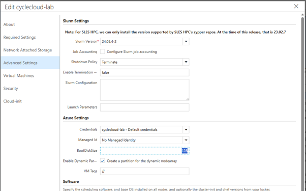
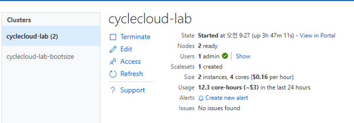
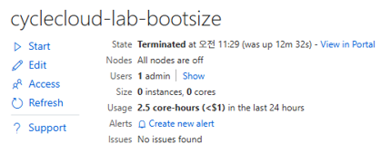
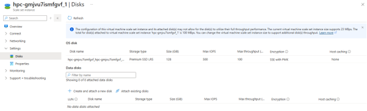
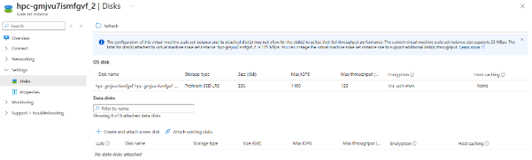
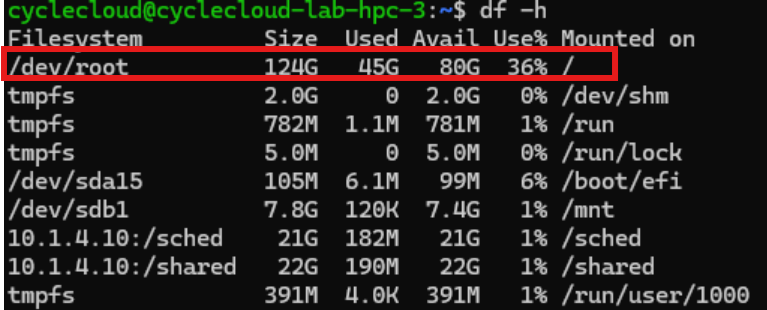
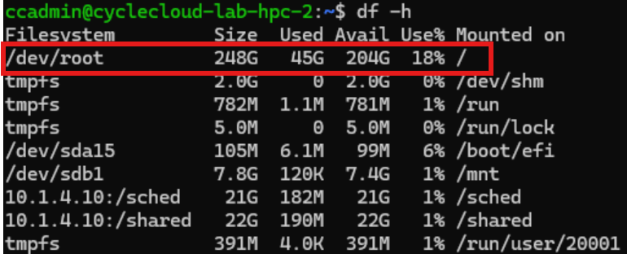
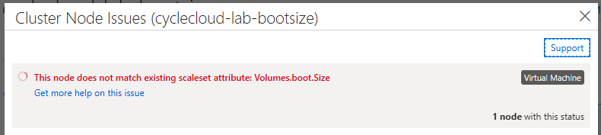
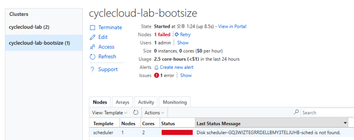

# 9. 디스크 사이즈 변경 (OS/부팅 디스크)

## 목적

CycleCloud VMSS 노드의 OS(부팅) 디스크 크기를 변경하는 절차이다. 클러스터 전체에 안전하게 반영하거나, 특정 파티션 VMSS에만 새로 생성되는 노드 기준으로 반영할 때 사용한다. VM SKU 변경과는 별도 절차이므로 노드 크기 변경은 [5.4](05-노드-증감설-사이즈변경.md#54-노드-사이즈vm-sku-변경)을 따른다.

## 사전 조건

- CycleCloud UI에서 클러스터를 편집할 수 있는 권한이 필요하다.
- 클러스터 전체 반영은 클러스터를 **Terminate → Start** 할 수 있는 운영 창과 영향도 검토가 필요하다.
- 특정 파티션만 변경하려면 대상 파티션의 노드 리소스 그룹과 VMSS 이름을 확인하고, Azure CLI로 VMSS를 수정할 권한이 있어야 한다.
- VMSS를 직접 변경(`az vmss update`)하려면 **Azure CLI에 로그인(`az login`)** 되어 있고 대상 구독이 선택돼 있어야 한다.
- VMSS 직접 변경은 **새로 뜨는 노드에만** 반영되며 기존 실행 노드는 영향을 받지 않는다.
- OS 디스크 크기 변경은 VM SKU 변경([5.4](05-노드-증감설-사이즈변경.md#54-노드-사이즈vm-sku-변경))과 별개이다.

## 절차

### 9.1 클러스터 전체 반영

노드 전체 재시작이 필요한 방식이며, 가장 안전하다.

#### 1) CycleCloud UI에서 BootDiskSize 변경

> **Clusters → 클러스터 → Edit → Advanced Settings → BootDiskSize**

기본값 `0` 은 실제로는 **64GB** 로 생성된다. 원하는 크기로 변경한다. (예: `128` → 128GB, `1000` → 1TB)



#### 2) 클러스터 Terminate 후 Start

변경을 저장한 뒤 클러스터를 **Terminate → Start** 하여 전체 노드를 재생성한다.





---

### 9.2 특정 파티션만 변경

특정 파티션의 OS 디스크만 변경해야 할 경우, 클러스터 전체 재시작 없이 해당 VMSS를 직접 수정한다. **새로 뜨는 노드에만** 반영된다.

#### 1) VMSS 찾기

해당 파티션의 노드 리소스 그룹에서 VMSS 이름을 확인한다.

#### 2) Azure CLI 로그인

`az vmss update` 는 Azure CLI 인증이 필요하다. 로그인하고 대상 구독을 선택한다.

```bash
az login
az account set --subscription <subscription-id>
```

> 스케줄러/CycleCloud VM에서 실행할 때 대화형 로그인이 어려우면 관리 ID로 `az login --identity` 를 사용하거나, 권한이 부여된 계정으로 디바이스 코드 로그인(`az login --use-device-code`)을 사용한다.

#### 3) VMSS OS 디스크 사이즈 변경

```bash
az vmss update \
  -g <resource-group> \
  -n <VMSS-name> \
  --set "virtualMachineProfile.storageProfile.osDisk.diskSizeGB=256"
```

> ⚠️ **속성 이름은 대문자 `diskSizeGB` 이다.** 소문자 `diskSizeGb` 로 지정하면 오류 없이 **조용히 무시**되어 값이 바뀌지 않는다(모델이 그대로 유지됨). 반드시 대문자 `GB` 를 사용한다.

출력에서 `diskSizeGB` 값이 변경되었는지 확인한다.

```json
"osDisk": {
  "caching": "None",
  "createOption": "FromImage",
  "diskSizeGB": 256,
  "managedDisk": { "storageAccountType": "Premium_LRS" },
  "osType": "Linux"
}
```

#### 4) 노드 재할당 시 자동 반영 (무중단 롤링)

모델 변경은 **새로 생성되는 노드에만** 적용된다. 기존 실행 노드는 그대로 두고, 노드를 순환(갈아끼우기)하면 클러스터 재생성 없이 새 디스크로 교체된다.

```bash
# 대상 노드에 실행 중 작업이 없는지 확인 후 순환
sudo -i
azslurm suspend --node-list <클러스터>-hpc-<n>   # 회수
azslurm resume  --node-list <클러스터>-hpc-<n>   # 새 디스크(256GB)로 재생성
```





> 실행 중 노드는 유지하면서, 자동확장으로 새로 뜨는 노드에만 큰 디스크가 필요한 경우(예: GPU 데이터 캐시)에 사용한다.

> ⚠️ **지속성 주의 — VMSS가 재생성되면 되돌아간다.**
> CycleCloud는 VMSS를 UI의 `BootDiskSize`(기본 `0` → 64GB) 정의를 기준으로 렌더링한다. 위 `az vmss update` 는 **현재 VMSS 모델만** 바꾸므로, 해당 배열을 전부 회수해 **VMSS가 삭제되고 재생성**되거나 클러스터를 **Terminate → Start** 하면 `BootDiskSize` 기준으로 다시 초기화된다. **영구적으로 유지하려면 §9.1처럼 UI `BootDiskSize` 값도 함께 변경**한다(UI 값은 Save만 하면 정의에 반영되며, 반영 시점은 노드 재생성 때이다).

---

## 검증

- CycleCloud UI의 Advanced Settings에서 `BootDiskSize` 값이 저장되었는지 확인한다.
- 클러스터 전체 반영 후 새 노드에서 `df -h /` 또는 OS 디스크 정보로 루트 디스크 크기가 변경되었는지 확인한다.
- VMSS 직접 변경 후 `az vmss show -g <resource-group> -n <VMSS-name> --query "virtualMachineProfile.storageProfile.osDisk.diskSizeGB" -o tsv` 로 값이 변경되었는지 확인한다. (쿼리도 대문자 `diskSizeGB` 를 사용해야 하며, 소문자로 조회하면 빈 값이 반환된다.)
- 새로 생성된 파티션 노드에서 디스크 크기가 변경되었고, 기존 실행 노드는 변경되지 않았는지 확인한다.
- 새 노드에서 `lsblk`(디스크 용량)와 `df -h /`(루트 파일시스템)를 함께 확인한다. 디스크는 커졌는데 `df -h /` 가 그대로면 파일시스템이 자동 확장되지 않은 것이므로 `sudo growpart /dev/sda 1 && sudo xfs_growfs /`(ext4는 `sudo resize2fs /dev/sda1`)로 확장한다.

변경 전후 노드의 루트 디스크 크기 예시이다.





## 롤백·주의

- 클러스터 전체 반영을 되돌리려면 `BootDiskSize` 를 이전 값으로 저장한 뒤 클러스터를 다시 **Terminate → Start** 하여 노드를 재생성한다.
- VMSS 직접 변경을 되돌리려면 VMSS의 `diskSizeGB` 값을 이전 기준으로 수정하고, 이후 새로 생성되는 노드에서 확인한다.
- OS 디스크 축소는 일반적으로 기존 디스크에 즉시 적용하기 어렵기 때문에, 축소가 필요한 경우 데이터 보존과 재생성 계획을 먼저 검토한다.
- VMSS 직접 변경은 새 노드에만 적용되므로, 기존 노드와 신규 노드의 디스크 크기가 일시적으로 다를 수 있다.

> ⚠️ **재시작하지 않으면 오류가 발생한다.**
>
> UI로 `BootDiskSize` 만 변경하고 재시작하지 않으면 다음 문제가 발생한다.
>
> - 기존 HPC 노드는 정상이지만, **새로 뜨는 HPC 노드**는 동일 VMSS를 사용하면서 디스크 용량이 불일치하여 오류가 발생한다.
>
>   
>
> - **스케줄러 노드**는 VM 기반이라 OS 디스크 크기 변경 후 재시작 시 오류가 발생한다.
>
>   

## 관련 문서

- [5.4](05-노드-증감설-사이즈변경.md#54-노드-사이즈vm-sku-변경)
- [10. 사용자 관리](10-사용자-관리.md)

다음 단계: [10. 사용자 관리](10-사용자-관리.md)
