# 10. 사용자 관리 (User Management)

CycleCloud는 사용자를 **Built-in**, Active Directory, LDAP, Microsoft Entra ID로 관리할 수 있다.

이 문서에서는 운영 환경에서 사용하는 **Built-in** 방식을 안내한다.

---

## 목적

CycleCloud Built-in 사용자 생성, SSH Keypair 등록, 클러스터 접근 권한 및 sudo 권한 부여 절차를 표준화한다. 운영 환경에서 외부 디렉터리 연동 없이 포털 사용자와 노드 OS 접근 권한을 관리할 때 사용한다. 필요 시 스케줄러 노드에서 Password 기반 SSH 접근을 허용하는 보조 절차도 포함한다.

## 사전 조건

- CycleCloud 포털 관리자 또는 사용자/그룹을 변경할 수 있는 권한.
- 대상 사용자의 SSH 공개키 또는 비밀번호 운영 정책에 맞는 초기 접속 수단.
- 사용자를 반영할 대상 클러스터와 노드가 실행 중이거나 반영 상태를 확인할 수 있을 것.
- sudo 권한 부여 시 Node Admin 그룹 사용 기준과 회수 절차가 승인되어 있을 것.

## 절차

### 10.1 사용자 생성 및 Keypair 등록

#### 1) Settings → Users 이동

포털에서 사용자 관리 메뉴로 이동한다.

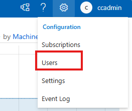

#### 2) Users 탭에서 Create

**`+` (Create)** 를 클릭해 사용자를 추가한다.

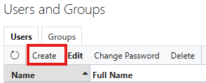

- **Roles**: 해당 사용자가 CycleCloud GUI에 접근할 필요가 없다면 아무것도 체크하지 않아도 된다.

- **Node Settings**: Keypair(pem 파일) 기반으로 노드에 접속하려면 **Public Key** 를 등록한다.

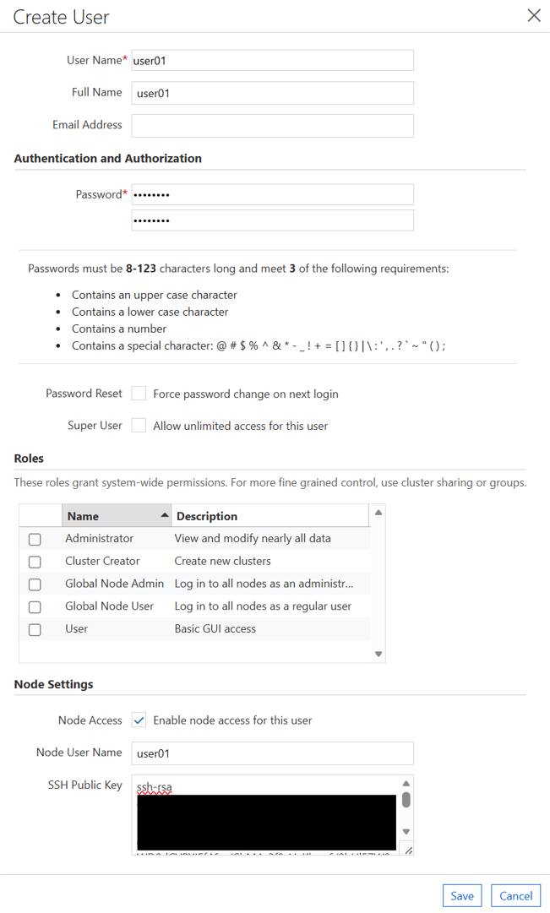

#### 3) Groups

여기서 말하는 Groups는 노드 OS 상의 Group이 아니라, **CycleCloud Cluster의 Groups**를 의미한다.

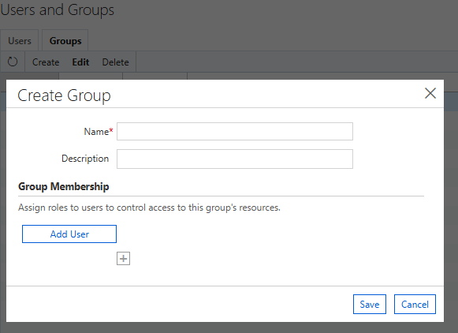

---

### 10.2 클러스터에 사용자 추가

노드 내부에서 `jetpack` 데몬이 동작하므로, GUI에서 사용자를 등록하면 노드에 바로 적용된다.

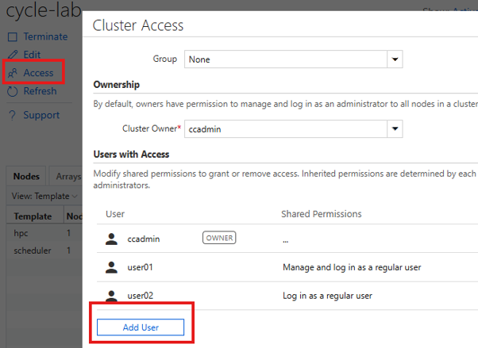

등록 후 pem 파일로 노드에 접속할 수 있다.

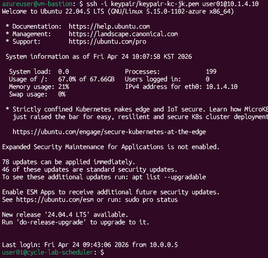

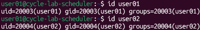

```bash
# 사용자 계정으로 스케줄러 노드 SSH 접속
ssh -i ~/.ssh/id_rsa <username>@<노드-IP>
```

---

### 10.3 사용자에게 sudo 권한 부여

sudo 권한은 CycleCloud GUI에서 **Node Admin** 그룹으로 부여한다.

#### 1) User를 Node Admin 그룹에 추가

> **Configuration → Users → Edit → 대상 User 선택 → Group에서 `Node Admin` 선택**


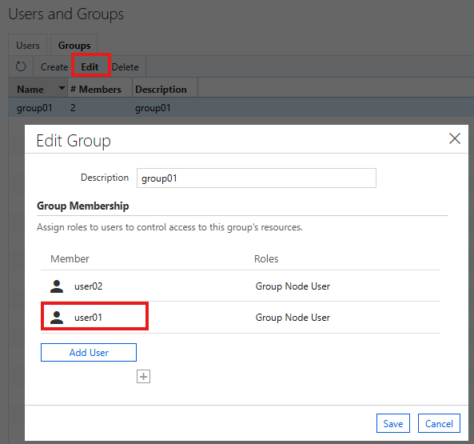

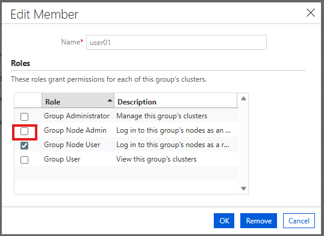

#### 2) 클러스터 Access에서 Group 변경

> **Cluster → Access → Group 변경**

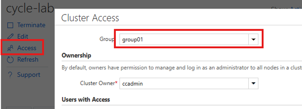

약간의 시간이 지나면 자동으로 반영된다.

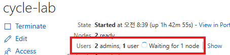

SSH 접속 시 Secondary Group에 `cyclecloud` 가 추가되고, sudo 권한을 사용할 수 있다.

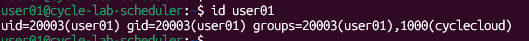

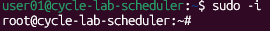

> 권한 회수도 CycleCloud GUI에서 진행한다. **Configuration → User 또는 Group** 에서 변경하면 자동 반영된다.

---

### 10.4 스케줄러 노드에 Password로 SSH 접속

기본적으로 노드는 Keypair 접속만 허용한다. Password 기반 접속이 필요하면 아래 절차로 비밀번호를 설정한다.

#### 1) Node Admin 사용자 비밀번호 준비

Keypair로 접속하거나 **Azure Portal → VM → 비밀번호 초기화** 로 접속 경로를 확보한다.

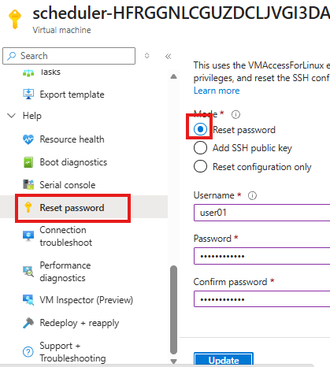

이 작업을 하지 않으면 Password 기반 SSH 접속이 불가하다.

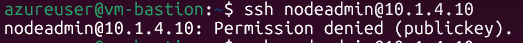

#### 2) 스케줄러 노드에서 사용자 비밀번호 등록

Node Admin 사용자로 스케줄러 노드에 접속한 뒤 비밀번호를 일괄 설정한다.

```bash
# users.txt 생성 (형식: 사용자명:비밀번호)
cat > users.txt << EOF
nodeadmin:<비밀번호>
nodeuser:<비밀번호>
EOF

# 비밀번호 반영
sudo chpasswd < users.txt
```

- **Node Admin** 사용자(`nodeadmin`)는 `su` 접근이 가능하다.

  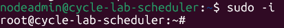

- **Node User** 사용자(`nodeuser`)는 `su` 접근이 불가하다.

  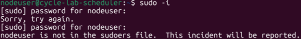

---

## 검증

- 포털 Settings → Users에서 생성한 사용자와 Public Key, Groups 설정이 저장되었는지 확인한다.
- 사용자 계정으로 스케줄러 노드에 SSH 접속해 세션이 열리는지 확인한다.
- sudo 권한 대상자는 SSH 접속 후 `id` 또는 Secondary Group 화면에서 `cyclecloud` 그룹 반영을 확인하고 `sudo` 명령이 동작하는지 확인한다.
- Password 접속을 허용한 경우 Node Admin과 Node User의 `su` 가능 여부가 의도한 권한 모델과 일치하는지 확인한다.

## 롤백·주의

- 권한 회수는 CycleCloud GUI의 Configuration → User 또는 Group에서 수행하며 자동 반영 시간을 고려한다.
- sudo 권한은 Node Admin 그룹으로 부여되므로 필요한 사용자에게만 제한적으로 적용한다.
- Password 기반 SSH는 기본 정책보다 위험하므로 필요한 경우에만 설정하고 사용 후 비밀번호를 회수하거나 변경한다.
- 사용자 삭제나 그룹 변경 후에는 기존 SSH 세션이 남아 있을 수 있으므로 필요 시 노드 세션을 종료하도록 안내한다.

## 관련 문서

- [다음 단계: Slurm Job Accounting 설정](11-Job-Accounting-설정.md)

다음 단계: [11. Slurm Job Accounting 설정](11-Job-Accounting-설정.md)
