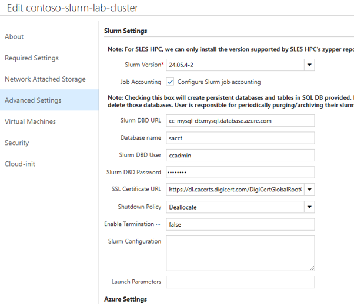
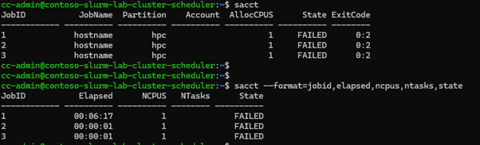
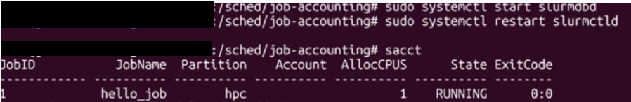

# 11. Slurm Job Accounting 설정

이 문서는 Slurm 작업 이력과 자원 사용량(CPU/GPU/메모리)을 영구 보존하기 위한 **Job Accounting (`sacct`)** 및 **Azure Database for MySQL - Flexible Server** 연동 절차를 다룬다.

---

## 목적

Slurm 작업 이력과 CPU/GPU/메모리 사용량을 영구 보존하기 위해 Job Accounting과 Azure Database for MySQL Flexible Server를 연동한다. 사용자/팀/프로젝트별 사용량 집계, 비용 정산, 용량 계획이 필요할 때 적용한다. GUI 설정과 운영 중인 클러스터 수동 연동 절차를 함께 제공한다.

## 사전 조건

- CycleCloud Slurm 클러스터와 스케줄러 노드에 관리자 권한으로 접근할 수 있을 것.
- Azure Database for MySQL Flexible Server가 CycleCloud/클러스터와 통신 가능한 VNet 또는 Private Access 구성으로 준비되어 있을 것.
- DB 관리자 계정, 비밀번호, 서버 FQDN, 사용할 DB 이름 정책이 준비되어 있을 것.
- 스케줄러 노드에서 `/etc/slurm` 설정 파일을 수정하고 `slurmdbd`, `slurmctld` 서비스를 재시작할 권한.
- GPU 사용량 집계가 필요하면 `AccountingStorageTRES=gres/gpu` 적용 여부를 확인할 것.

## 절차

### 11.1 Job Accounting 의 필요성

- **이력 소실 방지**: Slurm 기본 설정은 작업 이력을 메모리에만 보관하므로 스케줄러 재시작 시 데이터가 사라진다.
- **비용 정산 (Chargeback)**: 사용자, 팀, 프로젝트별 CPU/GPU 사용 시간을 집계할 수 있다.
- **용량 계획**: `sacct`, `sreport` 명령어로 자원 효율성(대기 시간 vs 실행 시간)을 분석할 수 있다.

---

### 11.2 Azure Database for MySQL Flexible Server 사전 준비

| 항목 | 설정 권장값 |
|------|-------------|
| **VNet** | CycleCloud Server 및 클러스터와 동일한 VNet (`cc-vnet`) |
| **Subnet** | 별도의 Private Subnet 생성 및 위임 |
| **Networking** | **Private Access (VNet Integration)** 선택 (공인 IP 차단) |

---

### 11.3 웹 포털 GUI에서 Job Accounting 활성화

기존 클러스터는 UI 설정 적용 후 재시작이 필요하다. 재시작이 어려우면 11.4의 수동 연동을 먼저 적용하고, 다음 재시작을 대비해 UI에도 값을 저장한다.

Cyclecloud UI > Cluster > (이미 생성된 경우) Edit > Advanced Settings > Slurm Settings > Job Accounting 선택> 정보 입력



1. **Clusters → 해당 클러스터 → Edit → Advanced Settings**.
2. **Slurm Settings** 의 **Job Accounting** 옵션 체크:
   - **Database Host**: MySQL 서버 FQDN (예: `cc-mysql-db.mysql.database.azure.com`)
   - **Database Admin User**: DB 관리자 계정명
   - **Database Password**: DB 비밀번호
3. **Save** 클릭.



---

### 11.4 운영 중인 클러스터 수동 연동 (`slurmdbd`)

이미 기동 중인 클러스터에서 재시작 없이 `slurmdbd`를 수동 설정한다.

#### 1) SSL CA 인증서 다운로드

스케줄러 노드에서 DigiCert 글로벌 루트 인증서를 다운로드한다.

```bash
sudo wget https://cacerts.digicert.com/DigiCertGlobalRootG2.crt.pem -O /etc/slurm/AzureCA.pem
```

#### 2) Accounting 활성화 및 GPU 추적 (`/etc/slurm/accounting.conf`)

Accounting 스토리지 유형과 **추적할 자원(TRES)** 을 지정한다. **GPU 사용량 집계에는 `gres/gpu` 가 필요**하다.

```ini
# /etc/slurm/accounting.conf
AccountingStorageType=accounting_storage/slurmdbd
AccountingStorageHost=<cluster-name>-scheduler
AccountingStorageTRES=gres/gpu     # ⭐ GPU 사용량(카드 수와 시간) 추적에 필수
```
> `AccountingStorageTRES=gres/gpu` 가 없으면 `sacct` 에 CPU/메모리는 기록되지만 GPU 할당량(AllocTRES 의 `gres/gpu=N`)은 기록되지 않는다.

#### 3) DB 접속 설정 (`/etc/slurm/slurmdbd.conf`)

```ini
# /etc/slurm/slurmdbd.conf
AuthType=auth/munge
DbdAddr=localhost
DbdHost=<cluster-name>-scheduler
SlurmUser=slurm
DebugLevel=verbose
LogFile=/var/log/slurmctld/slurmdbd.log
PidFile=/var/run/slurmdbd.pid

# Database info
StorageType=accounting_storage/mysql
StorageHost=cc-mysql-db.mysql.database.azure.com
StorageLoc=sacct
StoragePass=<DB_PASSWORD>
StorageUser=<DB_USER>
StorageParameters=SSL_CA=/etc/slurm/AzureCA.pem
```

#### 4) 권한 설정 및 데모 기동

```bash
sudo chown slurm:slurm /etc/slurm/slurmdbd.conf
sudo chmod 600 /etc/slurm/slurmdbd.conf

sudo systemctl start slurmdbd
sudo systemctl restart slurmctld
```

---

### 11.5 동작 검증 (`sacct`)



```bash
# 완료된 작업 이력 조회
sacct

# 특정 기간/사용자별 이력 상세 조회
sacct -X --format=JobID,JobName,User,State,ExitCode,Elapsed,AllocCPUs,AllocTRES
```

## 검증

- `sudo systemctl status slurmdbd`와 `sudo systemctl status slurmctld`로 서비스가 정상 동작하는지 확인한다.
- 테스트 작업 완료 후 `sacct`로 완료된 작업 이력이 조회되는지 확인한다.
- `sacct -X --format=JobID,JobName,User,State,ExitCode,Elapsed,AllocCPUs,AllocTRES`에서 사용자, 상태, 자원 할당 정보가 표시되는지 확인한다.
- GPU 작업은 `AllocTRES`에 `gres/gpu=N` 값이 기록되는지 확인한다.

## 롤백·주의

- 문제가 있으면 UI에서 Job Accounting 설정을 해제하거나 수동 변경한 `/etc/slurm/accounting.conf`, `/etc/slurm/slurmdbd.conf`를 이전 백업으로 되돌린다.
- 설정 변경 후에는 `slurmdbd`와 `slurmctld` 재시작이 필요하며 운영 작업 영향 시간을 고려한다.
- 클러스터를 삭제해도 MySQL DB는 자동 삭제되지 않으므로 데이터 보존/삭제 및 비용 관리를 별도로 수행한다.
- DB 비밀번호와 접속 정보가 포함된 설정 파일은 `slurm` 소유 및 `600` 권한을 유지한다.

## 관련 문서

- [다음 단계: 모니터링](12-모니터링.md)

다음 단계: [12. 모니터링](12-모니터링.md)
