# 12-1. 모니터링 — Prometheus + Grafana (HPC/GPU 메트릭)

이 문서는 [12. 모니터링](12-모니터링.md)의 **④ HPC/GPU 메트릭 계층**을 Prometheus + Grafana로 구축하는 절차이다. 일반적인 상태 확인(GUI/CLI/로그/알림)은 [12. 모니터링](12-모니터링.md)을 참고한다.

---

## 목적

CycleCloud 클러스터의 HPC/GPU 메트릭을 Prometheus로 수집하고 Grafana로 시각화한다. 고객사 환경에서 아직 적용되지 않은 메트릭 수집, 대시보드, 알림을 처음 구성할 때 사용한다. Azure Managed Prometheus/Grafana와 self-hosted 대안을 함께 검토한다.

## 사전 조건

- CycleCloud 8.8.1+ 및 cyclecloud-slurm 프로젝트 4.0.3+ 환경, azslurm-exporter 사용 시 4.0.7+ 확인.
- Azure Monitor Workspace와 Azure Managed Grafana를 만들 수 있는 Azure 권한 및 지원 리전 확인.
- Monitoring Metrics Publisher 역할을 부여할 Managed Identity와 해당 Client ID.
- 노드가 Prometheus ingestion endpoint로 아웃바운드 통신할 수 있는 네트워크 경로.
- 리소스 배포는 CycleCloud VM이나 Cloud Shell이 아닌 로컬 PC 또는 배포 에이전트에서 수행할 것.

## 절차

### 1. 아키텍처

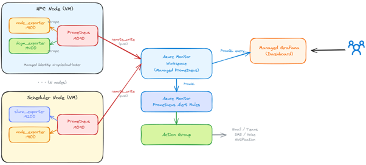

데이터 흐름은 다음과 같다.

- **각 노드의 Exporter** 가 지표를 노출한다. (CPU/메모리/디스크는 Node Exporter, GPU는 DCGM Exporter, 스케줄러는 azslurm-exporter)
- **노드의 로컬 Prometheus** 가 Exporter를 수집한 뒤, `remote_write` 로 **Azure Managed Prometheus(Azure Monitor Workspace)** 에 전송한다.
- **Azure Managed Grafana** 가 저장된 지표를 대시보드로 시각화한다.
- 필요 시 **Azure Managed Workspace Alert** 로 임계치 초과 알림을 받는다.

> **적용 버전**: CycleCloud **8.8.1+** / cyclecloud-slurm 프로젝트 **4.0.3+**(내장 Monitoring 탭), **4.0.7+**(azslurm-exporter 포함).

---

### 2. 1단계: Azure Prometheus / Grafana 설치

[공식 문서](https://learn.microsoft.com/ko-kr/azure/cyclecloud/how-to/monitor-cyclecloud-cluster-using-prometheus-grafana?view=cyclecloud-8)를 기준으로 구성한다.

#### 1) 리소스 그룹 준비

기존 리소스 그룹을 사용하거나, 모니터링 전용 리소스 그룹을 생성한다.

> ⚠️ 일부 리전(예: Korea South)에서는 **Azure Managed Grafana를 지원하지 않는다**. 이 경우 아래 **7. 리전 제약 및 Self-hosted 대안**을 참고한다.

#### 2) 모니터링 인프라 배포

리소스를 생성할 수 있는 **로컬 PC 또는 배포 에이전트**에서 실행한다. (CycleCloud VM이나 Cloud Shell에서는 실행하지 않는다.)

```bash
git clone https://github.com/Azure/cyclecloud-monitoring.git
cd cyclecloud-monitoring
./infra/deploy.sh <monitoring_resource_group>
```

이 스크립트는 Azure Monitor Workspace(Prometheus)와 Azure Managed Grafana, 사전 제작 대시보드를 생성한다.

#### 3) Managed Identity에 게시 권한 부여

Managed Identity를 새로 만들거나, **CycleCloud Locker용 Managed Identity를 재사용**할 수 있다.

Locker MI 이름은 CycleCloud GUI에서 확인한다.

> **Clusters → 클러스터 → Edit → Advanced Settings → Azure Settings → Managed Ids**

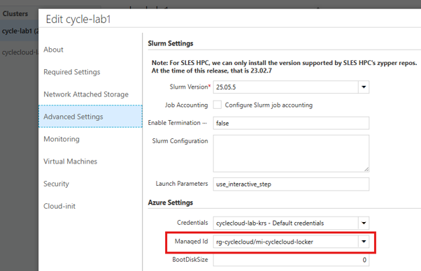

빨간 박스에서 **앞부분이 리소스 그룹**, **뒷부분이 Managed Identity 이름**이다. 이 값으로 게시 권한을 부여한다.

```bash
./infra/add_publisher.sh <umi_resource_group> <umi_name>
```

#### 4) Managed Identity의 Client ID 확인

다음 단계(모니터링 활성화)에서 입력할 **Client ID** 를 가져온다.

```bash
az identity show \
  --name <umi_name> \
  --resource-group <umi_resource_group> \
  --query 'clientId' --output tsv
```

Azure Portal에서도 해당 Managed Identity의 **Overview** 에서 확인할 수 있다.

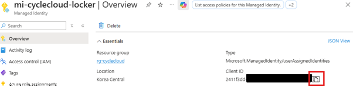

#### 5) Prometheus Ingestion Endpoint 확인

모니터링 인프라를 배포하면 `outputs.json` 파일이 생성된다. 여기에서 수집 엔드포인트를 추출한다.

```bash
jq -r '.properties.outputs.ingestionEndpoint.value' <infra_monitoring_dir>/outputs.json
```

Azure Portal에서는 다음 경로로 확인한다.

> **Azure Monitor Workspace → 생성된 Prometheus → Overview → Metrics ingestion endpoint**

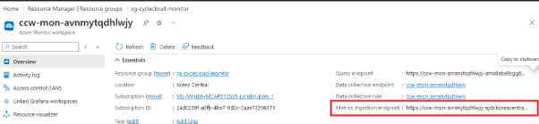

이제 아래 두 값을 확보했다. 다음 단계에서 사용한다.

- **Client ID** (4단계)
- **Ingestion Endpoint** (5단계)

---

### 3. 2단계: CycleCloud에서 모니터링 활성화

활성화 방법은 두 가지이다.

- **방법 A (GUI)**: 간단하지만 **클러스터 재시작이 필요**하다.
- **방법 B (수동)**: 운영 중인 노드에 **재시작 없이** 적용한다.

재시작이 어려운 운영 환경에서는 방법 B로 적용하되, 다음 재시작에 대비해 GUI(방법 A)에도 값을 미리 넣어두는 것을 권장한다.

#### 3.1 방법 A — GUI에서 활성화 (재시작 필요)

CycleCloud GUI에서 Exporter와 노드 Prometheus를 한 번에 활성화한다.

> **Clusters → 클러스터 → Edit → Monitoring 탭**

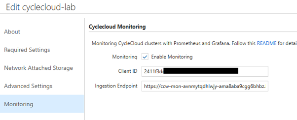

1. **Enable Monitoring** 체크.
2. **Client ID** 에 2단계 4)에서 확인한 값 입력.
3. **Prometheus Ingestion Endpoint** 에 2단계 5)에서 확인한 값 입력.
4. **Save** 후 클러스터를 (재)시작.

#### 3.2 방법 B — 노드에서 수동 활성화 (재시작 없음)

이미 실행 중인 노드에 재시작 없이 모니터링을 적용하는 방법이다. **스케줄러 노드 → HPC 노드** 순서로 적용한다.

`<CLIENT_ID>` 와 `<INGESTION_ENDPOINT>` 는 2단계에서 확인한 값으로 바꾼다.

##### 1) 스케줄러 노드에 적용

스케줄러 노드에 접속해 아래 스크립트를 실행한다.

```bash
#!/bin/bash
# CycleCloud configuration에 모니터링 설정을 주입한다.
cat > /tmp/fix_monitoring_config.py << 'PYEOF'
import json

f = '/opt/cycle/jetpack/config/configuration.json'
with open(f) as fh:
    d = json.load(fh)

d.setdefault('cyclecloud', {}).setdefault('monitoring', {})
d['cyclecloud']['monitoring']['enabled'] = True
d['cyclecloud']['monitoring']['identity_client_id'] = '<CLIENT_ID>'
d['cyclecloud']['monitoring']['ingestion_endpoint'] = '<INGESTION_ENDPOINT>'

with open(f, 'w') as fh:
    json.dump(d, fh, indent=2)

print('config updated on ' + __import__('socket').gethostname())
PYEOF

sudo chmod u+w /opt/cycle/jetpack/config/configuration.json
sudo python3 /tmp/fix_monitoring_config.py
sudo bash /mnt/cluster-init/monitoring/default/scripts/00_prometheus.sh
sudo bash /mnt/cluster-init/monitoring/default/scripts/10_node_exporter.sh

echo "$(hostname): prometheus=$(sudo systemctl is-active prometheus), node_exporter=$(sudo systemctl is-active node_exporter)"
```

적용 후 Exporter가 지표를 노출하는지 확인한다.

```bash
curl -s http://localhost:9100/metrics | head -5
# 메트릭이 출력되면 정상입니다.
```

##### 2) HPC 노드에 적용

HPC 노드에는 Slurm Job으로 배포한다. **1개 노드에 테스트**한 뒤 전체 노드로 확대하는 것을 권장한다.

```bash
cat << 'EOF' > ~/install_monitoring_job.sh
#!/bin/bash
#SBATCH -J install-mon
#SBATCH -N 1
#SBATCH --ntasks-per-node=1
#SBATCH -o monitoring_%j.log

sudo -i bash << 'ROOTEOF'
chmod u+w /opt/cycle/jetpack/config/configuration.json

cat > /tmp/fix_monitoring_config.py << 'PYEOF'
import json

f = '/opt/cycle/jetpack/config/configuration.json'
with open(f) as fh:
    d = json.load(fh)

d.setdefault('cyclecloud', {}).setdefault('monitoring', {})
d['cyclecloud']['monitoring']['enabled'] = True
d['cyclecloud']['monitoring']['identity_client_id'] = '<CLIENT_ID>'
d['cyclecloud']['monitoring']['ingestion_endpoint'] = '<INGESTION_ENDPOINT>'

with open(f, 'w') as fh:
    json.dump(d, fh, indent=2)

print('config updated on ' + __import__('socket').gethostname())
PYEOF

python3 /tmp/fix_monitoring_config.py
bash /mnt/cluster-init/monitoring/default/scripts/00_prometheus.sh
bash /mnt/cluster-init/monitoring/default/scripts/10_node_exporter.sh

echo "$(hostname): prometheus=$(systemctl is-active prometheus), node_exporter=$(systemctl is-active node_exporter)"
ROOTEOF
EOF

# 1개 노드에 테스트 제출
sbatch install_monitoring_job.sh

# squeue로 실행 노드 확인 후, 해당 노드에서 Exporter 노출 확인
ssh <노드> 'curl -s http://localhost:9100/metrics | head -5'
```

지표가 출력되면 정상이다. 아무 값도 나오지 않으면 스크립트 로그(`monitoring_<jobid>.log`)를 확인한다.

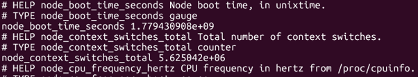

---

### 4. Exporter 동작 확인

노드에 접속해 각 Exporter가 지표를 노출하는지 `curl` 로 확인한다.

| Exporter | 포트 | 대상 노드 | 확인 명령 |
|----------|------|-----------|-----------|
| Node Exporter | `9100` | 전체 노드 | `curl -s http://localhost:9100/metrics` |
| DCGM Exporter (GPU) | `9400` | NVIDIA GPU VM | `curl -s http://localhost:9400/metrics` |
| azslurm-exporter | `9101` | 스케줄러 노드 | `curl -s http://localhost:9101/metrics` |

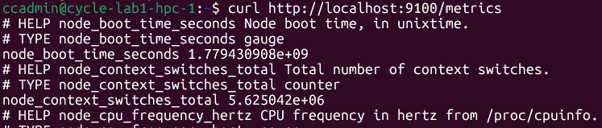

중앙 수집이 되는지는 Azure Portal에서 확인한다.

> **Azure Monitor Workspace → Prometheus explorer** 에서 PromQL `up` 을 실행해 노드가 나열되는지 확인한다.

---

### 5. 3단계: Grafana 대시보드

#### 1) CycleCloud 기본 대시보드

Grafana 접속 주소는 Azure Portal에서 확인한다.

> **Azure Managed Grafana → 생성된 Grafana → Overview → Endpoint**

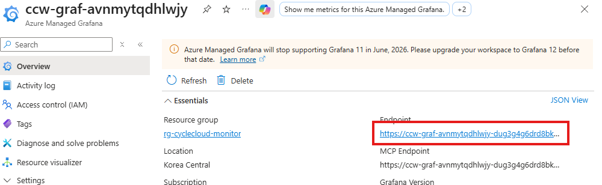

웹 브라우저에서 Grafana Endpoint로 접속한 뒤, **Dashboards → Azure CycleCloud** 폴더의 사전 제작 대시보드를 확인한다.

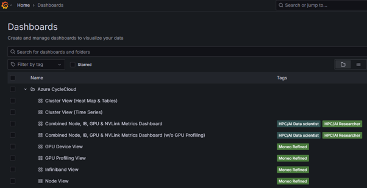

#### 2) 커뮤니티 대시보드 가져오기 (선택)

외부에서 공유된 대시보드를 가져올 수 있다. 단, Grafana 버전에 따라 정상 동작하지 않을 수 있으므로 필요 시 직접 구성한다.

[grafana.com/grafana/dashboards](https://grafana.com/grafana/dashboards/) 에서 `Slurm` 으로 검색해 원하는 대시보드를 찾는다.

- **Outbound가 열린 환경**: 대시보드 **ID**(예: `24979`)를 복사해 가져온다.
- **폐쇄망 환경**: 대시보드 **JSON 파일**을 다운로드해 사용한다.

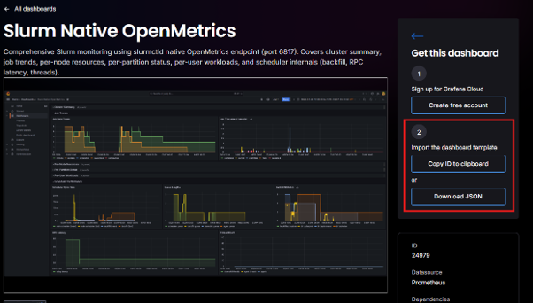

가져오기 절차는 다음과 같다.

1. **Azure Managed Grafana → Dashboard → 우측 상단 New → Import** 클릭.

   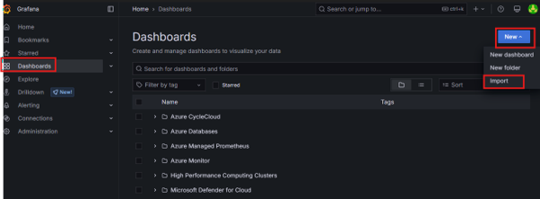

2. 다운로드한 JSON을 붙여넣고 **Load** 클릭.

   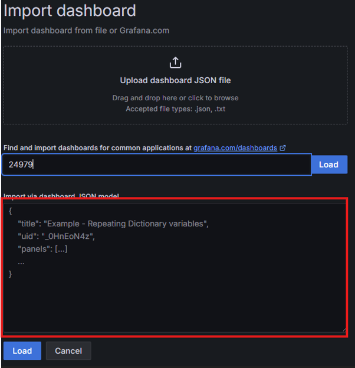

3. **Prometheus** 데이터 소스로 새로 생성한 Managed Prometheus를 선택하고 **Import** 클릭.

   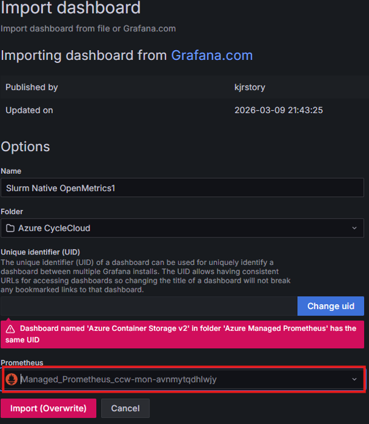

4. 대시보드에 접속해 정상적으로 지표가 출력되는지 확인한다.

   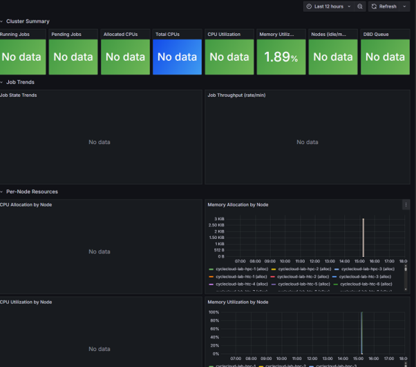

---

### 6. 4단계: 알림 설정

임계치를 초과하면 알림을 받도록 구성할 수 있다. 알림 조건은 **PromQL Query** 로 자유롭게 설정한다.

#### 1) PromQL Query 테스트

알림에 사용할 PromQL Query를 Grafana에서 먼저 테스트한다.

> **Grafana → Explore → Query → 우측 Code → Metrics browser** 에 PromQL 입력 → **Run Query**

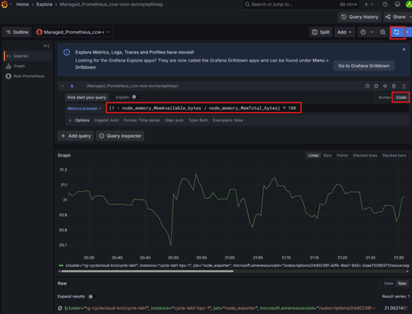

#### 2) 알림 규칙 생성

Azure Managed Workspace에서 알림 규칙을 생성한다.

> **Azure Monitor Workspace → Alerts → Create → Alert rule**

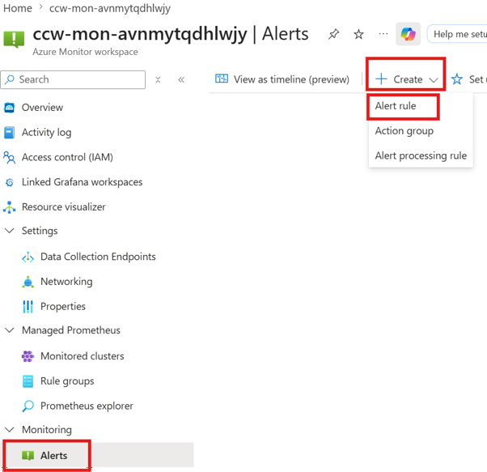

1. **Condition** 에 알림 조건(PromQL)과 **Check every**(평가 주기)를 입력.

   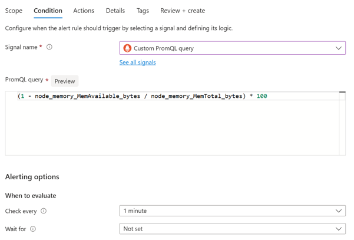

2. **Actions** 에서 Action group을 선택.

   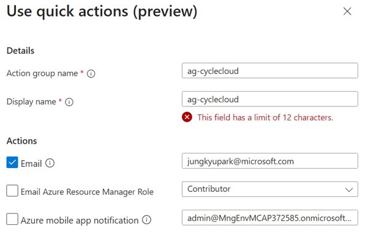

3. **Details** 에 Alert rule 이름과 설명을 입력하고 저장.

   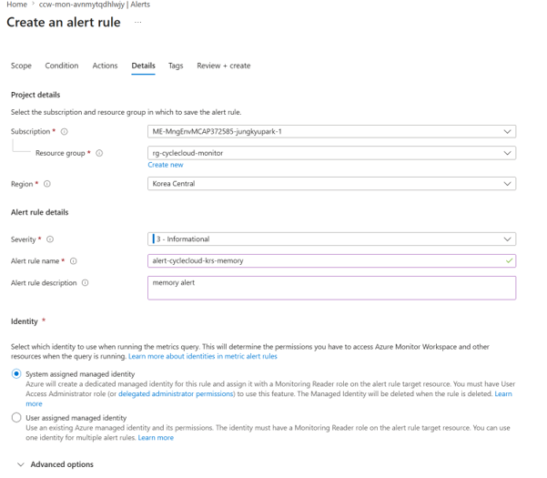

임계치를 초과하면 아래와 같이 경고 메일을 받는다.

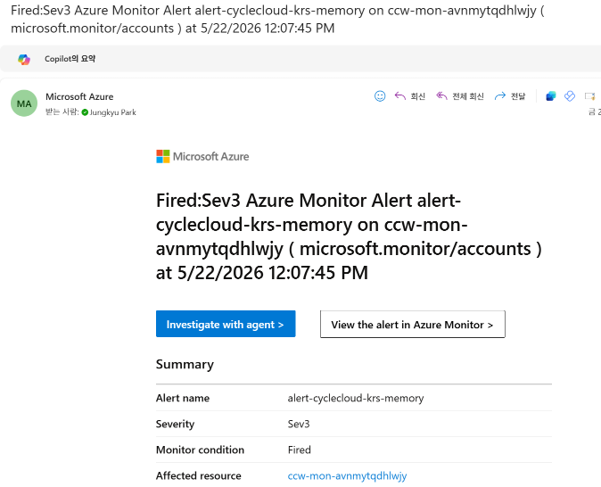

---

### 7. 리전 제약 및 Self-hosted 대안

일부 리전(예: Mexico, Korea South 등)에서는 **Azure Managed Grafana / Monitor Workspace** 가 미지원이거나 수집 리전 제약이 있을 수 있다.

- **대안 1 — 가까운 리전의 Managed Grafana 사용**: 노드 Prometheus가 수집한 지표를 가까운 리전(예: US South Central)의 Managed Grafana 데이터 소스로 연결한다. 리전 간 트래픽 비용을 확인한다.
- **대안 2 — Self-hosted 스택**: CycleCloud 서버 VM에 Grafana를 직접 설치하거나, 중앙 자체 Prometheus 서버가 노드 Exporter(`:9100`/`:9400`/`:9101`)를 직접 scrape하도록 구성한다. 폐쇄망 및 데이터 주권 요건에 적합하다.

---

### 8. 대규모 클러스터 수집 한도

Azure Monitor Workspace 기본 한도는 **분당 1M timeseries** 이다. 초과 시 스로틀링과 수집 지연이 발생한다. 현재 Exporter 기준 대략 다음 규모에서 한도에 도달한다.

| VM 종류 | 한도 도달 대략 노드 수 |
|---------|------------------------|
| Hbv4 (176 코어) | ~125 노드 |
| NDv5 (96 코어) | ~154 노드 |
| NCv4 (48 코어) | ~285 노드 |

대규모 클러스터는 [수집 한도 증설](https://learn.microsoft.com/azure/azure-monitor/metrics/azure-monitor-workspace-monitor-ingest-limits)을 검토한다.

---

## 검증

- 스케줄러와 계산 노드에서 `curl -s http://localhost:9100/metrics | head -5`로 Node Exporter 지표가 출력되는지 확인한다.
- GPU 노드는 `curl -s http://localhost:9400/metrics`, 스케줄러는 `curl -s http://localhost:9101/metrics`로 Exporter별 지표 노출을 확인한다.
- Azure Monitor Workspace의 Prometheus explorer에서 PromQL `up`을 실행해 노드가 나열되는지 확인한다.
- Azure Managed Grafana의 Azure CycleCloud 대시보드에서 CPU, 메모리, GPU, Slurm 지표가 표시되는지 확인한다.
- 알림 규칙을 만든 경우 테스트 Query와 임계치 조건이 예상대로 평가되는지 확인한다.

## 롤백·주의

- GUI 방식으로 활성화한 경우 Monitoring 탭의 Enable Monitoring을 해제하고 저장한 뒤 필요한 재시작 계획을 수립한다.
- 수동 적용한 경우 노드별 systemd 서비스와 configuration.json 변경 사항을 이전 상태로 되돌리고 exporter 서비스를 중지한다.
- Managed Grafana/Monitor Workspace 미지원 리전에서는 self-hosted 대안을 사용하고 리전 간 트래픽 비용을 확인한다.
- 대규모 클러스터는 Azure Monitor Workspace 수집 한도 초과로 스로틀링이 발생할 수 있으므로 한도 증설 또는 수집 범위 조정을 검토한다.

## 관련 문서

- [12. 모니터링 (상태 확인, 로그, 알림)](12-모니터링.md)
- [11. Job Accounting](11-Job-Accounting-설정.md)
- [13. 트러블슈팅 및 로그 확인](13-트러블슈팅-로그.md)
- [공식 Prometheus/Grafana 구성 문서](https://learn.microsoft.com/ko-kr/azure/cyclecloud/how-to/monitor-cyclecloud-cluster-using-prometheus-grafana?view=cyclecloud-8)

다음 단계: [13. 트러블슈팅 및 로그 확인](13-트러블슈팅-로그.md)
