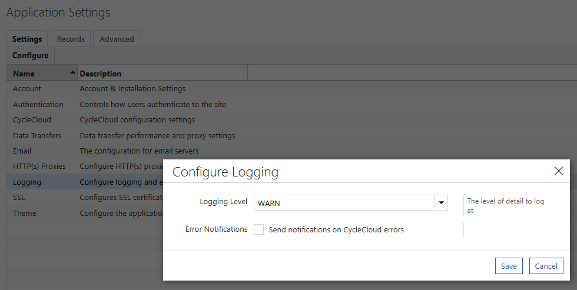

# 12. 모니터링 (상태 확인, 로그, 알림)

CycleCloud/Slurm 클러스터의 정상 여부와 노드/작업 상태를 GUI, CLI, 로그, Azure 지표로 점검하고 알림을 구성한다.

> HPC/GPU 메트릭 시각화는 [12-1. 모니터링 — Prometheus + Grafana](12-1-모니터링-Prometheus-Grafana.md)를 참고한다.

---

## 목적

클러스터의 정상 여부(노드 상태, 자동확장, 작업 큐, 스케줄러 서비스)를 GUI/CLI/로그로 점검하고, Azure 지표와 알림으로 이상을 조기에 감지한다. 일상 점검과 장애 1차 확인에 사용한다.

## 사전 조건

- CycleCloud 포털과 서버 VM, 스케줄러 노드에 접근할 수 있어야 한다.
- 스케줄러 노드에서 `sinfo`, `squeue`, `scontrol`, `sacct` 를 실행할 권한.
- Azure VM/VMSS 메트릭과 Activity Log 조회 권한(Reader 이상), 알림 구성 시 Action Group 생성 권한.

## 절차

### 12.1 모니터링 계층 개요

| 계층 | 무엇을 보나 | 도구 / 명령 |
|------|-------------|-------------|
| **① CycleCloud** | 노드 상태(Ready/Acquiring/Error), 자동확장 | 포털 Nodes 탭, `cyclecloud show_nodes` (§12.2, §12.3) |
| **② Slurm** | 파티션/큐/작업/노드 상태, 사용량 회계 | `sinfo`, `squeue`, `scontrol`, `sacct` (§12.3) |
| **③ Azure 플랫폼** | VM CPU/메모리/디스크/네트워크, 부팅 실패 | Azure Monitor, Boot diagnostics, Activity Log (§12.5) |
| **④ HPC/GPU 메트릭** | GPU 사용률/온도/전력 시각화 | Prometheus + Grafana → [12-1](12-1-모니터링-Prometheus-Grafana.md) |

이 문서는 **①~③의 일상 점검과 알림**을 다룬다.

---

### 12.2 상태 확인 (GUI)

1. **Clusters → 클러스터 선택** 에서 상태를 확인한다(`Off → Acquiring → Preparing → Ready`). `Ready` 가 정상, `Error` 는 노드 획득/설정 실패이다.
2. **Nodes 탭** 에서 노드별 State, 유형, VM 크기, IP를 확인한다. `Error` 노드는 클릭해 상세 메시지를 본다.
3. **Arrays 탭** 에서 파티션(nodearray)별 현재/최대 노드 수와 자동확장 현황을 확인한다.


> 노드가 `Error` 로 남으면 노드 `jetpack.log`, 서버 `cycle_server.log` 를 확인한다.

---

### 12.3 상태 확인 (CLI)

**CycleCloud (서버 VM)**

```bash
cyclecloud show_cluster <클러스터>       # 클러스터/노드 요약
cyclecloud show_nodes -c <클러스터>      # 노드별 STATUS(Ready/Acquiring/Error/Off)
```

**Slurm (스케줄러 노드)**

```bash
sinfo                       # 파티션별 노드 상태 요약
sinfo -R                    # DOWN/DRAIN 노드와 사유
squeue                      # 대기/실행 중 작업
scontrol show node <노드>    # 특정 노드 상세
scontrol ping               # slurmctld(기본/백업) 응답 확인
```

**노드 상태(State) 의미**

| 상태 | 의미 |
|------|------|
| `idle` / `alloc` / `mix` | 유휴 / 전체 할당 / 일부 할당 |
| `idle~` | 전원 꺼짐(오토스케일 대기, **정상**) |
| `idle#` | 전원 켜는 중(프로비저닝) |
| `drain` / `drng` | 신규 작업 차단(사유는 `sinfo -R`) |
| `down` | 다운(응답 없음, 헬스체크 실패) |
| `comp` | 작업 종료 처리 중 |

> `idle~` 는 자동확장의 정상 상태이다. `down`/`drain` 이 지속되면 `sinfo -R` 사유와 노드 로그를 확인한다.

**작업 이력**은 Job Accounting으로 조회한다(→ [11장](11-Job-Accounting-설정.md)).

```bash
sacct -X --format=JobID,JobName,User,State,ExitCode,Elapsed,AllocTRES
```

---

### 12.4 로그 위치

| 대상 | 내용 | 위치 |
|------|------|------|
| CycleCloud 서버 | 오케스트레이션, 노드 획득 | `/opt/cycle_server/logs/cycle_server.log` |
| 계산/스케줄러 노드 | 노드 수렴(converge) | `/opt/cycle/jetpack/logs/jetpack.log` |
| 계산 노드 부팅 | cloud-init 실행 | `/var/log/cloud-init-output.log` |
| Slurm 컨트롤러 | 스케줄링, 노드 상태 변화 | `/var/log/slurmctld/slurmctld.log` |


---

### 12.5 Azure 플랫폼 계층

- **메트릭**: 포털에서 계산 VMSS/스케줄러 VM → **Metrics** 로 CPU, Network, Disk 를 조회한다.

  ```bash
  az monitor metrics list --resource <VM/VMSS 리소스 ID> --metric "Percentage CPU" -o table
  ```

- **Boot diagnostics / Serial console**: 부팅 실패나 SSH 불가 시 스크린샷과 시리얼 콘솔로 진단한다.
- **Activity Log**: VM 시작, Deallocate, 삭제 등 컨트롤 플레인 이력을 확인한다.

---

### 12.6 알림 설정

#### 12.6.1 CycleCloud 오류 이메일 알림 (SMTP)

CycleCloud 서버가 감지한 오류를 담당자 메일로 받는다. 포털 우측 상단 **Settings → CycleCloud 시스템 설정** 에서 아래 세 값을 모두 채워야 발송된다(하나라도 비면 알림이 나가지 않는다).

| 설정 항목 | 설명 | 입력 예시 |
|-----------|------|-----------|
| `mail.host` | 알림을 보낼 SMTP 호스트 | `smtp.contoso.com` |
| `monitor.notify_to` | 수신 주소(여러 개는 쉼표로 구분) | `hpc-ops@contoso.com,oncall@contoso.com` |
| `monitor.notify_from` | 알림의 발신 주소 | `cyclecloud-noreply@contoso.com` |

CLI로도 동일하게 설정할 수 있다.

```bash
# 서버 VM에서 현재 값 확인
/opt/cycle_server/cycle_server execute \
  'select * from Application.Setting where Name matches "mail.*|monitor.notify.*"'
```

발송을 켜려면 **Settings → Logging → Configure Logging** 창에서 **Error Notifications** 의 `Send notifications on CycleCloud errors` 를 체크하고 저장한다.



설정 후 노드 획득 실패 등 오류 이벤트가 발생하면 지정한 주소로 메일이 발송된다. 발송되지 않으면 SMTP 호스트의 **포트·인증·방화벽(아웃바운드 25/587)** 허용 여부와 `cycle_server.log` 의 메일 전송 오류를 확인한다.

> SMTP 서버 자체(호스트·계정·포트)는 Settings 목록의 **Email — The configuration for email servers** 항목에서 관리한다.
>
> 사내 SMTP 릴레이가 없으면 Azure Communication Services Email 등 외부 릴레이를 `mail.host` 로 지정한다. Azure VM에서 25번 포트 아웃바운드는 기본 차단이므로 587 등 인증 릴레이를 사용한다.

#### 12.6.2 Logging Level 조정

알림·로그의 상세도는 같은 **Configure Logging** 창의 **Logging Level** 로 조정한다. 기본값 `DEBUG` 는 모든 메시지를 남기므로 운영 환경에서는 `INFO` 이상으로 낮춰 로그 용량을 줄인다.

| 값 | 범위 |
|----|------|
| `DEBUG` | 가장 상세함(기본값, 모든 로그 메시지 포함) |
| `INFO` | 일반 정보 이상 |
| `WARN` | 경고와 오류 |
| `ERROR` | 오류만 |

> 장애 재현·원인 분석 중에는 일시적으로 `DEBUG` 로 올리고, 분석이 끝나면 원래 값으로 되돌린다.

#### 12.6.3 비용 예산 경고 (참고)

**비용 예산 경고** — 클러스터 페이지의 Budget Alert 또는 Cost Management 예산 경고를 사용한다(→ [3장 §3.4](03-신규-클러스터-생성.md)).

**Slurm 노드 상태 알림(선택)** — `down`/`drain` 노드를 주기적으로 통지한다.

```bash
# /etc/cron.d 등에 등록 (예: 10분마다)
*/10 * * * * root bash -c 'R=$(sinfo -R -h); [ -n "$R" ] && echo "$R" | mail -s "Slurm node down/drain" ops@example.com'
```

> HPC/GPU 지표 기반 PromQL 알림은 [12-1 §6](12-1-모니터링-Prometheus-Grafana.md)을 참고한다.

---

## 검증

- 포털 Clusters/Nodes 탭에서 클러스터가 `Ready`, 노드가 정상 상태로 표시되는지 확인한다.
- 서버에서 `cyclecloud show_nodes -c <클러스터>`, 스케줄러에서 `sinfo -R`, `squeue`, `scontrol ping` 이 정상 응답하는지 확인한다.
- 포털 Metrics에서 대상 VM/VMSS 지표가 수집되고, 알림 규칙이 임계치대로 동작하는지 확인한다.
- Settings 에 `mail.host`, `monitor.notify_to`, `monitor.notify_from` 세 값이 모두 입력되어 있고, Configure Logging 의 **Error Notifications** 가 체크된 상태에서 오류 이벤트 발생 시 지정한 주소로 메일이 수신되는지 확인한다.

## 롤백·주의

- 상태 확인 절차는 조회 전용이므로 별도 롤백이 필요하지 않다.
- `idle~`(전원 꺼짐)은 자동확장의 정상 상태이므로 장애로 오인하지 않는다.
- 알림 규칙과 Action group은 리소스로 남아 과금될 수 있으므로 사용하지 않으면 정리하고, 임계치는 워크로드에 맞게 조정해 과도한 알림을 피한다.
- 이메일 알림을 끄려면 `monitor.notify_to` 를 비운다. `mail.host` 를 잘못 지정하면 `cycle_server.log` 에 전송 오류가 반복 기록되므로 함께 정리한다.
- Logging Level 을 `DEBUG` 로 유지하면 로그가 빠르게 증가해 서버 디스크를 소모하므로 분석 후 되돌린다.

## 관련 문서

- [12-1. 모니터링 — Prometheus + Grafana](12-1-모니터링-Prometheus-Grafana.md)
- [11. Job Accounting](11-Job-Accounting-설정.md)

다음 단계: [14. 버전 정보 확인](14-버전-확인.md)
