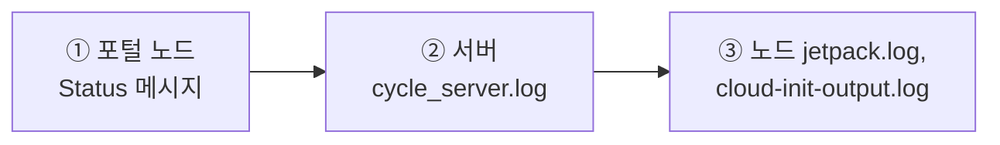

# 13. 기본 트러블슈팅 및 로그 확인

CycleCloud 서버 및 노드 로그 위치, SSH 없이 진단하는 방법, 자주 발생하는 문제와 대응 Triage 표를 정리한다.

---

## 목적

CycleCloud 서버와 노드의 로그 위치, SSH 없이 진단하는 방법, 자주 발생하는 장애 증상별 Triage 절차를 표준화한다. 포털 접속 장애, 노드 프로비저닝 실패, Slurm 상태 이상, Locker 중복등록 문제를 빠르게 분류하고 증거를 수집할 때 사용한다. 지원 케이스 제출에 필요한 버전과 로그 수집 항목도 함께 확인한다.

## 사전 조건

- Azure Portal 또는 Azure CLI에서 `<서버VM>` VM에 Run Command를 실행할 수 있는 RBAC 권한.
- 필요 시 CycleCloud 서버와 스케줄러/계산 노드에 SSH 접속할 수 있는 키 또는 점프호스트 경로.
- CycleCloud CLI 초기화가 완료되어 클러스터/노드 상태 조회가 가능할 것.
- 대상 클러스터명, 문제 노드명, 리소스 그룹, 리전, VM SKU 등 기본 식별 정보를 확보할 것.
- 지원 요청 전 CycleCloud, Slurm, Slurm Jetpack 버전을 확인할 수 있을 것.

## 절차

### 13.1 서버 로그 확인 3가지 접근 방법

#### (A) Azure Portal / az CLI "명령 실행" (SSH 키 불필요) ✅ 권장
Azure RBAC 권한이 있으면 담당자 PC에 SSH 키가 없어도 진단할 수 있다.
- **포털**: VM `<서버VM>` → **운영 → 명령 실행 (Run Command) → RunShellScript**
- **Azure CLI**:

  ```bash
  az vm run-command invoke -g <리소스그룹> -n <서버VM> \
    --command-id RunShellScript \
    --scripts "systemctl is-active cycle_server; tail -n 50 /opt/cycle_server/logs/cycle_server.log" \
    --query "value[0].message" -o tsv
  ```

#### (B) SSH 접속

```bash
ssh -i <SSH키> <서버관리자>@<서버IP>
```

*(NSG `<NSG>`에 허용된 IP 주소에서만 접속 허용)*

#### (C) Azure Serial Console (직렬 콘솔)
포털 → VM `<서버VM>` → **지원 + 문제 해결 → 직렬 콘솔 (Serial console)**로 접근.

---

### 13.2 CycleCloud 서버 로그 주요 경로 (`/opt/cycle_server/logs/`)

| 로그 파일 | 내용 및 점검 목적 |
|-----------|-------------------|
| **`cycle_server.log`** | **메인 애플리케이션 로그** (가장 먼저 tail/grep 점검) |
| `catalina.out` / `catalina.err` | 웹 포털(Tomcat/Java) 기동 및 서블릿 오류 로그 |
| `installation.log` | CycleCloud 서버 최초 설치/패키지 구성 로그 |
| `imds.log.log` | Azure IMDS 토큰 및 Managed Identity 인증 관련 로그 |

#### 필수 점검 명령

```bash
# 서비스 동작 상태 확인
sudo systemctl status cycle_server

# 실시간 로그 모니터링
sudo tail -n 100 -f /opt/cycle_server/logs/cycle_server.log

# 에러 및 예외 키워드 검색
sudo grep -iE "error|exception|denied" /opt/cycle_server/logs/cycle_server.log | tail -50

# 서비스 재시작
sudo systemctl restart cycle_server
```

---

### 13.3 계산 노드 내부 로그 및 CLI 진단

#### 1) CLI 클러스터/노드 상태 조회

```bash
cyclecloud show_cluster <cluster-name>
cyclecloud show_nodes -c <cluster-name> --states=Error
```

#### 2) 계산 노드 내부 에이전트 로그
노드 생성 실패 또는 스크립트 실행 에러는 노드에 SSH 접속해 점검한다:

```bash
# 노드 직접 접속
cyclecloud connect <node-name> -c <cluster-name>

# jetpack 초기화 및 converge 로그
sudo cat /opt/cycle/jetpack/logs/jetpack.log

# cluster-init 스크립트별 표준출력/에러 (실행 결과 확인은 여기)
sudo ls /opt/cycle/jetpack/logs/cluster-init/<프로젝트>/<spec>/scripts/
sudo cat /opt/cycle/jetpack/logs/cluster-init/<프로젝트>/<spec>/scripts/<스크립트명>.sh.out

# cloud-init 및 시스템 부팅 스크립트 로그
sudo cat /var/log/cloud-init-output.log

# (스케줄러 노드) Slurm 컨트롤러 로그 — 스케줄/노드 상태 이상 시
sudo journalctl -u slurmctld -n 100 --no-pager
```

> **로그 경로 주의** — 노드의 jetpack 로그는 `/opt/cycle/jetpack/logs/` 아래에 있고, `/var/log/jetpack/` 디렉터리는 **존재하지 않는다**. 같은 디렉터리에 `jetpack.log`, `jetpackd.log`, `install.log`, `install.err`, `healthcheck.log` 가 함께 있다. CycleCloud 8.9 는 기본값이 `EnableChef=false` 라 **`chef-client.log` 도 생성되지 않는다**.

> **cluster-init 스크립트가 "실행됐는데 아무 일도 안 일어난 것 같을 때"** — `jetpack.log` 에서 해당 스크립트의 `Executing cluster-init script: ...` 다음 줄에 `ran successfully` 가 있는지 확인한다. `Executing` 만 있고 `ran successfully` 가 없으면 **실행 권한(`chmod +x`)이 없어 건너뛴 것**이다. 이 경우에도 `/mnt/cluster-init/.run/<프로젝트>/<spec>/scripts/<스크립트명>.run` 마커는 생성되므로, 권한만 고쳐 재업로드해도 같은 파일명은 다시 실행되지 않는다. **새 파일명으로 다시 올린다.**

#### 3) 노드가 할당되었으나 오류난 경우 — UI 우회 직접 SSH ✅
노드가 Azure에는 할당(Allocation)되었지만 CycleCloud UI 연동 전에 실패하면 `cyclecloud connect` 가 동작하지 않을 수 있다. 이때는 **CycleCloud 서버에 내장된 키로 문제 노드에 직접 SSH** 한다.

```bash
# CycleCloud 서버(<서버VM>)에서 실행 — 서버 내장 개인키로 노드 private IP에 직접 접속
sudo ssh -i /opt/cycle_server/.ssh/cyclecloud.pem cyclecloud@<문제-노드-IP>
```

> 문제 노드의 private IP 는 포털 노드 상세 또는 `cyclecloud show_nodes -c <cluster-name>` 의 `PrivateIp` 로 확인한다. 접속 후 `jetpack.log`, `cloud-init-output.log`, `/var/log/waagent.log`(CSE 다운로드 오류) 를 점검한다.

> 공인 IP 없는 **Bastion / 서버 점프호스트 접근 모델**은 [1장 §1.8.3 Public IP & 접근 모델](01-HPC-및-CycleCloud-아키텍처.md#183-public-ip--접근-모델)을 참고한다.

---

### 13.4 자주 발생하는 장애 증상 및 Triage 진단표

진단 순서: ① 웹 포털 문제 노드의 **Status 메시지** 확인 → ② 서버 `cycle_server.log` 검색 → ③ 노드 내부 `jetpack.log` 확인.



| 증상 | 흔한 원인 | 진단 방법 | 해결 조치 |
|------|-----------|-----------|-----------|
| 노드가 안 생기고 `Acquiring` 상태 지속 | vCPU Quota(쿼터) 부족 | `az vm list-usage -l koreacentral` | 쿼터 증설 신청 또는 더 작은 SKU/다른 배열 지정 |
| 노드 `Error`: "allocation" / "capacity" | 리전/존 VM 가용 용량 부족 | 노드 Status 에러 메시지 | VM 크기 변경, 다른 가용성 존 지정, 일정 시간 후 재시도 |
| 노드 `Error`: "CloudInit mismatch" | `cloud-init` 수동 수정 후 노드 기동 | 노드 Status / `cycle_server.log` | `cycle_server fix_mismatched_attributes <cluster> --extra-attribute CloudInit` 또는 클러스터 재시작 후 `cluster-init` 방식 전환 |
| 클러스터 Start 실패 / "credentials" 에러 | Managed Identity 권한 미부여 | Settings > Subscriptions, `cycle_server.log` | VM 관리 ID에 구독 `Contributor` 역할 다시 부여 |
| 클러스터 생성/노드 프로비저닝 시 `Multiple lockers found for credential ...` | Locker(스토리지) 레코드가 **2개 이상** 등록됨 | `cyclecloud locker list`, `cycle_server.log` | Locker 하나만 남기거나 클러스터에 Locker 명시 → **[§13.9](#139-multiple-lockers-found--locker-중복등록미반영)** |
| 작업 제출해도 노드가 안 늘어남 (Autoscale 안 됨) | Max Cores 도달 또는 파티션 설정 미흡 | `sinfo`, `squeue -l` | Max Cores 상향, `azslurm` 파티션 동기화, `SuspendExcParts` 확인 |
| 작업이 `PENDING` (PD) 상태 유지 | 가용 노드 부족, 자원 요청 과다 | `squeue -l`, `scontrol show job <jobid>` | 자원 요청 수량 조정(`--cpus-per-task`), 쿼터 및 노드 상태 점검 |
| 노드가 `Installation` 에서 오래 멈춤 | compute 서브넷 **아웃바운드 없음**(apt/yum 미러 연결 실패) | 노드에서 `curl -4 http://azure.archive.ubuntu.com/` | 서브넷에 **NAT Gateway** 연결 → **[§13.10](#1310-노드가-installation-에서-멈춤--compute-서브넷-아웃바운드)** |
| Slurm 노드가 `inval` / `INVALID_REG` | SKU 변경 후 `azslurm scale` 미실행 | `sinfo -N`, `slurmctld.log` 의 `Low CPUs, Low RealMemory` | `azslurm scale` → `slurmd` 재기동 → `undrain`/`resume` ([5.4.3](05-노드-증감설-사이즈변경.md#543-sku-변경-후-azslurm-scale-을-반드시-실행한다-실측)) |
| cluster-init 스크립트가 실행된 것 같은데 효과 없음 | `chmod +x` 누락(조용히 건너뜀) | `jetpack.log` 에 `ran successfully` 가 없음 | `chmod +x` 후 **새 파일명**으로 재업로드 ([4.1.1](04-cluster-init-및-커스텀-스크립트.md#411-실행-중-노드에-반영되는-변경과-반영되지-않는-변경)) |
| 포털(HTTPS) 접속 불가 | `cycle_server` 다운 또는 NSG 443 차단 | `systemctl status cycle_server` | 서비스 재시작, NSG 443 허용 규칙 확인 |

---

### 13.5 인프라 진단 유용한 Azure CLI 명령어

```bash
# 1) vCPU 쿼터 사용량 확인
az vm list-usage -l koreacentral -o table | grep -iE "vCPU"

# 2) 특정 SKU 리전 가용 여부 확인
az vm list-skus -l koreacentral --size Standard_D -o table

# 3) 서버 VM 관리 ID 권한 확인
PID=$(az vm show -g <리소스그룹> -n <서버VM> --query identity.principalId -o tsv)
az role assignment list --assignee $PID -o table

# 4) NSG 인바운드 규칙 확인
az network nsg rule list -g <리소스그룹> --nsg-name <NSG> -o table
```

### 13.6 지원용 로그 일괄 수집 (`capture_logs.sh`)

지원용 로그/구성 데이터를 노드에서 수집한다. 스케줄러/로그인/실행 노드 어디서나 실행 가능하며, **점검 대상 노드마다** 실행해 생성된 tarball 을 지원 케이스에 첨부한다.

```bash
/opt/cycle/capture_logs.sh    # tarball 생성 → 지원 케이스 첨부
```

### 13.7 노드가 DRAIN 되는 경우 (Health Check)

Slurm `HealthCheckProgram` 이 **healthagent** 로 문제를 감지하면 노드를 **DRAIN** 처리한다(기본 60초 주기).

```bash
sinfo -R                       # DRAIN/DOWN 노드와 사유 확인
azslurm retry_failed_nodes     # 실패 노드 재시도
# 특정 노드 복구: 해당 노드에서 sudo systemctl restart slurmd
```

> healthagent 는 별도 systemd 서비스이며 CycleCloud UI 에도 상태 오류를 표시한다.

---

### 13.8 버전 정보 확인 (지원 케이스 필수 정보)

지원 요청 시 CycleCloud/Slurm/Jetpack 버전을 함께 제출한다.

#### CycleCloud 버전
CycleCloud UI **우측 상단의 `?` 아이콘** 클릭 → 버전 표시.


#### Slurm 버전
CycleCloud UI → **클러스터 → Edit → Advanced Settings → Slurm Version** 에서 확인.


#### Slurm Jetpack(프로젝트) 버전
스케줄러 노드에서 실행:

```bash
sudo jetpack config cyclecloud.cluster_init_specs --json | egrep 'project"|version'
```

출력 예시:

```json
"project": "slurm",
"version": "3.0.12"
```

> 버전에 따라 노드 수량 Count 기준이 달라진다(8.6 이전=코어 / 8.7+=인스턴스, → [5.2](05-노드-증감설-사이즈변경.md)). 지원 문의 전 세 버전을 확인한다.

> ⚠️ **`jetpack config` 는 읽기 전용이다** — 위처럼 값을 **조회**하는 용도로만 쓴다. 형식이 `jetpack config [KEY] [DEFAULT]` 이라 `jetpack config cyclecloud.mounts.data.type nfs` 처럼 값을 붙여 실행하면 두 번째 인자가 **키가 없을 때 출력할 기본값**으로 해석되어 화면에 `nfs` 가 찍힌다. 설정된 것처럼 보이지만 `node.json` 에는 **아무것도 저장되지 않는다**(되읽으면 `The value ... was not found.`). 노드 속성을 실제로 쓰는 명령은 `jetpack props --set` 이며, `cyclecloud.mounts.*` 는 이 방식으로 주입할 수 없다. 실행 중 노드에 마운트를 추가하려면 [4장 §4.1.1](04-cluster-init-및-커스텀-스크립트.md#411-실행-중-노드에-반영되는-변경과-반영되지-않는-변경) 의 cluster-init 경로를 사용한다.

---

### 13.9 `Multiple lockers found` — Locker 중복등록/미반영

#### 증상
클러스터 생성 또는 노드 프로비저닝 시 다음 오류가 발생하며, 노드가 프로젝트(jetpack)를 내려받지 못한다.

```
Multiple lockers found for credential <cred>, please specify a locker to use with the `Locker` attribute
```

#### 원인
- 동일 credential(구독)에 **Storage Locker 레코드가 2개 이상** 등록되어 CycleCloud가 노드에 쓸 Locker를 **자동 선택하지 못함**.
- 주 원인: 사이트 마법사/‘Add Locker’ **중복 실행**, 스토리지 재생성 후 기존 레코드 잔존.
- ⚠️ **Azure 포털에서 스토리지 계정만 삭제해도 CycleCloud 내부의 Locker 레코드는 남는다.** CycleCloud는 스토리지(Azure 리소스)와 **별개로** `Cloud.Locker` 레코드를 datastore에 보관한다.

#### 진단 — 등록된 Locker 확인
> `cyclecloud locker` 명령은 **`list` / `show` 만** 지원한다. **`remove` 서브커맨드는 없다.**

```bash
# 서버(<서버VM>)에서 — CLI 초기화가 되어 있어야 함 (4장 §4.2)
cyclecloud locker list
#   test-storage   (az://<acct>/cyclecloud)
#   test-storage-1 (az://<acct>/cyclecloud)   ← 2개 이상이면 이 오류의 원인

cyclecloud locker show test-storage-1     # 개별 상세 확인
```

내부 레코드를 직접 보려면(디버깅):

```bash
/opt/cycle_server/cycle_server execute 'SELECT Name, Credentials, Location, Default, Status FROM Cloud.Locker'
```

#### 해결 방법

검증된 방법은 **클러스터에 사용할 Locker를 명시**하는 것이다. CycleCloud 8.9.1에서 `cyclecloud locker` 에는 **`remove`/`delete` 서브커맨드가 없고**, `cycle_server execute` 로 레코드 삭제 시 **`Cannot delete active resources`** 로 차단된다. 아래 **A를 우선** 적용한다.

**A. (권장) 클러스터에 사용할 Locker 명시 — 비파괴적, 항상 동작**
- **포털**: 클러스터 **Edit → Advanced Settings → Software → Locker(프로젝트 저장소)** 에서 사용할 Locker(예: default인 `test-storage`)를 **직접 선택** 후 Save → 다시 Start.
- **템플릿(CLI)**: 클러스터 정의(또는 파라미터)에 `Locker = <locker-name>` 를 지정.
> credential 하나에 Locker가 여러 개이면 Default 플래그만으로 자동 선택하지 않는다. 클러스터에 Locker를 지정하면 이 오류가 사라진다.

**B. 중복 Locker를 실제로 제거하려면 (포털/재구성)**
CLI/`cycle_server` 로는 활성 Locker를 하드 삭제할 수 없다. 다음 중 하나로 정리한다.
- **포털 Settings → Subscriptions**: 해당 구독(credential)의 스토리지/Locker 구성을 편집하거나, credential을 **삭제 후 재등록**하면 딸린 Locker 레코드가 정리된다.
- **처음부터 하나만 등록**: 사이트 마법사/‘Add Locker’ 를 **중복 실행하지 말 것**. Locker는 credential당 **1개**만 유지한다([3장 §3.1 2)](03-신규-클러스터-생성.md)).
> ⚠️ **Azure 포털에서 스토리지 계정만 지우면** CycleCloud 레코드는 남아 오류가 지속된다. **CycleCloud 측(포털 Settings 또는 credential 재등록)** 에서 정리해야 한다.

```bash
# 정리 후 확인 — Locker가 하나만 남아야 함
cyclecloud locker list
```

#### ⚠️ Locker가 `Failed`(403)로 남아 있는 경우 — 함께 점검
`cyclecloud locker show` 또는 위 SELECT 결과에서 `Status = Failed`, `StatusMessage = Creating container (Http Status 403)` 이면 Locker 생성이 실패한 상태이다.
- **컨테이너 생성 권한**: shared key가 비활성화된 스토리지에서 CycleCloud가 컨테이너를 만들려면 **쓰기(`Storage Blob Data Contributor`)** 권한이 필요하다. **컨테이너를 미리 만들어 두거나**, 쓰기 권한이 있는 서버 MI로 등록한다([3장 §3.1 2)](03-신규-클러스터-생성.md)).
- **네트워크 도달성**: 스토리지 **Public network access가 Disabled**이고 **Private Endpoint가 없으면** 접근 자체가 실패한다([1장 §1.8.2](01-HPC-및-CycleCloud-아키텍처.md#182-private-endpoint--보안-스토리지db)).
- **역할 부여 대상**: 노드용 `locker-mi` = `Blob Data Reader`, 서버 MI = `Blob Data Contributor` ([3장 §3.1](03-신규-클러스터-생성.md)).

---

### 13.10 노드가 `Installation` 에서 멈춤 — compute 서브넷 아웃바운드

#### 증상

노드가 Azure 에는 정상 생성되지만 CycleCloud 상태가 `Installation (Awaiting software installation)` 에서 수십 분 이상 진행되지 않는다. 노드 `jetpack.log` 에는 약 18분 간격으로 `converge --mode=install` 재시도가 반복되고, cluster-init 첫 스크립트(예: healthagent `00-install.sh`)가 패키지 설치에서 실패한다.

```
E: Failed to fetch http://azure.archive.ubuntu.com/ubuntu/... Could not connect
```

#### 원인

컴퓨트 노드에 **공인 IP 가 없고**(`ExecuteNodesPublic=false`) 서브넷에 **NAT Gateway 등 명시적 아웃바운드 경로가 없는** 경우다. Azure 의 **기본 아웃바운드 액세스(default outbound access)** 는 폐지되어, 명시적 아웃바운드를 구성하지 않은 서브넷의 VM 은 인터넷에 나갈 수 없다. 노드는 부팅 시 OS 패키지와 에이전트를 내려받아야 하므로 여기서 멈춘다.

#### 진단

```bash
# 문제 노드에 SSH 접속 후 (접속 방법은 §13.3 3))
curl -4 -s -o /dev/null -w "%{http_code}\n" http://azure.archive.ubuntu.com/
curl -4 -s -o /dev/null -w "%{http_code}\n" https://packages.microsoft.com/
# 응답이 없거나 timeout 이면 아웃바운드 없음
```

```bash
# 서브넷에 NAT Gateway 가 붙어 있는지 확인
az network vnet subnet show -g <RG> --vnet-name <VNET> -n <SUBNET> --query natGateway.id -o tsv
```

#### 조치

compute 서브넷에 **NAT Gateway** 를 연결한다.

```bash
az network public-ip create -g <RG> -n <이름>-nat-ip \
  --sku Standard --allocation-method Static -l <리전>

az network nat gateway create -g <RG> -n <이름>-nat-gw -l <리전> \
  --public-ip-addresses <이름>-nat-ip --idle-timeout 10

az network vnet subnet update -g <RG> --vnet-name <VNET> -n <SUBNET> \
  --nat-gateway <이름>-nat-gw
```

노드를 재생성할 필요는 없다. jetpack 이 약 18분 주기로 `converge --mode=install` 을 자동 재시도하므로, 아웃바운드가 열리면 다음 재시도에서 설치가 이어진다.

> ⚠️ **Basic SKU 공인 IP 와 NAT Gateway 는 같은 서브넷에 공존할 수 없다.** 서브넷에 Basic SKU 공인 IP 나 Basic Load Balancer 를 쓰는 NIC 가 하나라도 있으면 아래 오류로 실패한다.
>
> ```
> NAT Gateway ... cannot be deployed on subnet containing Basic SKU Public IP addresses or Basic SKU Load Balancer
> ```
>
> CycleCloud 에서 `UsePublicNetwork=true` 로 만든 노드는 **Basic SKU 공인 IP** 를 받는다. NAT Gateway 를 쓰려면 해당 클러스터를 `UsePublicNetwork=false`(스케줄러) / `ExecuteNodesPublic=false`(실행 노드)로 바꾸고 기존 노드를 재생성한다.

---

### 13.11 Microsoft 공식 트러블슈팅 참고

CycleCloud 자체 진단과 지원 절차는 Microsoft Learn 공식 문서를 함께 참고한다. 노드 Status 카드의 **권장 사항/링크/세부 정보** 와 클러스터 **Support** 버튼(진단 리포트)을 활용하면 대부분의 문제를 직접 진단할 수 있다.

| 문서 | 용도 | 링크 |
|------|------|------|
| 문제 보고 (Report an Issue) | UI 지원 버튼으로 진단 데이터 수집 및 지원 요청 | [바로가기](https://learn.microsoft.com/ko-kr/azure/cyclecloud/how-to/report-issues?view=cyclecloud-8) |
| 오류 메시지 (Error Messages) | 준비/획득/부팅/소프트웨어 구성 단계별 오류와 해결 방법 | [바로가기](https://learn.microsoft.com/ko-kr/azure/cyclecloud/error-messages?view=cyclecloud-8) |
| 로그 위치 (Log Locations) | 서버/노드 로그 파일 경로 참조 | [바로가기](https://learn.microsoft.com/ko-kr/azure/cyclecloud/log-locations?view=cyclecloud-8) |

---

## 검증

- `systemctl is-active cycle_server` 또는 `sudo systemctl status cycle_server`로 서버 서비스 상태를 확인한다.
- `cyclecloud show_cluster <cluster-name>`와 `cyclecloud show_nodes -c <cluster-name> --states=Error`로 문제 범위를 확인한다.
- 서버 `cycle_server.log`, 노드 `jetpack.log`, `cloud-init-output.log`에서 같은 시간대의 에러 메시지를 교차 확인한다.
- Triage 표의 원인별 조치 후 포털 노드 Status, `sinfo`, `squeue`, `sacct` 등 관련 명령에서 정상 상태로 복구되었는지 확인한다.
- 지원 케이스가 필요하면 `/opt/cycle/capture_logs.sh` 산출물과 세 가지 버전 정보를 첨부한다.

## 롤백·주의

- `sudo systemctl restart cycle_server`, `azslurm retry_failed_nodes`, `slurmd` 재시작 같은 조치는 영향 범위를 확인한 뒤 수행한다.
- Azure 포털에서 Storage Account만 삭제해도 CycleCloud 내부 Locker 레코드는 남으므로 Locker 문제는 CycleCloud Settings 또는 credential 재등록으로 정리한다.
- CloudInit mismatch는 임시 명령으로만 해소하지 말고 운영 방식은 cluster-init으로 전환한다.
- NSG, RBAC, DB/Storage Private Endpoint 변경은 정상 노드에도 영향을 줄 수 있으므로 변경 전 현재 설정을 기록한다.

## 관련 문서

- [Public IP & 접근 모델](01-HPC-및-CycleCloud-아키텍처.md#183-public-ip--접근-모델)
- [노드 증설/감설 및 노드 사이즈 변경](05-노드-증감설-사이즈변경.md)
- [신규 클러스터 생성](03-신규-클러스터-생성.md)
- [Private Endpoint 및 보안 스토리지/DB](01-HPC-및-CycleCloud-아키텍처.md#182-private-endpoint--보안-스토리지db)
- [Microsoft: CycleCloud 문제 보고](https://learn.microsoft.com/ko-kr/azure/cyclecloud/how-to/report-issues?view=cyclecloud-8) · [오류 메시지](https://learn.microsoft.com/ko-kr/azure/cyclecloud/error-messages?view=cyclecloud-8) · [로그 위치](https://learn.microsoft.com/ko-kr/azure/cyclecloud/log-locations?view=cyclecloud-8)
- [다음 단계: 버전 정보 확인](14-버전-확인.md)

다음 단계: [14. 버전 정보 확인](14-버전-확인.md)
