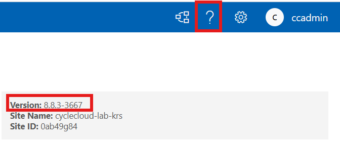
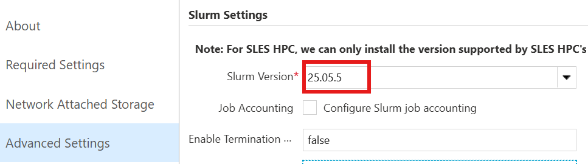

# 14. 버전 정보 확인 (CycleCloud, Slurm)

## 목적

운영 지원 시 CycleCloud, Slurm, Slurm Jetpack(프로젝트) 버전 정보를 확인하는 절차다. 포털에서 제품 버전을 확인하거나, 서버와 스케줄러 노드에서 CLI 명령으로 실제 설치 버전을 확인할 때 사용한다.

## 사전 조건

- CycleCloud 포털에 접근할 수 있어야 한다.
- CycleCloud 서버 VM에서 `cyclecloud --version` 명령을 실행할 수 있어야 한다.
- 스케줄러 노드에 접속해 `sinfo --version` 및 `sudo jetpack config` 명령을 실행할 수 있어야 한다.
- 클러스터의 Slurm Version 설정을 확인하려면 CycleCloud UI에서 클러스터 Edit 화면에 접근할 수 있어야 한다.

## 절차

### 14.1 CycleCloud 버전 확인

포털 우측 상단의 **`?` (도움말)** 아이콘을 클릭해 확인한다.



서버 VM에서 CLI로도 확인할 수 있다.

```bash
cyclecloud --version
```

---

### 14.2 Slurm 버전 확인

포털에서 클러스터에 지정된 Slurm 버전을 확인한다.

> **Clusters → 클러스터 → Edit → Advanced Settings → Slurm Version**



스케줄러 노드에 접속해 직접 확인할 수도 있다.

```bash
sinfo --version
```

---

### 14.3 Slurm Jetpack(프로젝트) 버전 확인

노드에 적용된 cluster-init 프로젝트(spec) 버전은 스케줄러 노드에서 확인한다.

```bash
sudo jetpack config cyclecloud.cluster_init_specs --json | egrep 'project"|version'
```

출력 예시는 다음과 같다.

```json
"project": "slurm",
"version": "3.0.12"
"project": "slurm",
"version": "3.0.12"
```

---

## 검증

- 포털과 CLI에서 CycleCloud 버전이 확인되는지 확인한다.
- CycleCloud UI의 Slurm Version 값과 `sinfo --version` 출력이 운영 기록에 필요한 수준으로 식별되는지 확인한다.
- `sudo jetpack config cyclecloud.cluster_init_specs --json | egrep 'project"|version'` 출력에 `project` 와 `version` 항목이 표시되는지 확인한다.

## 롤백·주의

- 이 절차는 조회 전용이므로 별도 롤백은 필요하지 않다.
- 포털 설정값과 노드 CLI 출력이 다르면 클러스터에 실제 적용된 버전을 우선 확인하고, 운영 지원 기록에 두 값을 모두 남긴다.
- 지원 요청이나 장애 분석에는 CycleCloud, Slurm, Slurm Jetpack 버전을 함께 첨부한다.


