# Azure CycleCloud 운영 실습 가이드 (Generic · 복사-붙여넣기용)

- CycleCloud + Slurm 클러스터를 **직접 구축한 환경**에서 운영하기 위한 실습 절차이다.
- 각 명령은 **`<...>` 부분을 본인 환경 값으로 치환**한 뒤 그대로 복사해 실행하면 된다. 명령 앞의 아이콘은 **어디서 실행하는지**를 나타낸다.

### 📍 실행 위치

| 아이콘 | 위치 | 설명 |
|---|---|---|
| 🖥️ **[내 PC]** | 로컬 터미널 | 내 노트북/PC 터미널(Windows PowerShell 또는 bash) |
| 🌐 **[브라우저]** | CycleCloud 포털 | 웹 UI (마우스 클릭 — 복사 대상 아님) |
| ☁️ **[CC 서버]** | CycleCloud 서버 | `ssh` 로 접속한 서버 쉘 |
| 🧮 **[스케줄러]** | 스케줄러 노드 | `cyclecloud connect scheduler` 로 접속한 노드 쉘 |

### 🔤 이 가이드의 플레이스홀더 (본인 값으로 치환)

| 플레이스홀더 | 의미 | 예시 |
|---|---|---|
| `<리소스그룹>` | 리소스가 배포된 RG | `rg-cyclecloud` |
| `<리전>` | Azure 리전 | `koreacentral` |
| `<서버-VM명>` | CycleCloud 서버 VM 이름 | `cyclecloud-server` |
| `<서버주소>` | 서버 공인 IP 또는 FQDN | `20.1.2.3` / `cc.koreacentral.cloudapp.azure.com` |
| `<서버관리자>` | 서버 SSH 관리자 계정 | `azureadmin` |
| `<클러스터명>` | 생성할 Slurm 클러스터 이름 | `myslurm` |
| `<스토리지계정>` | NFS/Locker 스토리지 계정 | `myccstorage` |
| `<쉐어1>` / `<쉐어2>` | NFS 쉐어(파일 쉐어) 이름 | `share1` / `share2` |
| `<서버-MI>` | 서버가 노드를 생성할 때 쓰는 관리 ID | `cc-server-mi` |
| `<노드-MI>` | 노드가 Locker 를 내려받을 때 쓰는 관리 ID | `cc-locker-mi` |

> 노드 이름은 CycleCloud 가 `<클러스터명>-<파티션>-<번호>` 형식으로 만든다(예: `<클러스터명>-hpc-1`). 정확한 이름은 항상 `sinfo -N` 또는 `cyclecloud show_nodes` 로 확인한다.

---

## 0. 사전 조건 — 환경 구축 (실습 전 완료 필요)

- 아래 절차를 **🖥️ [내 PC] Azure CLI** 에서 순서대로 실행하면 실습 환경이 구축된다.
- (Bicep/Terraform/포털로 대체 가능하나, 여기서는 재현 가능한 CLI 절차를 제공한다.)

> 사전: `az login` 완료, `az account set --subscription <구독ID>` 로 대상 구독 선택, 그리고 로컬에 SSH 키(`~/.ssh/id_rsa.pub`)가 있어야 한다(없으면 `ssh-keygen -t rsa -b 4096`).

**0-1.** 🖥️ **[내 PC]** 변수 설정 
— **이 블록만 본인 값으로 수정**하고, 이후 명령은 그대로 붙여 넣는다. (bash 기준. Windows 는 WSL/Git-Bash 권장)

```bash
export LOC=koreacentral
export RG=rg-cyclecloud
export VNET=cc-vnet
export STORAGE=myccstorage$RANDOM      # 전역 유일해야 함(소문자/숫자, 3~24자)
export SERVER_MI=cc-server-mi
export NODE_MI=cc-locker-mi
export VMNAME=cyclecloud-server
export ADMIN=azureadmin
export IMAGE=azurecyclecloud:azure-cyclecloud:cyclecloud8-gen2:latest
export SUB=$(az account show --query id -o tsv)
```

**0-2.** 🖥️ **[내 PC]** 리소스 그룹을 생성한다.

```bash
az group create -n $RG -l $LOC
```

**0-3.** 🖥️ **[내 PC]** VNet + 서브넷 2개(`server`, `compute`) + **compute 아웃바운드용 NAT Gateway**를 구성한다.

> **compute 서브넷 아웃바운드는 필수** — 노드가 부팅 시 OS 패키지(`apt`/`yum`)와 프로젝트를 내려받는다.
> 막히면 노드가 `Installation` 단계에서 멈춘다.

```bash
# VNet + 서버 서브넷
az network vnet create -g $RG -n $VNET --address-prefixes 10.0.0.0/16 \
  --subnet-name server --subnet-prefixes 10.0.1.0/24
# compute 서브넷
az network vnet subnet create -g $RG --vnet-name $VNET -n compute --address-prefixes 10.0.2.0/23
# NAT Gateway(고정 아웃바운드 IP) → compute 서브넷에 연결
az network public-ip create -g $RG -n cc-nat-pip --sku Standard --allocation-method Static
az network nat gateway create -g $RG -n cc-nat --public-ip-addresses cc-nat-pip --idle-timeout 10
az network vnet subnet update -g $RG --vnet-name $VNET -n compute --nat-gateway cc-nat
```

**0-4.** 🖥️ **[내 PC]** Storage Account(Locker) + Blob 컨테이너를 생성한다. 노드는 부팅 시 이 Locker 에서 프로젝트를 내려받는다.

```bash
az storage account create -g $RG -n $STORAGE -l $LOC --sku Standard_LRS --kind StorageV2 --min-tls-version TLS1_2
az storage container create --account-name $STORAGE -n cyclecloud --auth-mode login
```

**0-5.** 🖥️ **[내 PC]** User Managed Identity **2개**를 생성한다.

```bash
az identity create -g $RG -n $SERVER_MI    # 서버가 노드/VMSS 를 생성할 때 사용
az identity create -g $RG -n $NODE_MI      # 노드가 Locker(스토리지)를 내려받을 때 사용
```

**0-6.** 🖥️ **[내 PC]** **역할 부여** — 권한이 없으면 노드 생성(VMSS) 또는 Locker 다운로드가 실패한다.

```bash
SERVER_PID=$(az identity show -g $RG -n $SERVER_MI --query principalId -o tsv)
NODE_PID=$(az identity show   -g $RG -n $NODE_MI   --query principalId -o tsv)
NODE_MI_ID=$(az identity show -g $RG -n $NODE_MI   --query id -o tsv)

# (1) 서버 MI → RG Contributor : 노드/VMSS/디스크 생성 권한
az role assignment create --assignee-object-id $SERVER_PID --assignee-principal-type ServicePrincipal \
  --role Contributor --scope /subscriptions/$SUB/resourceGroups/$RG
# (2) 서버 MI → 노드 MI 에 대한 Managed Identity Operator : 노드에 노드-MI 를 붙일 권한
az role assignment create --assignee-object-id $SERVER_PID --assignee-principal-type ServicePrincipal \
  --role "Managed Identity Operator" --scope $NODE_MI_ID
# (3) 노드 MI → 스토리지 Blob 권한 : Locker 다운로드(없으면 부팅 시 403)
az role assignment create --assignee-object-id $NODE_PID --assignee-principal-type ServicePrincipal \
  --role "Storage Blob Data Contributor" \
  --scope /subscriptions/$SUB/resourceGroups/$RG/providers/Microsoft.Storage/storageAccounts/$STORAGE
```

> 🖼️ **포털 대안** — 역할은 포털에서도 부여할 수 있다: **Managed Identity → Azure role assignments → + Add role assignment** 에서 `Storage Blob Data Contributor` 를 스토리지에 부여.
>
> 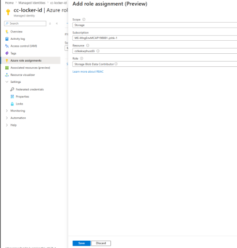

**0-7.** 🖥️ **[내 PC]** Marketplace 이미지 약관을 수락한다(구독당 1회).

```bash
az vm image terms accept --urn $IMAGE
```

**0-8.** 🖥️ **[내 PC]** CycleCloud 서버 VM을 배포한다(서버 서브넷, **서버-MI 할당**, 공인 IP, 443 오픈).

```bash
az vm create -g $RG -n $VMNAME \
  --image $IMAGE --size Standard_D4s_v5 \
  --admin-username $ADMIN --ssh-key-values ~/.ssh/id_rsa.pub \
  --vnet-name $VNET --subnet server \
  --public-ip-sku Standard --os-disk-size-gb 128 \
  --assign-identity $(az identity show -g $RG -n $SERVER_MI --query id -o tsv)
# 포털(HTTPS) 접근 허용
az vm open-port -g $RG -n $VMNAME --port 443 --priority 1001
# 접속 주소 확인 → 1장 <서버주소> / 2장 포털 URL 로 사용
az vm show -d -g $RG -n $VMNAME --query "{ip:publicIps, fqdn:fqdns}" -o tsv
```

> 🖼️ **GUI 대안 — Azure Portal Marketplace 로 서버 VM 생성** (위 CLI 대신 포털로 배포)
>
> 1. Azure Portal → **Marketplace** → 검색창에 `cyclecloud` 입력 → **Azure CycleCloud**(Virtual Machine, *Bring your own license*) 선택 → **Create**.
>
> 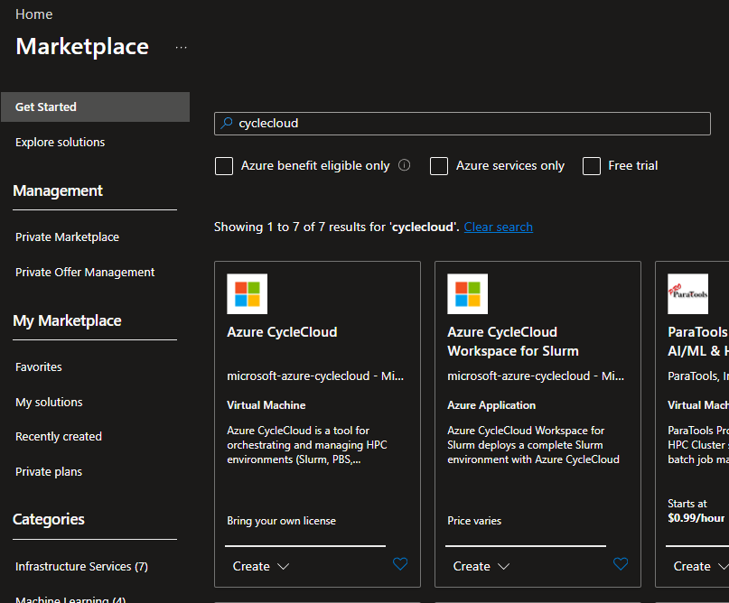
>
> 2. **Create a virtual machine** 마법사에 입력한다.
>    - **Subscription / Resource group**: 0-2 의 `<리소스그룹>`
>    - **Virtual machine name**: `<서버-VM명>`, **Region**: `<리전>`
>    - **Image**: `Azure CycleCloud 8.x`(Gen2), **Size**: 최소 **4 vCPU / 8GB**(예 `Standard_D4s_v5`)
>    - **Authentication type**: SSH 공개키
>    - **Networking** 탭: VNet=`<VNet>`, Subnet=**server**, 공인 IP 생성
>    - **Management** 탭: **Identity → User assigned** 에 0-5 의 `<서버-MI>` 추가(또는 System assigned = On)
>    - **Review + create → Create**
>
> 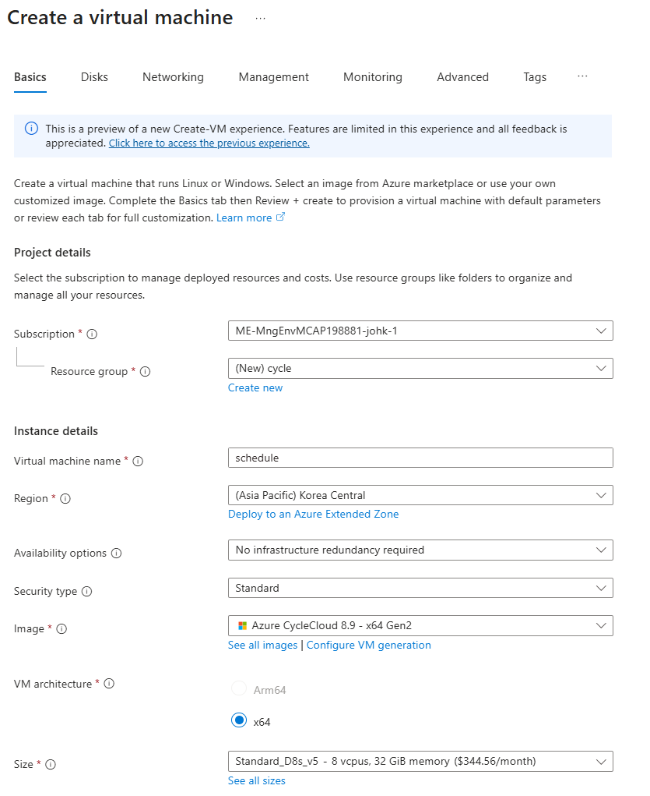
>
> 3. 배포가 끝나면 **443(HTTPS)** 인바운드를 허용(NSG)하고, 공인 IP/FQDN 으로 포털에 접속한다(→ 2장). System assigned 를 썼다면 0-6 의 역할 부여를 **그 System MI 대상**으로 수행한다.

**0-9.** (선택 — 실습 7장 NFS 용) 🖥️ **[내 PC]** Azure Files **NFS 4.1** 쉐어를 준비한다.

> NFS 파일 쉐어는 **Premium FileStorage 계정 + Private Endpoint** 가 필요하며, **보안 전송/전송 중 암호화를 꺼야** 한다(안 끄면 `access denied by server`).

```bash
export NFS=myccnfs$RANDOM
az storage account create -g $RG -n $NFS -l $LOC --sku Premium_LRS --kind FileStorage \
  --https-only false --min-tls-version TLS1_2
az storage account file-service-properties update -n $NFS -g $RG \
  --nfs-eit --require-nfs-encryption-in-transit false
# 쉐어 2개(<쉐어1>/<쉐어2>) 생성 — 프로토콜 NFS
az storage share-rm create --storage-account $NFS -g $RG -n share1 --protocol NFS --quota 100
az storage share-rm create --storage-account $NFS -g $RG -n share2 --protocol NFS --quota 100
# compute/server 서브넷에서 접근하도록 Private Endpoint 연결(요약)
az network private-endpoint create -g $RG -n ${NFS}-pe --vnet-name $VNET --subnet compute \
  --private-connection-resource-id $(az storage account show -g $RG -n $NFS --query id -o tsv) \
  --group-id file --connection-name ${NFS}-conn
```
> Private DNS(`privatelink.file.core.windows.net`) 연동은 환경 표준에 맞춰 구성한다. 7장에서 `<스토리지계정>` = `$NFS`, `<쉐어1>`=`share1`, `<쉐어2>`=`share2` 로 사용한다.

**0-10.** ☁️ **[CC 서버]** 배포 후 2~3분 뒤 서버가 부팅되면 1장으로 진행한다. SSH 키(`.pub`)는 2장에서 포털 **My Profile → SSH Public Keys** 에 등록한다(노드 접속용, 클러스터 시작 전 필수).

> ✅ 위 단계로 만들어지는 것: **RG · VNet(server/compute) · NAT · 스토리지(Locker) · MI 2개+권한 · 서버 VM**. 이 값들이 이후 `<...>` 플레이스홀더에 대응한다.

### 실습 흐름
1. 서버 접속 → 2. 포털 최초 설정 → 3. 클러스터 생성 → 4. 기동·검증(**CLI 초기화 포함**) → 5. 증설/감설 → 6. 사이즈 변경 → 7. NFS·디스크 마운트 → 8. 단일 노드 추가 → 9. 트러블슈팅 → 10. 정리

---

## 1. CycleCloud 서버에 접속

**1-1.** 🖥️ **[내 PC]** 터미널을 연다(Windows: `Windows Terminal` 또는 `PowerShell`).

**1-2.** 🖥️ **[내 PC]** 서버에 SSH 접속한다. (`<...>` 치환)

```bash
ssh <서버관리자>@<서버주소>
```

- 최초 접속 시 `Are you sure you want to continue connecting?` → `yes`.

**1-3.** ☁️ **[CC 서버]** 접속을 확인한다.

```bash
whoami; hostname; cyclecloud --version
```

- 기대 출력: `<서버관리자>` / (서버 호스트명) / `CycleCloud ... version ...`

> 💡 구독에서 야간에 VM 을 자동 종료(deallocate)하도록 설정한 경우, 실습 전 `az vm start -g <리소스그룹> -n <서버-VM명>` 으로 서버를 먼저 켠다. 공인 IP 를 **Static** 으로 두면 재시작해도 주소가 유지된다.

---

## 2. CycleCloud 포털 접속 및 최초 설정 (환경당 1회)

**2-1.** 🌐 **[브라우저]** 서버 주소로 접속한다.

```
https://<서버주소>
```

**2-2.** 🌐 **[브라우저]** 인증서 경고 → **고급(Advanced)** → **계속 진행(Proceed)**한다.

**2-3.** 🌐 **[브라우저]** (최초만) **관리자 계정 생성** 화면에서 입력 후 **Create** → 로그인한다.
   1. **Site Name**: 임의(예 `mysite`)
   2. **Username / Password**: 포털 관리용 계정(**기록해 둘 것** — 4장 CLI 초기화에 사용)

**2-4.** 🌐 **[브라우저]** 좌측 하단 **Settings**(톱니) → **Subscriptions** → **Add/Edit**에서 입력한다.
   1. **Service Type**: `Managed Identity`
   2. **Region**: `<리전>`
   3. **Resource Group / Storage(Locker) / Locker Identity**: 0장에서 만든 값 선택
      - Storage = **0-4 의 Locker 스토리지 계정**, Locker Identity = **`<노드-MI>`**(0-5)
   4. **Validate** → 초록색 통과 확인 → **Save**

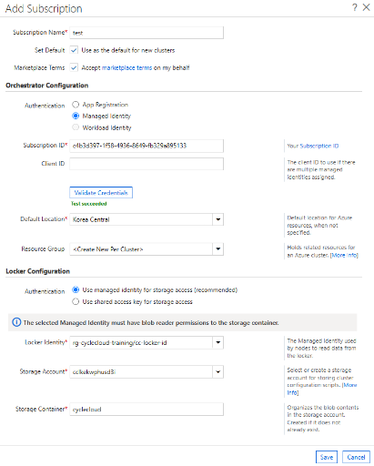

**2-5.** 🌐 **[브라우저]** 우측 상단 사용자명 → **My Profile** → **SSH Public Keys** → **+** 로 공개키를 등록하고 **Save**한다.

   등록할 공개키가 없으면 먼저 생성한다.

   - 🖥️ **[내 PC]** (Linux/macOS/WSL):
   ```bash
   ssh-keygen -t rsa -b 4096 -f ~/.ssh/cyclecloud_rsa -C "cyclecloud-node"
   cat ~/.ssh/cyclecloud_rsa.pub     # 이 한 줄(ssh-rsa AAAA...)을 포털에 붙여넣기
   ```
   - 🖥️ **[내 PC]** (Windows PowerShell):
   ```powershell
   ssh-keygen -t rsa -b 4096 -f $env:USERPROFILE\.ssh\cyclecloud_rsa -C "cyclecloud-node"
   Get-Content $env:USERPROFILE\.ssh\cyclecloud_rsa.pub
   ```
   > 🔐 개인키는 공유·업로드 금지, 포털에는 `.pub`(공개키)만 등록. 키는 **노드 부팅 시 주입**되므로 **클러스터 시작 전에** 등록해야 하며, 미등록 시 노드 접속이 `Permission denied (publickey)` 로 실패한다.

---

## 3. Slurm 클러스터 생성

**3-1.** 🌐 **[브라우저]** 좌측 **Clusters**를 클릭한다.

**3-2.** 🌐 **[브라우저]** 좌측 하단 **`+`**(New Cluster) → 목록에서 **Slurm**을 선택한다.

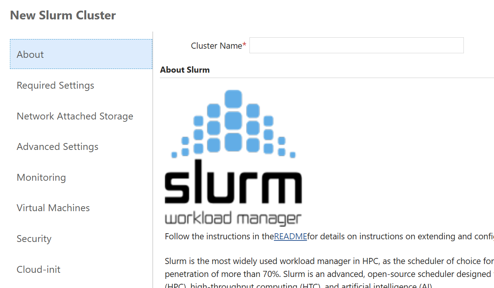

**3-3.** 🌐 **[브라우저]** **Required Settings**를 입력한다.
   1. **Cluster Name**: `<클러스터명>`  ← (이후 명령이 이 이름을 사용)
   2. **Region**: `<리전>`
   3. **Scheduler VM Type**: 예) `Standard_D4s_v5`
   4. **HPC / HTC VM Type**: 실습용 크기(예 `Standard_D2s_v5`) 와 **Max Cores**(예 `16`)
   5. **Subnet**: **`compute` 서브넷**(0-3)
   6. **Autoscale**: **Enabled**

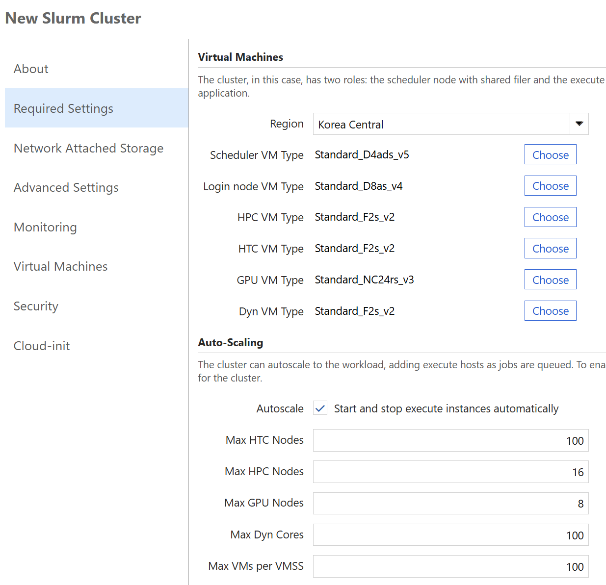

**3-4.** 🌐 **[브라우저]** **Advanced Settings** → 노드 아이덴티티(Managed Identity)를 지정한다.

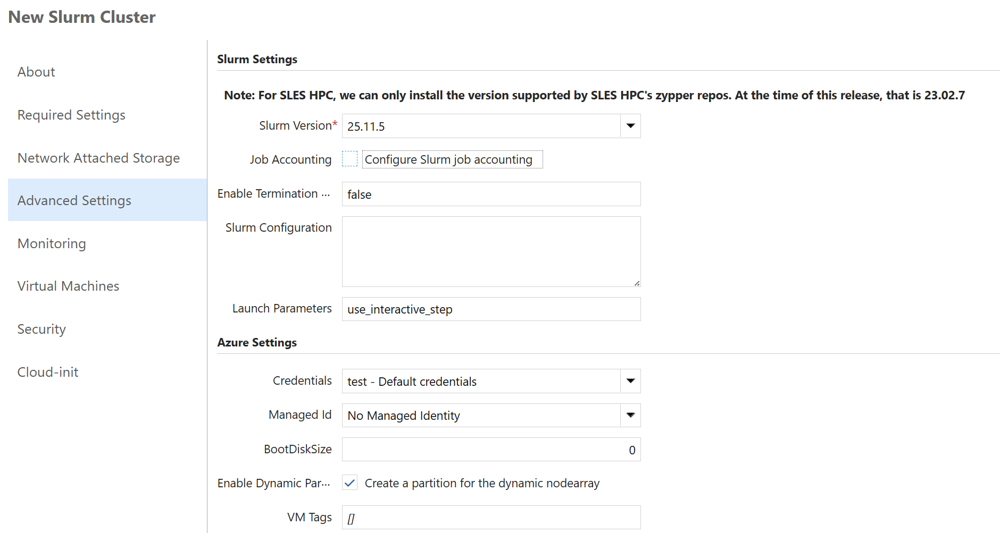

같은 화면의 **Software** 섹션에서 **Name As Hostname**, **Node Prefix**, **Scheduler Hostname**, OS 이미지를 확인/조정할 수 있다(노드 명명 규칙과 직접 관련 — §8 참고).

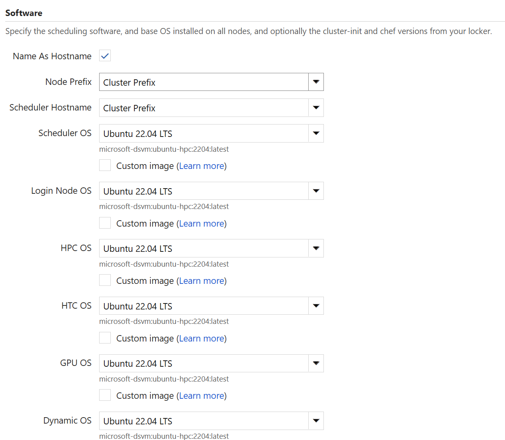

**3-5.** 🌐 **[브라우저]** 하단 **Save**를 클릭한다(아직 시작 전 = `Off`).

> **참고 — 위 설정값의 의미**
> - **노드 유형**: **HPC**=MPI(노드 간 저지연 통신, IB/RDMA SKU), **HTC**=독립 배치잡(범용 SKU), **Scheduler**=`slurmctld` 구동 + `/shared`·`/sched` 제공(1대 상주).
> - **Advanced Settings 아이덴티티 2개(필수)**: **Credentials**=2-4 에서 등록한 구독(서버 MI 가 노드 생성), **Managed Id**=노드에 붙는 **`<노드-MI>`**(부팅 시 Locker 다운로드). 잘못 고르면 노드 다운로드가 `403` 실패.
> - **Network Attached Storage**: NFS Type=`Builtin` 이면 스케줄러가 `/shared`·`/sched` 를 제공.
> - **Max Cores** 는 파티션 자동확장 상한(CycleCloud 8.7+ 는 인스턴스 수 기준).

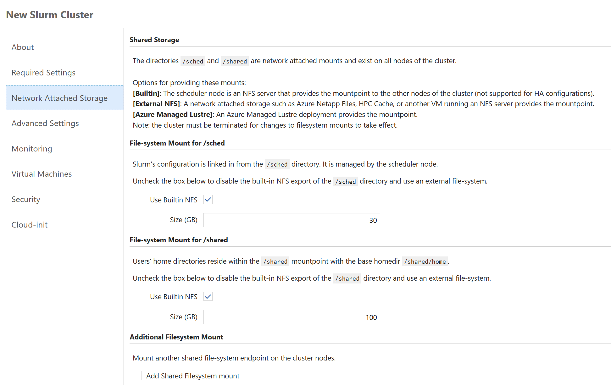

---

## 4. 클러스터 기동 및 검증

**4-1.** 🌐 **[브라우저]** **Clusters → `<클러스터명>`** 선택 → 상단 **Start** → **OK**를 클릭한다.

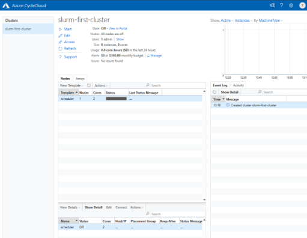

**4-2.** 🌐 **[브라우저]** 상태가 `Off → Acquiring → Preparing → Ready` 로 진행된다. 스케줄러가 **Ready** 될 때까지 대기(수 분).

**4-3.** ☁️ **[CC 서버]** **(최초 1회) CycleCloud CLI 를 포털에 연결**한다. `<포털관리자ID>` / `<포털관리자PW>` 는 **2-3 에서 만든 값**이다.

```bash
cyclecloud initialize --batch --url=https://localhost:9443 --verify-ssl=false --username='<포털관리자ID>' --password='<포털관리자PW>'
```

- 성공 확인:

```bash
cyclecloud show_cluster <클러스터명>
```

**4-4.** ☁️ **[CC 서버]** 스케줄러 노드로 접속한다.

```bash
cyclecloud connect scheduler -c <클러스터명>
```

**4-5.** 🧮 **[스케줄러]** Slurm 상태를 확인한다.

```bash
sinfo
squeue
```

- 기대 출력: `sinfo` 에 파티션(`hpc*` 등)과 노드 상태(`idle~` = 대기)가 표시됨.

---

## 5. 노드 증설 / 감설

> 표준 절차 = **포털에서 정의 변경 → `azslurm scale`**. 아래 5-4 의 `resume/suspend` 는 개별 노드를 즉시 켜고/끄는 검증용이다.

**5-1.** 🌐 **[브라우저]** **Clusters → `<클러스터명>` → Edit → Auto-Scaling** 에서 **Max Cores**(또는 노드 수)를 조정하고 **Save**한다.

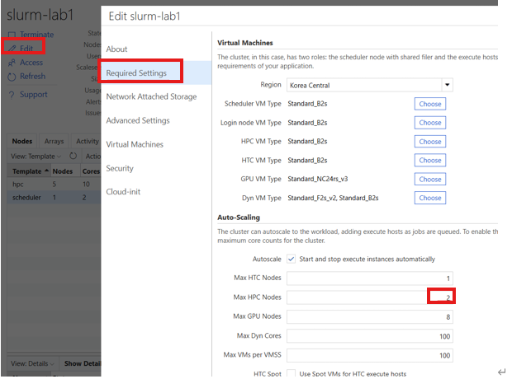

**5-2.** ☁️ **[CC 서버]** 스케줄러에 접속한다.

```bash
cyclecloud connect scheduler -c <클러스터명>
```

**5-3.** 🧮 **[스케줄러]** root 로 전환한다.

```bash
sudo -i
```

**5-4.** 🧮 **[스케줄러]** 아래에서 필요한 것을 복사해 실행한다.

```bash
# (권장) 포털에서 바꾼 정의를 Slurm 에 반영
azslurm scale

# 현재 노드 목록/이름 확인
sinfo -N

# 증설: 특정 노드 즉시 기동 (이름은 위 sinfo 결과 사용)
azslurm resume  --node-list <클러스터명>-hpc-1

# 감설: 특정 노드 회수
azslurm suspend --node-list <클러스터명>-hpc-1
```

> **참고 — 반영 방식**
> - **증설**: 먼저 **GUI Auto-Scaling 의 Max 를 올리고 Save**(정의 갱신) → 스케줄러에서 `azslurm scale`(정의 기준 `azure.conf` 재생성, 재시작 불필요). GUI Max 를 안 올리면 `Unknown node name` 오류.
> - **감설**: 켜져 있는 VM 은 정의만 줄여도 안 꺼지므로 **먼저 `azslurm suspend` 로 노드를 내린 뒤** GUI Max 를 낮춰 Save한다(그렇지 않으면 과금 지속 고아 VM 발생).
> - 늘어난 노드는 작업 제출(`srun`/`sbatch`) 또는 `azslurm resume` 시 실제로 생성된다.

---

## 6. 노드 사이즈(VM Type) 변경

**6-1.** 🌐 **[브라우저]** **Clusters → `<클러스터명>` → Edit** → HPC 노드어레이의 **Machine Type** 을 원하는 크기로 변경하고 **Save**한다.

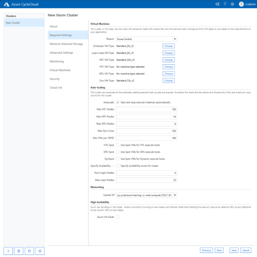

**6-2.** 🧮 **[스케줄러]** 실행 중이던 노드는 회수 후 새 크기로 다시 기동해야 반영된다.

```bash
# 🧮 [스케줄러] (sudo -i 상태)
azslurm suspend --node-list <클러스터명>-hpc-1
azslurm scale
azslurm resume  --node-list <클러스터명>-hpc-1
```

> **참고** — 동작 중 VM 크기는 실시간 변경 불가. **Machine Type 변경 → Save → 기존 노드 Terminate/suspend → 새 크기로 재생성** 순서로만 반영된다. RI/GPU 노드는 회수 후 재생성 시 용량 부족으로 실패할 수 있으니 사전 용량을 확인한다. 템플릿(IaC)으로는 `[[[parameter HPCMachineType]]]` 값을 바꿔 `import_cluster` 로 재적용한다.
>
> **SKU 변경은 노드 단위 순차 교체가 가능하다(전체 array 동시 다운 불필요, 실증 확인).** CycleCloud 는 SKU 마다 **별도 VMSS(scaleset) 버킷**을 만들므로, 위 예시처럼 한 대씩 `suspend → scale → resume` 하면 새 SKU 노드가 **별도 scaleset 에 새로 생성**되고 나머지 기존 노드는 그대로 유지된다. 이는 **§7D 디스크/볼륨 변경**과 대비되는 지점이다. §7D에서는 볼륨이 scaleset 고정 속성이라 `does not match existing scaleset attributes` 오류가 발생하므로 **nodearray 전체 재생성이 필요하다**.
>
> ⚠️ 다만 **HPC(InfiniBand/RDMA) 운영 시 주의**: 하나의 MPI 잡은 같은 placement group(= 같은 VMSS)에 있어야 하므로, 두 SKU 가 서로 다른 VMSS 에 혼재하면 **단일 잡이 두 버킷에 걸칠 수 없다**. 실무에서는 혼합을 피하려 **nodearray 전체를 한꺼번에 교체**하기도 한다(기술적 강제는 아니며 운영 정책상 선택).

---

## 7. 스토리지·디스크 마운트 실습

마운트를 **선언적으로** 관리하는 방식을 실습한다(사전 조건 0-9 의 NFS 쉐어 필요).

- **7A. 템플릿 방식 → `<쉐어1>`** : 클러스터 템플릿(`slurm.txt`)에 NFS 마운트 선언을 넣고 재적용
- **7B. cluster-init 방식 → `<쉐어2>`** : 프로젝트 스크립트로 전 노드에 마운트 적용
- **7C. 마운트 검증**
- **7D. 데이터 디스크(관리 디스크) 추가 → `/data`** : 노드에 개별 관리 디스크를 붙여 포맷·마운트

> ⚠️ 아래 방식들은 **클러스터 정의만** 바꾼다. **이미 실행 중인 노드에는 자동 반영되지 않으며**, 새로 뜨는 노드(오토스케일) 또는 **재생성(suspend→resume)** 한 노드에만 적용된다.

### 7A. 템플릿 방식으로 `<쉐어1>` 마운트

**7A-1.** ☁️ **[CC 서버]** 공식 저장소에서 Slurm 템플릿을 내려받는다.

> ⚠️ `/opt/cycle_server/...` 아래 내장 템플릿은 **root 전용**이라 SSH 사용자가 `cp` 하면 *Permission denied* 가 난다. 공식 저장소에서 **배포된 버전과 동일한 태그**로 받는 방식을 사용한다.

```bash
# 1) 현재 배포된 Slurm 프로젝트 버전 확인 (예: slurm_template_4.0.9.txt → 4.0.9)
sudo find /opt/cycle_server -name 'slurm_template_*.txt' 2>/dev/null | head -1

# 2) 공식 저장소를 클론하고 위에서 확인한 버전으로 체크아웃 (<버전> 치환)
sudo yum install -y git 2>/dev/null || sudo apt-get install -y git
git clone https://github.com/Azure/cyclecloud-slurm.git ~/cyclecloud-slurm
cd ~/cyclecloud-slurm && git checkout <버전> && cd ~

# 3) 표준 템플릿(slurm.txt)을 편집용으로 홈에 복사
cp ~/cyclecloud-slurm/templates/slurm.txt ~/slurm.txt
```

> 출처: [Azure/cyclecloud-slurm · templates/slurm.txt](https://github.com/Azure/cyclecloud-slurm/tree/master/templates)

**7A-2.** ☁️ **[CC 서버]** 현재 클러스터의 GUI 설정(파라미터)을 백업한다(재적용 시 설정 유지용).

```bash
cyclecloud export_parameters <클러스터명> > ~/params.json
```

**7A-3.** ☁️ **[CC 서버]** 실행 노드(`nodearraybase`)의 설정 블록에 NFS 마운트 선언을 삽입한다. **아래 `<스토리지계정>` / `<쉐어1>` 를 치환**한 뒤 실행하면 올바른 위치에 자동 삽입된다.

> 마운트 하위 섹션 `[[[configuration cyclecloud.mounts.*]]]` 은 `[[[configuration]]]` 의 **일반 속성(`slurm.role`, `slurm.node_prefix` 등) 뒤, 첫 `[[[cluster-init` 앞**에 위치해야 한다.

```bash
awk '/\[\[node nodearraybase\]\]/{f=1}
     f && /\[\[\[cluster-init/ && !d {
       print "        [[[configuration cyclecloud.mounts.<쉐어1>]]]";
       print "        type = nfs";
       print "        address = <스토리지계정>.file.core.windows.net";
       print "        export_path = /<스토리지계정>/<쉐어1>";
       print "        mountpoint = /mnt/<쉐어1>";
       print "        options = vers=4,minorversion=1,sec=sys";
       print "";
       d=1 }
     {print}' ~/slurm.txt > ~/slurm.new && mv ~/slurm.new ~/slurm.txt
```

- 삽입 확인: `grep -A6 "cyclecloud.mounts" ~/slurm.txt`

> 🖼️ 아래는 템플릿에 마운트 블록을 **어디에 삽입하는지** 를 보여주는 예시이다(👉여기부터 ~ 여기까지).
>
> 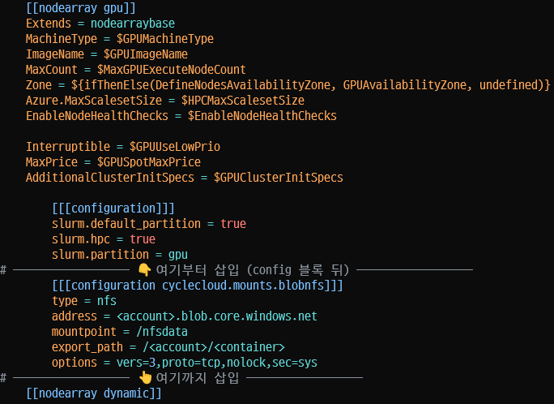

**7A-4.** ☁️ **[CC 서버]** 수정한 템플릿을 클러스터에 재적용한다(GUI 파라미터 유지).

```bash
cyclecloud import_cluster <클러스터명> -c Slurm -f ~/slurm.txt -p ~/params.json --force
```

**7A-5.** 🧮 **[스케줄러]** 대상 노드를 재생성하면 마운트된다(새 노드는 자동).

```bash
sudo azslurm suspend --node-list <클러스터명>-hpc-1
sudo azslurm resume  --node-list <클러스터명>-hpc-1
```

### 7B. cluster-init 방식으로 `<쉐어2>` 마운트

**7B-1.** ☁️ **[CC 서버]** 프로젝트를 생성한다.

```bash
mkdir -p ~/cluster-init && cd ~/cluster-init
cyclecloud project init nfs-share2
```

**7B-2.** ☁️ **[CC 서버]** 마운트 스크립트를 추가한다(**`<스토리지계정>` / `<쉐어2>` 치환** 후 전체 복사·실행).

```bash
cat > ~/cluster-init/nfs-share2/specs/default/cluster-init/scripts/01-mount-share2.sh <<'EOF'
#!/bin/bash
set -euo pipefail
ACCOUNT=<스토리지계정>
SHARE=<쉐어2>
MP=/mnt/<쉐어2>
mkdir -p "$MP"
if ! mountpoint -q "$MP"; then
  mount -t nfs -o vers=4,minorversion=1,sec=sys \
    "$ACCOUNT.file.core.windows.net:/$ACCOUNT/$SHARE" "$MP"
fi
grep -q " $MP " /etc/fstab || \
  echo "$ACCOUNT.file.core.windows.net:/$ACCOUNT/$SHARE $MP nfs vers=4,minorversion=1,sec=sys,_netdev 0 0" >> /etc/fstab
EOF
```

**7B-3.** ☁️ **[CC 서버]** Locker 이름을 확인하고 프로젝트를 업로드한다.

```bash
cyclecloud locker list
cd ~/cluster-init/nfs-share2
cyclecloud project upload "$(cyclecloud locker list | head -1 | awk '{print $1}')"
```

**7B-4.** 🌐 **[브라우저]** 프로젝트를 파티션에 연결한다.
   1. **Clusters → `<클러스터명>` → Edit → Advanced Settings**
   2. 대상 파티션(예 `hpc`) 의 **Cluster-Init → Browse**
   3. 프로젝트 `nfs-share2` → 업로드된 **버전** → spec `default` 선택 → **Select**
   4. **Save**

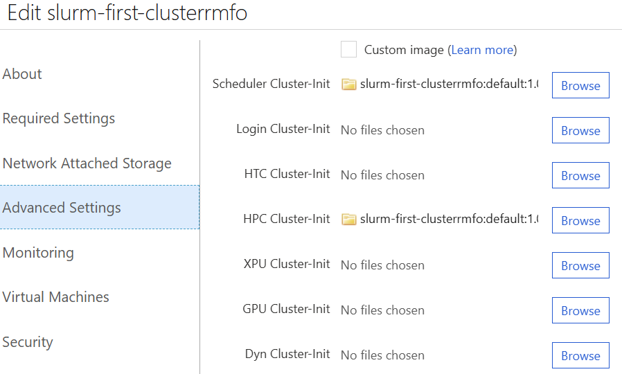

**7B-5.** 🧮 **[스케줄러]** 노드를 재생성하면 마운트된다(새 노드는 자동).

```bash
sudo azslurm suspend --node-list <클러스터명>-hpc-1
sudo azslurm resume  --node-list <클러스터명>-hpc-1
```

> **스크립트만 바꿀 때** — 같은 파일명의 내용만 고치면 이미 실행된 노드에서는 건너뛰므로(`.run` 마커가 파일명 단위) 노드 재생성이 필요하다. 반면 **프로젝트가 이미 연결되어 있는 노드**에 **새 파일명**으로 스크립트를 추가하면 재생성 없이 converge 로 반영된다. 이 경우 스케줄러에서 전체 노드에 브로드캐스트한다(실측 확인).
>
> ```bash
> srun -N<노드수> --ntasks-per-node=1 -p hpc --label \
>   sudo /opt/cycle/jetpack/bin/jetpack converge
> ```
>
> `srun` 환경에는 PATH 에 `/opt/cycle/jetpack/bin` 이 없으므로 **절대 경로**를 써야 한다. 자세한 규칙은 [4장 §4.1.1 / §4.1.2](04-cluster-init-및-커스텀-스크립트.md#411-실행-중-노드에-반영되는-변경과-반영되지-않는-변경) 참고.

### 7C. 마운트 검증

**7C-1.** ☁️ **[CC 서버]** 실행 노드에 접속한다.

```bash
cyclecloud connect <클러스터명>-hpc-1 -c <클러스터명>
```

**7C-2.** 실행 노드 쉘에서 두 마운트를 확인한다.

```bash
df -h /mnt/<쉐어1> /mnt/<쉐어2>
```

- 기대 출력: `/mnt/<쉐어1>`(템플릿), `/mnt/<쉐어2>`(cluster-init) 가 각각 표시됨.

### (참고) 즉시 임시 마운트

재생성 없이 지금 당장 한 노드에서만 확인하려면 직접 마운트할 수 있다(노드 재생성 시 사라짐).

```bash
sudo mkdir -p /mnt/<쉐어1>
sudo mount -t nfs -o vers=4,minorversion=1,sec=sys <스토리지계정>.file.core.windows.net:/<스토리지계정>/<쉐어1> /mnt/<쉐어1>
```

> **참고** — 직접 마운트는 **즉시 반영되나 노드 재생성 시 사라지는 임시** 방식이다(영구 적용은 7A 템플릿 / 7B cluster-init).
> Azure Files NFS(4.1) 는 스토리지 계정에서 **"보안 전송 필수"·"NFS 전송 중 암호화 필요"를 모두 꺼야** 한다(안 끄면 `access denied by server`):
> ```bash
> az storage account file-service-properties update -n <스토리지계정> -g <리소스그룹> \
>   --nfs-eit --require-nfs-encryption-in-transit false
> ```
> 템플릿 조각: [`../templates/add-nfs-mount.txt`](../templates/add-nfs-mount.txt) · cluster-init: [04. Cluster-Init](04-cluster-init-및-커스텀-스크립트.md)

### 7D. 데이터 디스크(관리 디스크) 추가 → `/data`

NFS(공유 스토리지)와 달리, **노드마다 개별 관리 디스크(Managed Disk = CycleCloud `volume`)** 를 붙여 로컬 데이터 공간으로 쓴다. CycleCloud 가 노드 시작 시 디스크를 **연결·포맷·마운트**까지 자동 처리한다.

> ⚠️ `[[[volume]]]` 은 **scaleset 속성**이라 일부 노드만 재생성하면 `does not match existing scaleset attributes: Volumes.*` 오류가 난다. **반드시 해당 nodearray 전체를 내렸다가 올려야** 반영된다.

**7D-1.** ☁️ **[CC 서버]** (7A 에서 만든 `~/slurm.txt` 를 이어서 사용) 실행 노드(`nodearraybase`)에 디스크 선언을 삽입한다.

```bash
awk '/\[\[node nodearraybase\]\]/{f=1}
     f && /\[\[\[cluster-init/ && !d {
       print "        [[[volume datadisk]]]";
       print "        Size = 32";
       print "        SSD = True";
       print "        Mount = datadisk";
       print "        Persistent = false";
       print "        [[[configuration cyclecloud.mounts.datadisk]]]";
       print "        mountpoint = /data";
       print "        fs_type = xfs";
       print "";
       d=1 }
     {print}' ~/slurm.txt > ~/slurm.new && mv ~/slurm.new ~/slurm.txt
```

- 삽입 확인: `grep -A8 "volume datadisk" ~/slurm.txt`

**7D-2.** ☁️ **[CC 서버]** 수정한 템플릿을 재적용한다.

```bash
cyclecloud import_cluster <클러스터명> -c Slurm -f ~/slurm.txt -p ~/params.json --force
```

**7D-3.** 🧮 **[스케줄러]** 대상 nodearray **전체**를 내렸다가 다시 올린다(옛 scaleset 삭제 → 새 scaleset 에 디스크 부착).

```bash
sudo azslurm suspend --node-list <클러스터명>-hpc-[1-2]
# CycleCloud 에서 노드가 완전히 사라진 뒤(수십 초)
sudo azslurm resume  --node-list <클러스터명>-hpc-1
```

**7D-4.** 🧮 **[스케줄러/노드]** 새로 뜬 노드에서 디스크를 확인한다.

```bash
srun -N1 -w <클러스터명>-hpc-1 bash -c 'lsblk; df -h /data'
```

- 기대 출력: `sdb 32G ... /data`(xfs) — 관리 디스크가 자동 포맷·마운트됨.

> **참고** — `[[[volume]]]` 옵션: `Size`(GB), `SSD=True`(또는 `StorageAccountType=Premium_LRS`), `Persistent=true`(노드 종료 후에도 유지, 클러스터 삭제 시에만 제거), `fs_type`(ext4/xfs). 기존 디스크 재사용은 `VolumeId=<disk-id>`. `[[[volume]]]` 은 scaleset 속성이라 반영하려면 nodearray 전체 재생성이 필요하다(위 ⚠️). 템플릿 조각: [`../templates/add-disk.txt`](../templates/add-disk.txt)

---

## 8. 커스텀 명칭 단일 노드 추가 (템플릿 방식)

nodearray 자동확장과 별개로, **이름을 직접 지정한 단일 노드**(데이터 이동·라이선스·유틸리티용 등)를 템플릿에 정의해 수동으로 켜고 끌 수 있다. GUI 에는 자유 입력 이름 필드가 없어 **템플릿(`[[node <이름>]]`)** 으로만 가능하다. *(아래 절차·출력은 실제 클러스터에서 실행·검증한 것이다.)*

**8-1.** ☁️ **[CC 서버]** 표준 템플릿과 현재 파라미터를 준비한다(§7A 에서 받은 `~/slurm.txt` 를 이어 써도 된다. 없으면 §7A-1 로 먼저 내려받는다).

```bash
cyclecloud export_parameters <클러스터명> > ~/params.json
```

**8-2.** ☁️ **[CC 서버]** `~/slurm.txt` 의 **마지막 nodearray 정의 뒤, `[parameters ...]` 앞**에 아래 블록을 추가한다. *(실측 검증된 코드 블록. `mynode` 를 원하는 이름으로 치환)*

```ini
    [[node mynode]]
    Extends = nodearraybase
    MachineType = Standard_D2s_v5
    ImageName = $HPCImageName
    ComputerName = mynode
        [[[configuration]]]
        slurm.autoscale = false
```

> - `[[node mynode]]` — CycleCloud 노드명(=GUI/CLI 표시명). `mynode` 부분을 원하는 이름으로.
> - `Extends = nodearraybase` — 표준 실행 노드의 네트워크·cluster-init 설정을 상속(Abstract 베이스).
> - `MachineType` / `ImageName` — 단독 `[[node]]` 는 상속만으로 값이 없으므로 **직접 지정 필수**.
> - `ComputerName = mynode` — **OS hostname 을 노드명으로 고정**. 생략하면 hostname 이 랜덤(실측 예: `lqafcp0tixm`)으로 붙는다.
> - `slurm.autoscale = false` — Slurm 자동회수 대상에서 제외(수동으로 켜고 끄는 고정 노드).

**8-3.** ☁️ **[CC 서버]** 수정한 템플릿을 재적용한다(GUI 파라미터 유지). `import_cluster` 는 정의를 **통째로 교체**하므로 반드시 **원본 전체 + 추가 블록**이 든 `~/slurm.txt` 를 사용한다.

```bash
cyclecloud import_cluster <클러스터명> -c Slurm -f ~/slurm.txt -p ~/params.json --force
```

**8-4.** ☁️ **[CC 서버]** 정의된 단일 노드를 기동하고 상태를 확인한다.

```bash
cyclecloud start_node   <클러스터명> mynode
cyclecloud show_cluster <클러스터명>        # mynode 가 Off → Allocation → Installation → Started 로 진행
```

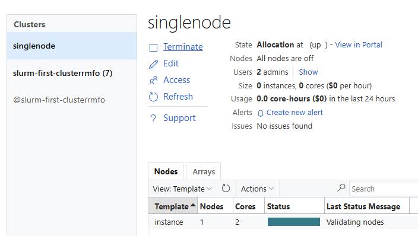

**8-5.** 확인한다 — 노드가 뜨면 **이름 3종**이 아래처럼 나타난다(실측).

| 이름 종류 | 값 (실측 예시) | 결정 요소 |
|---|---|---|
| CycleCloud 노드명 (GUI/CLI) | `mynode` | `[[node mynode]]` 그대로 (suffix 없음) |
| OS hostname | `mynode` | `ComputerName = mynode` (미지정 시 랜덤) |
| Azure 리소스(VM) 이름 | `mynode-GQ4DSZJQGRRWKLLFMI3TKLJUGA` | CC 가 노드ID(base32)를 자동 부여 — **prefix 만 지정, suffix 제거 불가** |

> **참고**
> - 회수: `cyclecloud terminate_node <클러스터명> mynode`. 정의 자체를 없애려면 `~/slurm.txt` 에서 블록을 지운 뒤 다시 `import_cluster`.
> - 이 노드는 **특정 Slurm 파티션에 속하지 않는 독립 노드**이다(잡 스케줄링 대상 아님). Slurm 실행 노드로 쓰려면 nodearray 방식(§5)을 사용한다.
> - **Azure 포털 리소스 이름의 suffix 는 CC 관리 VM 인 이상 제거할 수 없다.** 포털 이름까지 완전히 통제하려면 CC 오케스트레이션 밖에서 VM 을 직접 배포해야 한다.

---

## 9. 트러블슈팅 / 로그 확인

**9-1.** ☁️ **[CC 서버]** 클러스터/노드 상태를 확인한다.

```bash
cyclecloud show_cluster <클러스터명>
cyclecloud show_nodes -c <클러스터명>
```

**9-2.** 🧮 **[스케줄러]** Slurm 데몬 로그를 확인한다.

```bash
journalctl -u slurmctld -n 100 --no-pager
tail -n 100 /var/log/slurmctld/slurmctld.log
```

**9-3.** 🧮 **[스케줄러/노드]** CycleCloud 에이전트 로그를 확인한다.

```bash
ls /opt/cycle/jetpack/logs/
tail -n 100 /opt/cycle/jetpack/logs/jetpack.log
```

> **참고 — 로그 위치 요약**
>
> | 위치 | 경로 | 내용 |
> |---|---|---|
> | ☁️ 서버 | `/opt/cycle_server/logs/cycle_server.log` | CycleCloud 메인 로그 |
> | ☁️ 서버 | `/opt/cycle_server/logs/azure-<클러스터명>.log` | 클러스터별 프로비저닝 상세 |
> | 🧮 노드 | `/opt/cycle/jetpack/logs/jetpack.log` | 노드 부트스트랩/converge |
> | 🧮 노드 | `/opt/cycle/jetpack/logs/cluster-init/**/*.out` | cluster-init 스크립트 출력 |
> | 🧮 노드 | `/var/log/cloud-init-output.log`, `/var/log/waagent.log` | OS 초기화·에이전트 |
> | 🧮 스케줄러 | `/var/log/slurmctld/slurmctld.log` | slurmctld |
>
> - SSH 키 없이 서버 로그 보기: `az vm run-command invoke -g <리소스그룹> -n <서버-VM명> --command-id RunShellScript --scripts "tail -50 /opt/cycle_server/logs/cycle_server.log"`
> - 실패한 노드에 직접 SSH: 서버에서 `sudo ssh -i /opt/cycle_server/.ssh/cyclecloud.pem cyclecloud@<노드-private-IP>` (IP 는 `cyclecloud show_nodes -c <클러스터명>`).
> - **노드가 `Installation` 에서 멈추면** compute 서브넷 **아웃바운드(NAT)** 를 먼저 의심한다(apt/yum 미러 연결 실패). 로그: 노드 `jetpack.log` 의 `Unable to connect to ... archive`.
> - `Multiple lockers found` 오류: `cyclecloud locker list` 확인 후 클러스터 Edit → Advanced → Software 에서 Locker 명시.

> 🖼️ **GUI 모니터링** — 노드를 클릭하면 **Connect/Support/Actions** 탭과 함께 CPU·Disk·Network 그래프로 상태를 볼 수 있다.
>
> 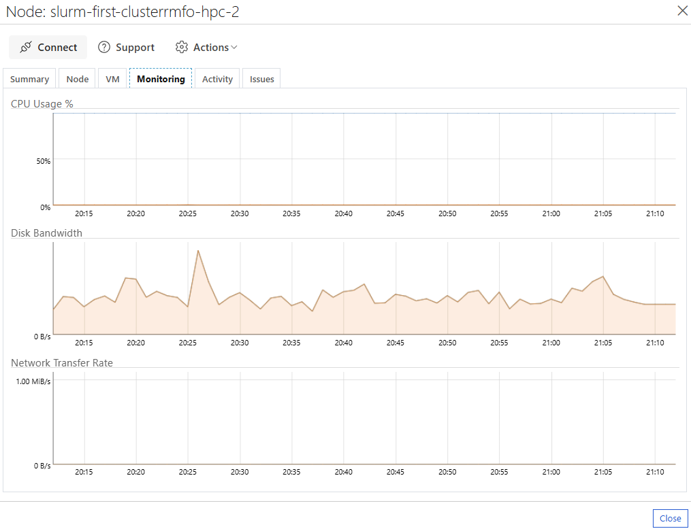

---

## 10. 정리 (실습 종료 후에만)

**10-1.** 🖥️ **[내 PC]** Azure CLI에 로그인한다(이미 로그인돼 있으면 생략).

```bash
az login
```

**10-2.** 🖥️ **[내 PC]** 이 실습 리소스 그룹 전체를 삭제한다.

```bash
az group delete -n <리소스그룹> --yes --no-wait
```

> ⚠️ 삭제하면 서버·클러스터·스토리지가 모두 제거된다. **실습 종료 후에만** 실행한다.
> 보존하려면 삭제 대신 서버 VM 만 중지: `az vm deallocate -g <리소스그룹> -n <서버-VM명>` (다음에 다시 Start).
